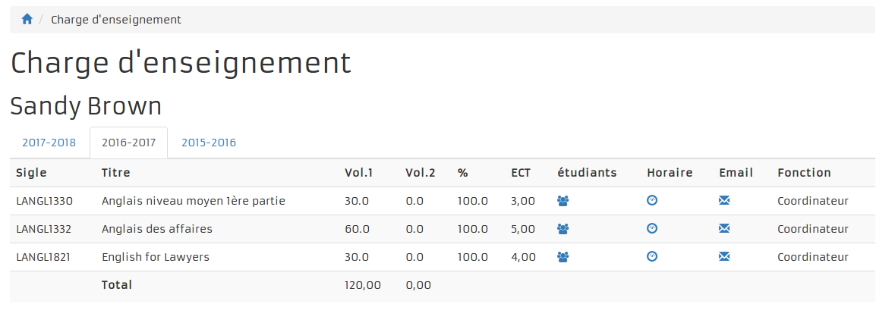
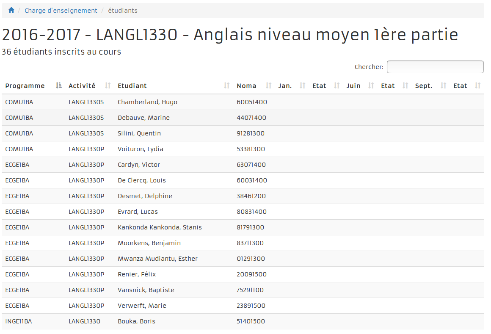
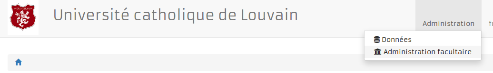
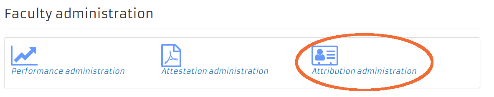
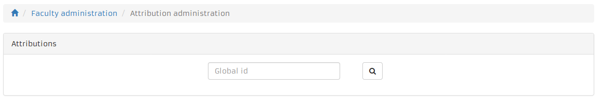

== Attributions

=== Charge d'enseignement

Les enseignants ont la possibilité d'accèder à leur charge d'enseignement via
de tableau de bord d'OSIS Portal:

image::images/charge_enseignement/home.png[]

La charge d'enseignement est présentée dans des onglets. On ne reprend **que les
activités de type cours** (pas les partim/classe). Un onglet par année de charge
d'enseignement connue. Par défaut, l'onglet de l'année en cours est sélectionné.

|===
2+|Détail de l'écran
| Sigle     | Ouvre une nouvelle fenêtre qui va afficher le descriptif du cours.
              On tient compte de l'année de l'onglet.
| %         | Le pourcentage est calculé de la façon suivante :charge de cours
              allouée à l'enseignant * 100 / la durée de l'activité.
| Etudiants | Lien pour accèder à la liste des étudiants inscrits au cours.
| Horaire   | Lien pour accèder à l'horaire du cours dans ADE. Une nouvelle page
              est ouverte pour afficher l'horaire.
| Email     | Fait un mailto à une adresse correspondant à une liste. Sympa.
|===

==== Liste des étudiants

Les étudiants des classes et des partims sont également affichés dans la liste.
On a la possibilité de trier la liste en cliquant sur les entêtes de colonnes.
On peut faire une recherche dans la liste à partir de la boite de texte située
en haut à droite de l'écran. Dès que l'on commence à taper dans la zone de
texte, la liste s'adapte.

==== Vue de l'administratif

Le personnel administratif, ayant les droits nécessaires, va pouvoir voir la
charge d'un enseignant à partir de son numéro de matricule. Pour ce faire,
l'utilisateur doit choisir l'option "administration facultaire" dans le menu en
haut à droite.

Ensuite, il faudra choisir l'option "attribution administration".

Puis encoder le matricule d'un enseignant.

L'administratif aura alors accès à la même vue que celle de l'enseignant.

=== Les suppléances

Il arrive donc que des enseignants doivent être remplacés pendant la durée de
leur attribution; ce peut être à cause d'une mission, d'une maladie, d'un congé,
ou tout autre raison qui n'est pas du ressort de EPC.

Mr/Mme Y supplée Mr/Mme Z pour X heures, l'année N.

Le cours reste attribué à la personne à laquelle il a été attribuée (le suppléé),
et une seconde attribution est crée pour la personne qui va le remplacer (le
suppléant).

Les types de suppléant sont:

Suppléant:: il doit toujours y avoir un suppléé

Suppléant de sabbatique:: il doit toujours y avoir un suppléé. Quand le suppléé
est parti en congé de 1 an.

Suppléant d'autorité:: il doit toujours y avoir un suppléé. Le suppléé doit
exercer une fonction d'autorité dans l'UCL (par exemple le recteur).

Suppléant de N:: le suppléé est inconnu (chef d'entreprise, politicien, mais
lequel?)

On peut ici faire évoluer le concept en obligeant de mettre une attribution à
`SOMEBODY` (pas `NOBODY`) pour permettre la création d'une contrainte.

Initialement, les suppléances devaient avoir une durée de 1 an, mais en realité
tous les cas sont possible, comme constaté dans la base de données. Il y a bien
sûr des cas particulier: des attributions viennent d'être faite mais une
personne supplée toute la durée de l'attribution.

On peut avoir plus d'un suppléant. Ex: un prof a 30h et il est suppléé par 2
personnes pour 15h chacune.

Les  co-suppléances ne sont pas utilisées actuellement.
