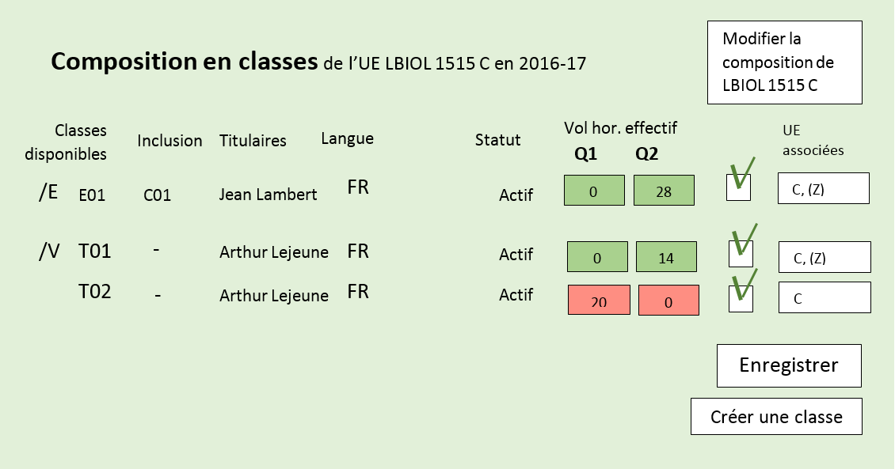

== Gestion du catalogue des formations


=== Gestion des formations

==== Concepts généraux

===== Organisations de formation (OF)

Une _OF_ est organisation qui soutient un processus d’apprentissage, possédant

* des attributs
* et un _contenu_, qui est une liste d’UE et d’OF.

On distingue le contenu du premier degré, du second degré, et récursif.

Chaque type d'OF possède des règles d'utilisation des attributs et de construction de son contenu.

Types d'OF :

* Intitulé principal
* Orientation
* Finalité
* Mini-formation : ensemble structuré d’UE et/ de Groupements conçus pour être inclus dans les Formations, sur base d’objectifs académiques et pédagogiques explicites
** Mineure
** Approfondissement
** Majeure EPL
** Option de master
* Groupements autres (présentation et choix)
** Choix d'orientations
** Choix de Finalités
** Choix de Mini-formations
** Choix / Présentation de cours (faut-il différentier ?) 

===== Formation

Une **Formation** est une organisation qui soutient un processus d’apprentissage sanctionné par un diplôme ou un certificat. Elle est spécifiée par un triplet d’OF des 3 premiers niveaux {Intitulé principal, Orientation, Finalité} ; seule la composante Intitulé principal est toujours _nommée_ càd possède toujours un intitulé ; les composantes Orientation et Finalité peuvent soit rester _muettes_, soit être _nommées_.

Donc, quand un Intitulé principal ne possède pas d’orientation, une orientation muette lui est cependant adjointe et permet de représenter les attributs communs et le contenu commun (TC) des finalités. (Dans l’arborescence des OF cette orientation muette sera présentée de la même manière que les orientations réelles.)

De même, quand un Intitulé principal ou ses orientations ne possèdent pas de finalités, une finalité muette permettra cependant d’enregistrer le code de la Formation et tous les attributs des formations qui relèvent de ce niveau. (Dans l’arborescence des OF ces finalités muettes seront présentées de la même manière que les finalités réelles.)

Une orientation ne peut rester muette que si elle est seule à appartenir à son intitulé principal.
Une finalité ne peut rester muette que si elle est seule à appartenir à son orientation (que celle-ci soit muette ou nommée).

Une Formation possède un programme-type, contenu _construit_ à partir des contenus _propres_ aux OF du triplet définissant la formation.

===== Relations d’inclusion de contenu entre OF

====== Relations entre Intitulé principal, Orientation, Finalité 
*	les 3 niveaux coexistent toujours, bien que l’orientation et/ou la finalité puissent être muettes
** 	une _Orientation_ ne peut être incluse que dans le contenu d'un et un seul _Intitulé principal_ ;
** 	une _Finalité_ ne peut être incluse que dans le contenu (de second degré) d'une et une seule _Orientation_ (qui peut être muette), et dans le contenu (de quatrième degré) d'un et un seul _Intitulé principal_ ; 
*	héritage des attributs et du contenu
**	une _Orientation_ hérite des attributs de son _Intitulé principal_
**	une _Finalité_ hérite des attributs de l'_Intitulé principal_, et, le cas échéant, de l'_Orientation_, auxquels elle appartient.
*	certains attributs peuvent être surchargés

====== Relations entre MF, Grpm et UE et avec F
*	existence indépendante 
*	pas d’héritage des attributs
*	certains attributs sont contextuels ou contextualisables (« relatifs ») 
 
====== Exemple typique

* Intitulé principal
** Tronc commun d'intitulé principal, inutilisé
** Choix d'orientations
*** Orientation
**** Tronc commun d'orientation
***** UE
***** Choix/présentations d'UE
****** UE
**** Choix de finalités
***** Finalité


***** Finalité
****** UE


****** UE
****** Choix/présentations d'UE
******* UE
****** Choix de Mini-formations
***** Mini-formation
****** UE
****** Choix/présentations d'UE
******* UE

- une _Mini-formation_ existe indépendammnent de tout contexte ; elle peut figurer
dans le _contenu_ de toute _QF_, sans hériter des attributs de cette _QF_ ;
- un _Regroupement_ peut exister en général indépendamment de tout contexte
mais on peut restreindre son inclusion dans les contenus appartenant directement
ou indirectement à une _Formation_ ou à un _Ensemble de formations_;
il n'hérite pas des attributs des QF au contenu desquels il est inclus.

==== Création d'une formation

Les formations (offres inscriptibles menant à l'obtention d'un diplôme ou d'un
certificat) sont classifiées selon 1, 2 ou 3 niveaux.
Les niveaux de classification sont les suivants :

1. Intitulé principal
2. Orientation, localisation, type d'horaire
3. Finalité

Les informations propres à un niveau sont héritées par les niveaux inférieurs.
Pour cette raison, les formations effectivement classifiées en 3 niveaux seront
gérées en 3 écrans séparés ; l'écran de gestion du niveau 2 présente en lecture
seule les informations héritées du niveau 1, et l'écran de gestion du niveau 3
présente en lecture seule les informations héritées des niveaux 1 et 2.

Toutes les formations possèdent un intitulé principal, mais les deux autres
niveaux de classification ne sont pas toujours utilisés dans la classification
décrite par le décret "paysage". *Exemple* :
les formations de baccalauréat n'ont jamais de finalité et souvant pas d'orientation.

Il arrive également qu'un niveau soit utilisé de manière purement formelle,
avec une seule instanciation.

* *Exemple* :
les masters sont en principe toujours déclinés en finalités mais les masters
de bioingénieurs n'en possèdent qu'une.

Qu'un niveau existe en une seule instanciation ou que ce niveau n'existe pas
se traduira dans les deux cas par la fusion de l'écran de gestion des informations
de ce niveau avec l'écran de gestion du niveau directement supérieur.

* *Exemple* :
on traitera donc en un seul écran le cas des baccalauréats sans orientations,
car les baccalauréats n'ont jamais de finalité. De même, les
masters de bioingénieurs seront gérés un un seul écran.

==== Création d'une _Mini-formation_ (_MF_)


==== Création d'un _Regroupement_ de présentation ou de choix


=== Gestion des unités d'enseignement

==== Concepts

Les Unités d’enseignement (UE) sont les pièces de base des programmes d’études.
À une UE correspond un intitulé, un cahier de charges, des acquis
d’apprentissage (AA), un nombre d’unités de crédits ECTS (poids ECTS).
L’inscription d’un étudiant à une UE, dans le cadre de son inscription à un
programme d’études, conduit à l’obtention d’une note.

Les UE ont donc une signification académique, indépendemment des aspects
organisationnels, qui sont gérés dans les composants et classes associés aux UE.

Les UE sont actuellement de l’un des types suivants : cours, mémoire, stage,
cours externe, ??????

Le contenu des UE de type cours comporte souvent deux composants, le cours
magistral (CM) et les travaux pratiques (TP). Les UE de type mémoire et stage ne comportent qu’un seul composant.

Chacun des composants est organisé en un ou plusieurs horaires, les classes.
Les classes peuvent être organisées avec des horaires, locaux, enseignants différents.

Un composant est peut être vu comme un groupe de classes de contenus
identiques. Un composant désigne donc un contenu d’enseignement, et une
classe désigne une organisation de ce contenu d’enseignement.

Un partim est une UE dont le contenu est une partie du contenu d’une UE
principale (ou cours principal). Ses composants seront donc aussi des parties
des composants de ce cours principal. Un partim est une UE autonome du point
de vue académique, mais l’organisation de ses classes sera le plus souvent
fortement liée à celle des classes de son cours principal.

Pour cette raison, une UE cours principal et des UE partim qui dérivent
de ce cours principal sont regroupés en un conteneur, qui contient aussi
les composants et leurs classes.

==== Objectifs

La représentation des structures d’enseignement dans OSIS doit permettre :

-	de bien distinguer les aspects académiques des aspects organisationnels des UE ;
-	de représenter les charges réelles des professeurs et assistants ;
-	de garantir la cohérence des aspects organisationnels : inscriptions aux
classes, horaires, charges
-	de détailler les « attributions au sens large », càd y compris sur les
classes de TP.
Ces objectifs nécessitent de représenter le détail réel des différents
composants dont se compose une UE, leur organisation matérielle en classes
(séries), et de représenter comment ces composants et classes sont parfois
utilisés dans plusieurs UE, et comment une classe composant peut être
incluse dans une classe d’un autre composant.

Les UE présentent la vision académique de l’enseignement : objectifs, AA,
inscriptions, crédits …
Les composants et classes sont l’aspect organisationnel de l’enseignement.

Ces différents éléments et leurs associations seront regroupés dans un objet
technique nommé le conteneur, auquel correspond la partie commune de leurs
acronymes respectifs.

==== Notations


Nous travaillerons sur un exemple fictif avec 4 UE liées par des contenus communs :

LBIOLL 1515 Z  		Zoologie générale				cours complet
LBIOLL 1515 A		Zoologie générale (sans laboratoire)		partim
LBIOLL 1515 B		Zoologie générale (1ère partie : Invertébrés)	partim
LBIOLL 1515 C		Zoologie générale (2è partie : Vertébrés)	partim


===== Pour désigner le conteneur

LBIOL 1515

===== Pour désigner un composant

Les différents composants seront désignées explicitement par une lettre
précédée d’un ‘/’.
On choisira de préférence les lettres
-	/C, /D, /E, … pour les composants de type CM.
-	/T, /U, /V, … pour les composants de type TP.
-	/M pour le composant unique (de type mémoire) d’une UE de type mémoire.
-	/S pour le composant unique (de type stage) d’une UE de type stage.

Ainsi :
LBIOL 1515 /C désigne un composant de type CM inclus dans le conteneur LBIOL 1515.
LBIOL 1515 /T désigne un composant de type TP inclus dans le conteneur LBIOL 1515.


===== Pour désigner une classe

Les différentes instances (ou répétitions, ou réalisations) matérielles d’un composant seront désignées par un chiffre placé après la lettre désignant l’activité.

LBIOL 1515 /C01 désigne la classe 1 du composant /C
LBIOL 1515 /T02 désigne la classe 2 du composant /T

===== Pour désigner une UE

L’actuel champ « subdivision » sera réservée à l’identification des partim (et non plus des classes). La subdivision ‘Z’  sera réservée pour désigner explicitement le cours principal, dont l’enseignement est le plus complet.

NB Cette UE existe nécessairement mais peut ne pas être active dans certains cas :
-	quand le conteneur contient des activités dont le contenu alterne d’une année à l’autre.

LBIOL 1515 Z : enseignement entier (la lettre Z est facultative s’il n’y a pas de partim)
LBIOL 1515    : enseignement entier
LBIOL 1515 A : partim A

==== Inclusion de composants et de classes

===== Inclusion de composants

Si le contenu d’un composant /D est une partie du contenu d’un composant /C du même type, on dira que /D est inclus dans /C. Le composant /C est alors incluant.

Un seul composant d’un type donné peut être incluant dans un container
Il est parfois nécessaire de construire un composant incluant qui n’entre dans la composition d’aucune UE. Il faut alors aussi créer une classe non utilisée à l’inscription qui portera l’horaire de référence.


_Exemple_

image::images/UE_Inclusion_composants.png[]


===== Inclusion de classes

Si l’horaire d’une classe /D01 est une partie de l’horaire d’une classe /C02, avec le même local, on dira que la classe /D01 est incluse dans la classe /C02.

Cela signifie que les étudiants inscrits à la classe LBIOL 1515 /D01 sont rassemblés avec les étudiants de la classe LBIOL 1515 /C02 (pour la durée du calendrier de la classe /D01). L’inclusion de classes porte sur l’organisation physique de l’enseignement, alors que l’inclusion de composants portait sur les contenus.

Une classe qui n’est pas incluse est dite autonome.
Toute classe d’un composant incluant peut être incluante.


_Exemples_

====== Classes de cours magistral (complet, 1ère partie, 2ème partie)

image::images/UE_Inclusion_classes_1.png[]

====== Classes de TP (complets, 1ère partie, 2ème partie) 

image::images/UE_Inclusion_classes_2.png[]


==== Composants et classes : exemple détaillé

Détaillons à présent les composants et classes dans notre exemple :
```
LBIOL 1515 Z  	Zoologie générale				cours complet	2 classes CM	4 classes TP
LBIOL 1515 A	Zoologie générale (sans laboratoire)		partim		1 classe CM	0 classe TP
LBIOL 1515 B	Zoologie générale (1ère partie : Invertébrés)	partim		1 classe CM	2 classes TP
LBIOL 1515 C	Zoologie générale (2è partie : Vertébrés)	partim		1 classe CM	1 classe TP
```
Le cours principal, l’UE ‘Z’, a besoin de 2 composants, /C (cours magistral complet) avec 2 classes et /T (TP complets) avec 4 classes.
Le partim A n’a besoin que d’une classe du cours magistral complet. On peut lui attribuer la classe /C01 ou la classe /C02, ou encore donner le choix aux étudiant. Quoi qu’il en soit il ne faut pas créer de composant pour le partim C.

Dans le tableau ci-dessous, on voit que l’UE Z (cours principal) fait appel à toutes les classes qui ont été créées, tandis que le partim A ne fait appel qu’à la classe /C01. Pour construire le partim A, les composants et classes créés pour organiser le cours principal sont suffisants.

image::images/UE_Composition_principe_tableau1.png[]

Pour le partim B, en revanche, il faut définir un nouveau composant
« Cours magistral 1ère partie », dont le contenu correspond à la première
partie du contenu du composant /C. Il sera désigné ici par la lettre /D.
De même, il faut définir un composant « TP 1ère partie », dont le contenu
correspond à la première partie du contenu du composant /T. Il sera désigné
par la lettre /U.

Dans le tableau ci-dessous, les signes (+) signalent que l’inscription
d’étudiants aux classes /D01 et /U01 ont pour conséquence la présence de
ces étudiants à une partie du calendrier des classes /C02 et /T03, étant
données les inclusions de classes. Donc les classes /D01 et /U01 ne nécessitent
pas de réservations de locaux et d’enseignant  supplémentaires, mais le local
réservé pour la classe /C02 devra accueillir aussi les étudiants inscrits à
la classe /D01, et le local réservé pour la classe /T03 devra accueillir
aussi les étudiants inscrits à la classe /U01, pour la partie du calendrier
correspondant à la première partie de la matière.

image::images/UE_Composition_principe_tableau2.png[]


De même, pour le partim C, il faut définir un composant « Cours magistral
2ème partie », dont le contenu correspond à la seconde partie du composant
/C. Il sera désigné ici par la lettre /E. De même, il faut définir un
composant « TP 2ème partie », dont le contenu correspond à la seconde partie du composant /T. Il sera désigné par la lettre /V.

Dans le tableau ci-dessous, la classe /V02 n’est pas incluse dans une classe
de /C, elle est alors dite autonome.

image::images/UE_Composition_principe_tableau3.png[]

==== Articulation entre UE, Parcours et attributions

image::images/UE_Interface_UE_autresModules.png[]

==== Types de conteneurs

Actuellement : cours, mémoire, stage, cours externe
Toutes les UE d’un conteneur sont du même type, et héritent du type du conteneur.

==== Types de composants

Actuellement : cours magistral (CM), travaux pratiques (TP), mémoire (M),
stage (ST), composant externe (EXT).
NB : les composants de type Stage ou Mémoire possèderont autant de classes
que de promoteurs.

==== Statuts d’UE
(à discuter)

|===
| *Statut*       | *Signification*     | *Condition* | *Utilisation, droits d’accès* 
| _Préparation_  | L’UE a été créée.   |          	 | Les auteurs de la proposition peuvent y travailler.
| _Proposition_  | L’UE fait partie d’une proposition soumise à QOPA, qui peut l’étudier. | Les attributs et éléments de composition nécessaires à une proposition sont introduits.	QOPA peut étudier la proposition. | 
| _Vérifié_      | QOPA a approuvé la proposition.	| | La faculté ou CE concernée peut préparer les classes (locaux, horaires, titulaires). 
| _Publiable_    | Feu vert.		    | L’UE peut apparaître sur le portail, notamment dans des programmes-types. |  
| _Organisé_     | Les classes sont prêtes.	| Pour chaque composant associé à l’UE, au moins une classe doit être associée à l’UE. | 
|===


Après prolongation, un nouveau record annuel reçoit le statut Publiable.


==== Statuts de composant

Non sélectionnable, En préparation, Prêt

==== Statuts de classe


==== Actualisation

*	Un conteneur, une UE, un composant qui possèdent une anac de fin antérieure
à l’anac en cours, ou une année de début postérieure à l’anac en cours,
peuvent être actualisés à l’anac en cours ou l’une des deux suivantes
**	 si l’UE possède une anac de fin antérieure à l’anac en cours, celle-ci
est remplacée par une anac >= anac en cours ; une instanciation annuelle
est créée pour l’anac de départ demandée.
**	si l’UE possède une anac de début postérieure à l’anac en cours, une
instanciation annuelle est créée pour l’anac de départ demandée.

==== Contraintes sur les années de fin

*	changer l’année de fin d’une UE
**	si l’année de fin du container < nouvelle année de fin de l’UE, alors son
année de fin prend cette nouvelle valeur
**	pour chaque composant qui entre dans la composition de principe de l’UE, si
son année de fin < nouvelle année de fin de l’UE, alors son année de fin prend
cette nouvelle valeur
**	pour chaque classe qui entre dans la composition en classes de l’UE, si
son année de fin < nouvelle année de fin de l’UE, alors son année de fin
prend cette nouvelle valeur
*	on ne peut pas changer directement les anac de fin des composants ni des
classes ni du conteneur
*	si une classe ou un composant est retiré de la composition d’un UE dans
le cadre de l’anac « anac de sortie »
**	s’il entre dans la composition d’autres UE, son anac de fin prend la
valeur du maximum des anac de fin de ces autres UE
**	s’il n’entre plus dans la composition d’aucune UE, son anac de fin prend
la valeur précédent celle de l’« anac de sortie ».
*	si une classe ou un composant est ajouté à la composition d’un UE dans le
cadre de l’anac « anac de sortie »
**	son anac de fin prend la valeur du maximum des anac de fin des UE dans la
composition desquelles il entre

==== Contraintes de Quadri et volumes horaires : règles de cohérence entre composants inclus et incluant

*	si un composant /D est inclus dans un composant /C,
**	le volume horaire nominal de /D est inférieur ou égal à celui de /C
**	le quadrimestre de /D est égal à, ou compris dans, celui de /C

|===
| */C*  | */D*
| Q1	| Q1
| Q2	|Q2
| Q1&2	| Q1&2, Q1/2, Q1, Q2
| Q1/2	| Q1/2, Q1, Q2
|===


==== Prolongation

Chaque année, les entités doivent être instanciées pour une année académique supplémentaire.


==== Attributs

On veille à séparer le mieux possible les informations à carctère académique de celle qui relèvent de l'organisation.

===== Volet académique

====== Identification

*	Code (+ historique)
*	Intitulé complet (+ historique)
*	Intitulé complet en anglais (+ historique)
*	Intitulé abrégé

*	Partim (Oui / Non)
*	Activités (Cours mag., TP, Stage, etc)
*	Langue(s)

====== Volume

*	Nb de crédits
*	Volumes des activités
*	Répartition …………..

====== Volet Organisation

*	Prise en charge
**	Cahier de charges
**	Attribution
*	Titulaires
*	Début, Fin
*	Actif
*	Périodicité
*	Site

====== Volet Vacance et attribution


====== Volet Workflow

*	Type de proposition
*	Etat
*	N° de dossier

Container annualisée

*	acronyme : sigle_cours et CNum
*	Intitulé principal
*	anac de clôture (avec subsudiarité)
*	site (avec subsidiariité)
*	Organisation :
**	entité de charge (avec subs)
**	entité d’attribution (avec subs)
*	Type
*	Langue (avec subs dans UE et dans Classe)

UE

*	Année de clôture subsidiaire
*	Périodicité : UE non annualisée

UE annualisée

*	acronyme (détermine aussi le sous-type principal/partim)
*	Intitulé complémentaire
*	Organisation
**	entité de charge subsidiaire
**	entité d’attribution subsidiaire
**	Actif
**	Site subsidiaire
*	Volume
**	Nb de crédits
**	Quadris
**	session par dérogation
*	Langue subsidiaire à celle du conteneur

Composant

*	Type de composant
*	Intitulé de composant

Composant annualisé

*	Volumes des activités
**	Crédits ECTS
**	Volume horaire
**	Quadris (avac subs. des classes)

Classe annualisée

*	Langue subsidiaire à celle du conteneur
*	Quadri subsidiaire

==== Gestion des UE

===== Approche utilisateur

====== Container 
Il sera seulement perçu comme le code commun des acronymes d’un groupe des cours reliés. Il est pertinent de ne pas le montrer. Les attributs liés à cet objetsont hérités par l’UE cours principal, et peuvent donc être géré dans le cadre de celle-ci.

====== Composant
Le plus souvent, pour le gestionnaire, le composant n’a de sens compréhensible que dans le contexte d’une UE. Pour la bonne compréhension, nous ne donnerons accès aux composants que dans le cadre d’une UE. Cependant nous présenterons toujours la liste complète des composants du container.

====== Classe
Le plus souvent, pour le gestionnaire, la classe n’est compréhensible que dans le contexte d’une UE. Pour la bonne compréhension, nous ne donnerons accès aux classes que dans le cadre d’une UE. Cependant nous présenterons toujours toutes les classes des composants associés à l’UE concernée.

====== UE
L’UE reste donc le point  
Recherche et création d’UE

===== Formulaire
*	Anac (intialisée à l’anac en cours, et disposant d’un menu avec « blanc », anac « Plus récente », et les 10 dernières anac)
*	Type d’UE
*	Acronyme ou partie d’acronyme
*	Mots d’un titre ou mots-clefs
*	Entité d’attribution
*	Entité de charge

Le bouton [ Recherche ] est toujours visible, et actif à condition que le formulaire dispose de valeur pour au moins l’une des combinaisons de champs suivantes :

*	Anac et Sigle
*	Anac et Mot d’un titre
*	Anac et Entité de charge
*	Anac et Entité d’attribution
*	Signe et CNum

Si le formulaire a été rempli
-	en spécifiant l’anac la « Plus récente »,
-	en introduisant un acronyme comportant 4 chiffres après les lettres

*	si la liste produite contient un et un seul container,
**	les UE arrêtées sont accessibles et peuvent donc être actualisées
**	le bouton [ Créer une UE partim ] est actif
**	si toutes les UE sont arrêtées depuis au moins 5 ans, le bouton [Recréer une nouvelle UE principale avec ce code ] est actif (cette opération créera un nouveau container)
*	si les autres champs du formulaire sont vides et que la liste produite est vide (zéro container),
**	le bouton [ Créer une UE principale ] est actif


===== Onglet Identification de l'UE

Règles

Code cour principal, Intitulé officiel principal et  intitulé abrégé principal (et leurs traductions anglaises)
Attribut du conteneur, éditable dans l’UE « cours principal », en lecture seul dans les partims. Si des partims (d’autres UE) existent dans le container, un changement de code donnra lieu à un avertissement.

Intitulé officiel secondaire et l’intitulé abrégé sedondaire
Obligatoire pour les partims.
Libre pour l’UE « cours principal », mais obligatoire si l’intitulé principal correspondant est vide.


image::images/UE_details_onglet-Identif.png[]

===== Onglet Composition de principe de l'UE
Règles
*	Le système présente tous les composants existants (learning_component_year)
**	ils sont triés par type (CM, TP, ST (Stage), M (Mémoire))
**	Attributs présentés 
***	code
***	type de composant
***	Intitulé du composant
***	inclusion
***	statut ou dernière année d’existence si le composant n’existe pas pour l’anac concernée
***	volume horaire nominal (+ code couleur pour signaler la conformité des classes)
***	quadrimestre nominal (+ code couleur pour signaler la conformité des classes)
***	nombre de classes prévu
***	nombre de classes existantes dans l’anac concernée (valeur calculée) (+ code couleur pour signaler la conformité du nombre réel de classes avec le nombre prévu)

*	coche de sélection permettant de définir la composition de principe de l’UE (learning_unit_component)
**	Le bouton [ Modifier la composition ] permet d’éditer les coches d’association
**	Il existe un statut de composant « Non sélectionnable »

Exemples d'écrans :


image::images/UE_details_composPrincipe-1.png[]

image::images/UE_details_composPrincipe-2.png[]


===== Onglet « Composition en classes de l’UE »

Règles

*	le système présente toutes les classes existantes pour les composants sélectionnés
**	Attributs présentés (tous en lecture seule)
***	code
***	filiation
***	titulaires
***	langue (calculée par subsidiarité à partir du container)
***	statut
**	2 volumes horaires effectifs (calculé dynamiquement à partir des règles horaires des classes si elles existent) (+ codes couleur pour signaler la conformité de chaque classe avec les valeur nominales du composant)


*	coche de sélection permettant de definir la composition en classes de l’UE

Exemples d'écrans :

image::images/UE_details_composClasses-1.png[]



===== Onglet Organisation de l'UE

Règles

|====
|                        	| Entité			| Surcharge	
| Entité de cahier de charge	| UE_year		        |	
| Entité d’attribution		| Container_year (via détails de l’UE principale) |	UE_year (partims)
| Anac de fin			| UE (petit chapeau)		|	
| Site 				| Container_year (via détails de l’UE principale)  |	UE_year (partims)	
|Périodicité 			| UE (petit chapeau)		|	
| Langue			| Container_year (via UE principale) |	Classe_year
|====

* L'anac de début	est calculée en recherchant le plus ancien record annuel de l’UE.
* Les volumes horaires et quadrimestres sont ceux des composants.


 

Onglet Organisation


image::images/UE_details_onglet-Org.pgn[]

 
Onglet Informations pédagogiques

•	Préalables
•	Thèmes
•	Acquis d’apprentissage
•	Modes d’évaluation
•	Méthodes d’enseignement
•	Contenu
•	Bibliographie
•	Autres informations


 
Gestion des détails d’une Classe

Règles horaires d’une Classe autonome ou (ici) incluante

T01	T01/1	Quadrimestre	Q1
		Semaine début	1
		Nb semaines	14
		Excepté semaine n°	-
		Jour semaine	Lundi
		Heure début	14
		Durée	1
	T01/2	Quadrimestre	Q2
		Semaine début	1
		Nb semaines	14
		Excepté semaine n°	-
		Jour semaine	Jeudi
		Heure début	14 :15
		Durée	1

Volume horaire effectif = 14 sem X 1 h/sem = 14 h
 
Règles horaires d’une Classe incluse

Les classes incluses héritent des règles horaires d’une classe incluante, munies de restrictions : suppression totale ou partielle des nos de semaines d’une règle.
Mots clefs : Suivre, Suivre excepté semaine(s) …, Supprimer
Classe
incluse	Classe incluante	Règles de la classe incluantes	Règles de la classe incluse
U02	T01	T01/1	Quadrimestre	Q1	Suivre excepté semaine 14
			Semaine début	1	
			Nb semaines	14	
			Excepté semaine n°		
			Jour semaine	Lundi	
			Heure début	14 :00	
			Durée	1	
		T01/2	Quadrimestre	Q2	Supprimer
			Semaine début	1	
			Nb semaines	14	
			Excepté semaine n°	--	
			Jour semaine	Lundi	
			Heure début	14 :00	
			Durée	1	

Volume horaire effectif = 14 X 1 + 0 = 14 h


==== Création d'UE, activités, classes


===== EU de type *cours* : création

Une UE est rattachée à un conteneur de type *cours* qui possède deux composants, l'un de type *cours magistral*
et l'autre de type *travaux pratiques*.


.Quand un utilisateur souhaire créer une UE de type *cours*, le système créera
. un conteneur,
. un composant de type *cours magistral* (code /C),
. avec une seule classe (code /C01),
. un composant de type *travaux pratiques* (code /T),
. avec une seule classe (série) également (code /T01),
. et une UE composée des classes des 2 activités, /C01 et /T01.


.Conteneur de tout type: ajout de classe dans une composant
. L'utilisateur ouvre le composant concerné
. L'utilisateur demande une classe supplémentaire
. Quelles UE auront accès à cette classe ?
    - si la super-UE ne contient qu'une seule UE, le système donne
      automatiquement accès à cette classe dans le cadre de l'UE ;
    - si la super-UE contient plusieurs UE, le système demande pour
      chaque UE si la classe doit y être accessible ; si
      l'utilisateur répond non pour toutes les UE, le système
      conclut à une impossibilité.
. L'utilisateur complète les attributs de cette classe, parmi lesquels
  il indique quels membres de l'équipe pédagogique de la super-UE seront
  affectés à cette classe. La complétion de ce travail conditionne à ce
  stade le statut de la classe créée.


.Super-UE de tout type: ajout d'une activité
. L'utilisateur demande une activité supplémentaire
. Sera-t-elle de type "partiel" ?
    - "cours magistral partiel"
        * condition : une activité de type "cours magistral complet"
          doit exister.
        * première classe créée automatiquement : l'utilisateur doit
          préciser si la classe est une réutilisation partielle d'une
          classe de l'activité de type "cours magistral complet", et
          si oui, laquelle. Pour chaque classe supplémentaire créée
          l'utilisateur devra fournir ces précisions.
     - "travaux pratiques partiels"
        * condition : une activité de type "travaux pratiques complet"
          doit exister.
        * première classe (série) créée automatiquement : l'utilisateur
          doit préciser si la classe est une réutilisation partielle d'une
          classe de l'activité de type "cours magistral complet", et
          si oui, laquelle. Pour chaque classe supplémentaire créée
         l'utilisateur devra fournir ces précisions.
. L'utilisateur complète les attributs de cette classe, parmi lesquels
  il indique quels membres de l'équipe pédagogique de la super-UE seront
  affectés à cette classe. La complétion de ce travail conditionne à ce
  stade le statut de la classe créée.

.EU de type partim : création
. Faut-il une nouvelle activité (d'un type différent ou non) dans la super-UE ?
  * Exemples
  ** Seule existe l'activité "Cours magistral complet", de type "cours
  magistral", et il faut créer une activité "Cours magistral
  1ère partie", de type "cours magistral partiel".
  ** Seules existent les activités "Cours magistral complet" et "Cours
  magistral 1ère partie" il faut créer une nouvelle activité
  de type "cours magistral partiel", nommée "Cours magistral 2è partie".
. Faut-il ajouter une classe à une activité ?
. Création de l'EU partim
  1. L'utilisateur demande la création d'une UE partim
  2. L'utilisateur doit indiquer quelle activités de la super-UE sont
  requises dans ce partim
  3. Pour chaque activité requise, l'utilisateur indique quelles classes
  seront accessible dans le cadre de cette UE.
  4. L'utilisateur édite les attributs. Le statut de l'UE dépend à ce
  stade de la complétion des attributs obligatoires
  5.


.EU de type *mémoire*

Une EU de type *mémoire* est rattachée à une super-UE
ne possède qu'un seule activité, de type *mémoire*.
Une classe est automatiquement créée pour chaque professeur de la faculté
ou CE pour laquelle l'UE est créée, et toutes ces classes sont accessibles
dans le cadre de l'UE.

.UE de stype *stage*

idem


=== Gestion du contenu des formations

=== Publication du catalogue des formations
