== Gestion des demandes d'inscription en ligne

=== Le workflow

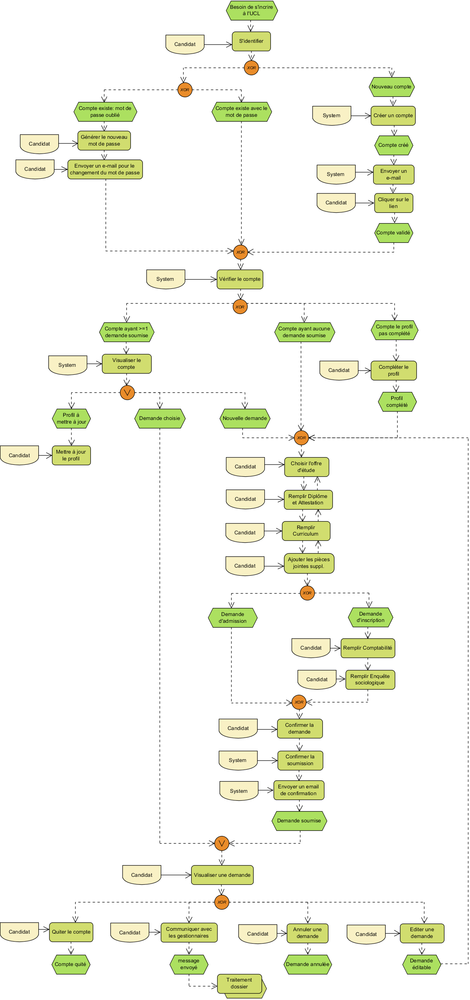

=== Les fonctionnalités
. S'identifier
+
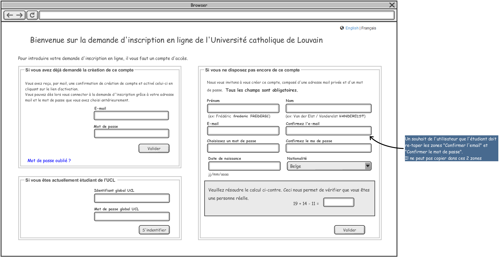
. Créer un compte
+
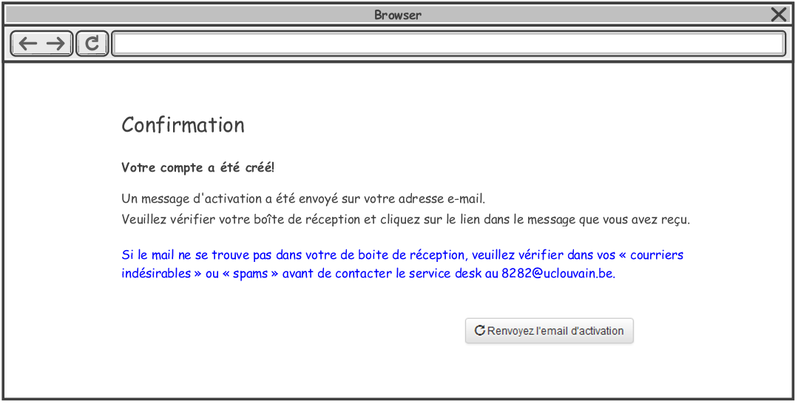
. Envoyer un e-mail
+
image::images/demande_d_inscription/envoyer_un_e-mail.png[]
. Compléter le profil
+
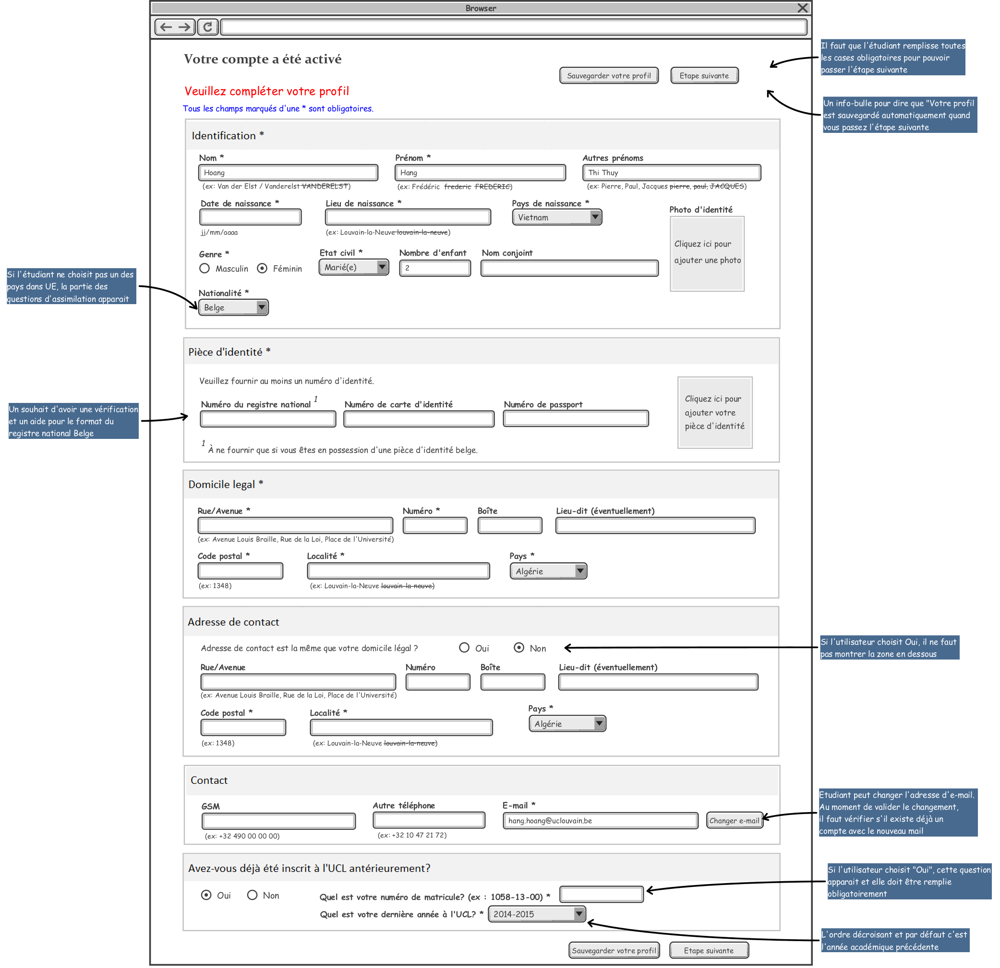
+
Pour les étudiants qui n’ont pas la nationalité dans UE, des questions d'assimilation apparaissent
+
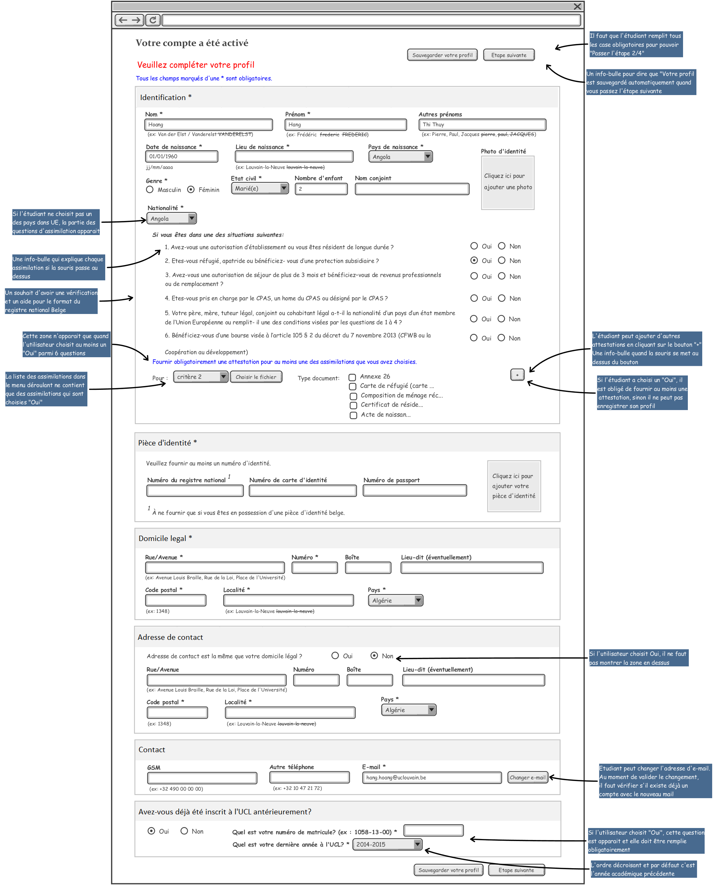
+
La liste des documents à fournir par critère: http://uclouvain.be/14095.
+
On doit présenter *tous* les types documents par critère comme une liste plate (peu importe ET et OU): dans le même bullet ce sont des ET, entre des bullets ce sont des OU
+
* Critère 1:
** Carte de "résident longue durée" (Carte D)
** Carte d'identité des étrangers séjour illimité "établissement" (Carte C)
* Critère 2:
** Annexe 26
** Carte de réfugié (Carte B) ET +
Composition de ménage récente ET +
Acte de naissance.
** Carte de réfugié (Carte B) ET +
Certificat de résidence récent ET +
Acte de naissance.
** Document officiel de la commune ou de l’Office des étrangers prouvant le statut d’apatride.
** Certificat d’inscription au registre des étrangers d’une durée limitée d’un an renouvelable ET +
Décision de l’Office des étrangers attestant de la situation de la protection subsidiaire ET +
Permis de séjour de un an minimum.
* Critère 3:
** Composition de ménage récente ET +
6 fiches de salaires sur les 12 mois précédant l’inscription prouvant que votre rémunération correspond à la moitié de la rémunération brute mensuelle moyenne minimum garantie fixée par le CNT (http://www.cnt-nar.be/CAO-CCT-BEDRAGEN/BEDRAGEN-2013-01-01.pdf ) ET +
Carte d'identité récente
** Certificat de résidence récent ET +
6 fiches de salaires sur les 12 mois précédant l’inscription prouvant que votre rémunération correspond à la moitié de la rémunération brute mensuelle moyenne minimum garantie fixée par le CNT (http://www.cnt-nar.be/CAO-CCT-BEDRAGEN/BEDRAGEN-2013-01-01.pdf ) ET +
Carte d'identité récente.
* Critère 4:
** Attestation récente du CPAS
* Critère 5:
** Carte d’identité valide (Carte F ou Carte F+) ET +
Attestation émanant de l’administration communale et la tutelle légale par un jugement de tutelle (NB : l’âge de la majorité peut varier suivant la nationalité) (Optionnel)
** Documents demandés pour l’étudiant à adapter pour la personne concernée.
* Critère 6:
** Attestation de bourse délivrée par la CFWB ou la Coopération au développement ET +
Attestation émanant de l’administration communale et la tutelle légale par un jugement de tutelle (NB : l’âge de la majorité peut varier suivant la nationalité) (Optionnel).
+
S’il y a plus qu'un document à fournir :
+
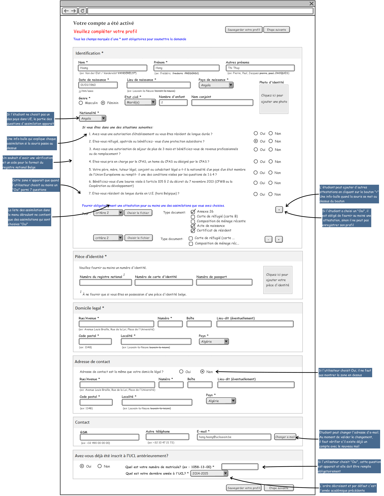
+
La liste des types documents à cocher réduite, il ne contient pas des types que le candidat a déjà cochés.
+
. Choisir l'offre d'étude
+
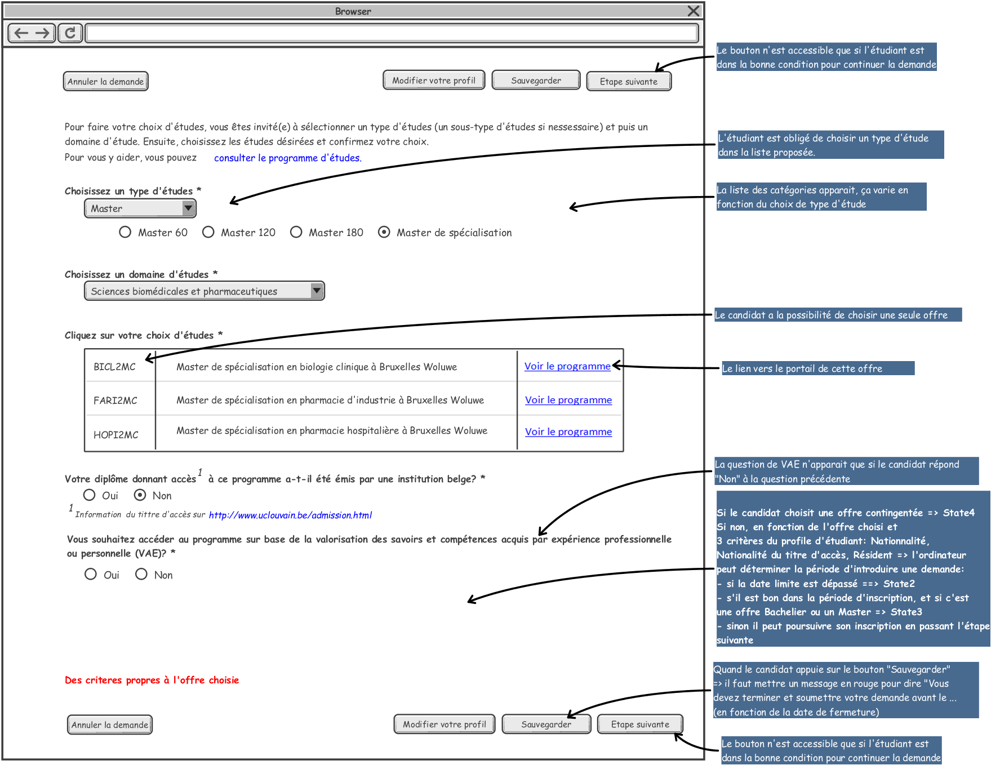
+
Après avoir choisi l'offre, le candidat doit répondre à une question (ou deux questions en fonction de la première réponse) pour savoir si le candidat a le titre d'accès belge ou pas.
+
En se basant sur des informations saisies par le candidat:
+
 - 3 caractéristiques du candidat: la nationalité du candidat, la nationalité du diplôme (titre d'accès), résident.
 - l'offre à laquelle il s'inscrit.
+
Selon le schéma ci-dessous, on peut déterminer:
 - le type de la demande (une demande d'inscription ou une demande d'admission).
 - la période d'introduire la demande en ligne (l'ouverture et la fermeture).
+
image::images/demande_d_inscription/DistinctionEtudiants.png[]
+
Si la période d'introduire la demande en ligne n'est pas encore commencé, on met le message suivant et le candidat ne peut pas poursuivre la demande.
+
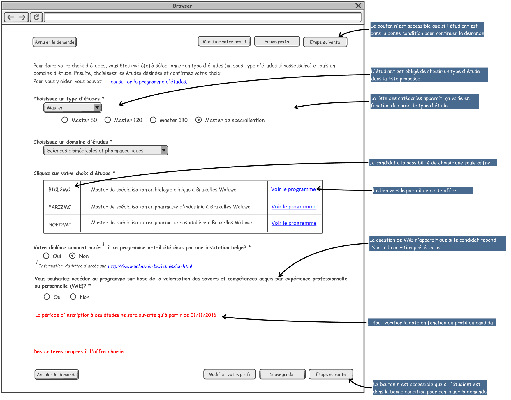
+
Si la période d'introduire la demande en ligne est terminé, on met le message suivant et le candidat ne peut pas poursuivre la demande.
+
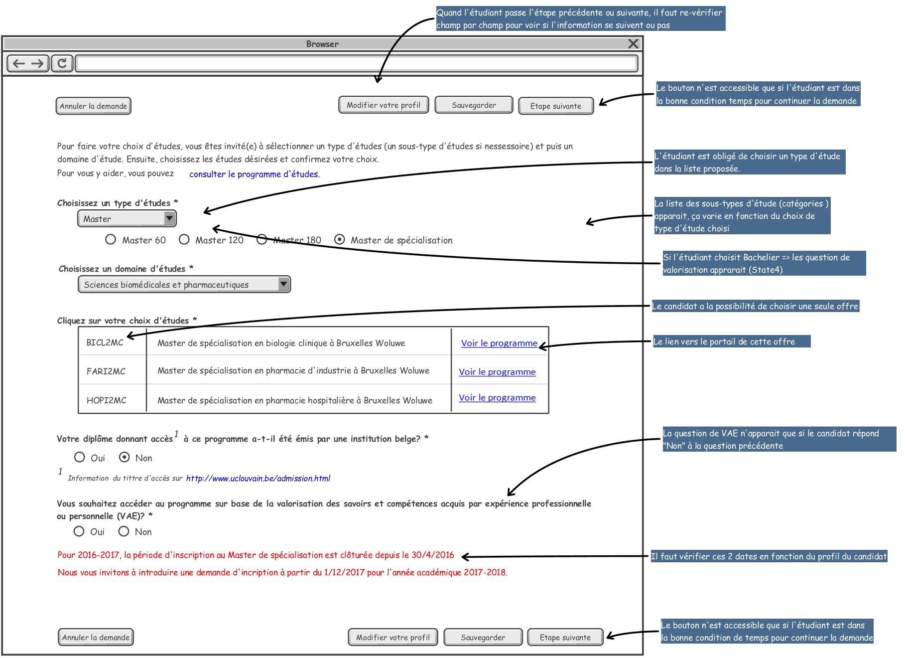
+
S'il est bien dans la période d'introduire la demande, on vérifie si le candidat a choisi une offre "Bachelier" ou "Master", si oui => on pose la question pour savoir si le candidat a déjà fait des études similaires et qu'il veut valoriser des crédits.
(cette information est important qui demande des traitements spécifiques à côté faculté plus tard).
+
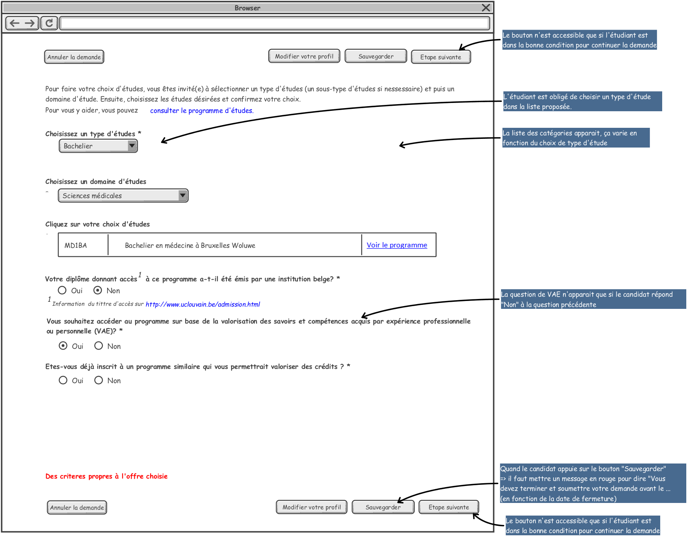
+
Il y a des exceptions pour déterminer le type de la demande (demande d'inscription ou demande d'admission) et pour déterminer des périodes d'introduire la demande, ça concerne des offres suivantes:
+
 * Les offres des études contingentées: KINE1BA, VETE1BA, LOGO1BA, MD1BA, DENT1BA
 * Les offres certificats en médecine: MSP9CE et MSC9CE
 * Les offres doctorats
+
*Offre d'étude contingentée:*
+
Les critères de la distinction du type de demande et les dates pour des études contingentées sont:
+
image::images/demande_d_inscription/DistinctionEtudiants_EtudesContingentées.png[]
+
Si le candidat choisit une offre contingentée (KINE1BA, VETE1BA, LOGO1BA, MD1BA, DENT1BA). La première question est pour savoir si le candidat est déjà inscrit au même programme dans un établissement de la communauté française.
+
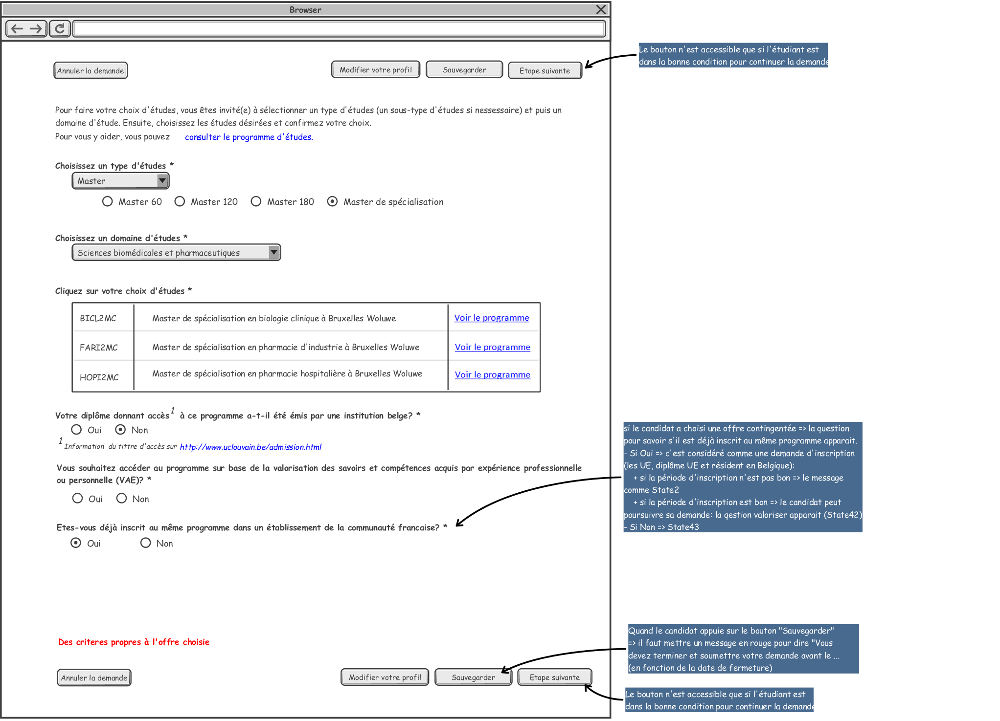
+
- Si le candidat est déjà inscrit au même programme  => la demande est considéré comme une demande d'inscription (= les UE, diplôme UE et résident en Belgique). On vérifie la période d'introduire la demande:
* S'il n'est pas dans la période d'introduire la demande => le message pour dire c'est fermé ou ce n'est pas encore commencé (comme pour les autres offres)
+
* S'il est dans la période d'introduire => la question de valoriser apparait
+

+
- Si le candidat n'est pas inscrit au même programme => on invite le candidat d'aller voir la page réservée aux études contingentées et le candidat doit répondre à la question "Résident" ou "Non-résident".
+
IMPORTANT: Attention: la notion de résident dans des études contingentées est différente que la notion de résident pour les autres offres. Et donc la façon de déterminer une demande d'inscription ou une demande d'admission est différente.
+
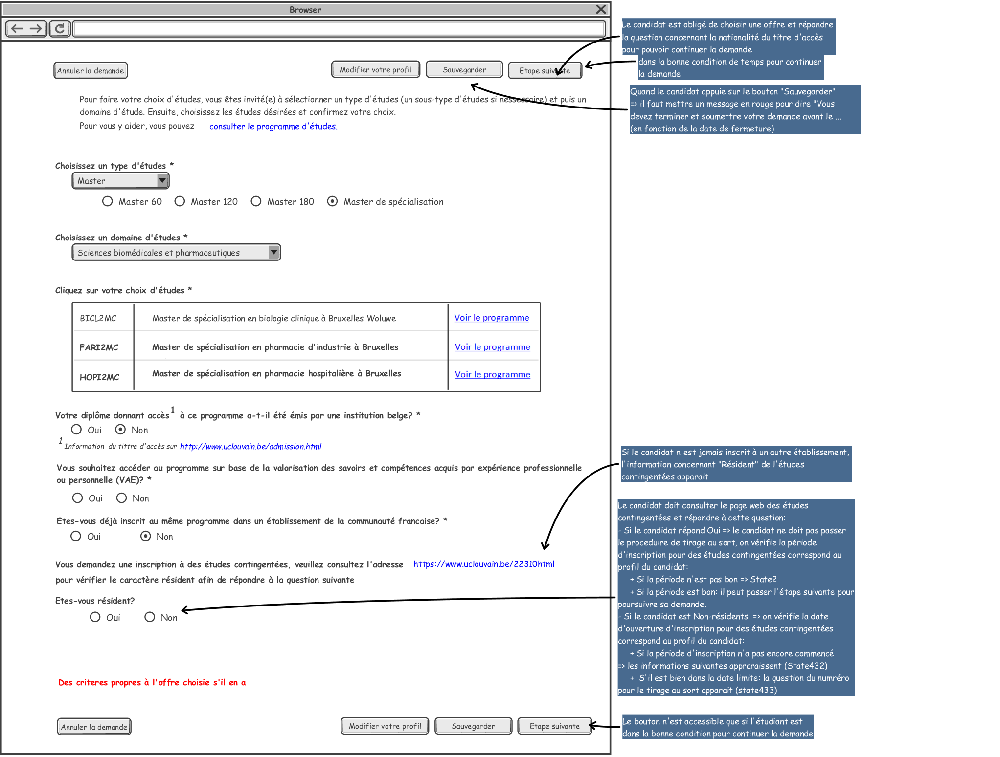
+
* Si le candidat est résident => il ne doit pas passer la procédure de tirage au sort, on vérifie la période d'inscription pour des études contingentées correspond au profil du candidat:
+
** S'il n'est pas dans la période => le message pour dire que c'est fermé ou ce n'est pas ouvert (comme pour les autres offres)
+
** S'il est dans la période: il peut passer l'étape suivante pour poursuivre sa demande.
+
* Si le candidat est Non-résidents  => il doit passer la procédure de tirage au sort organisée par la communauté française.
+
NOTE: La communauté française chaque année détermine la date d'ouverture pour des études contingentées. Ca change chaque année (souvent c'est fin Aout).
+
On vérifie la date d'ouverture pour des études contingentées correspond au profil du candidat:
+
** Si la période n'est pas encore commencée => le message pour demander au candidat de suivre la modalité prévu sur la page réservée aux études contingentées
+
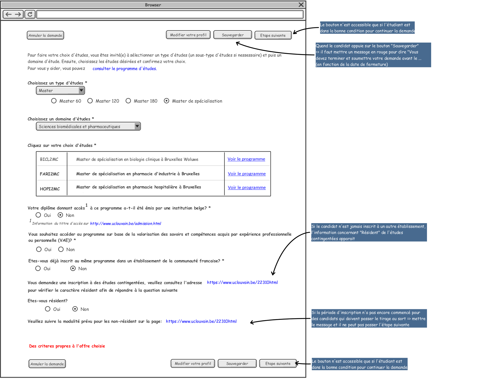
+
** Si la période est finie => le message pour dire que c'est fermé (comme pour les autres offres)
+
** S'il est dans la période d'introduire: la question du numéro du tirage au sort apparait et le candidat est obligé d'encoder le numéro de tirage au sort afin de poursuivre la demande.
+
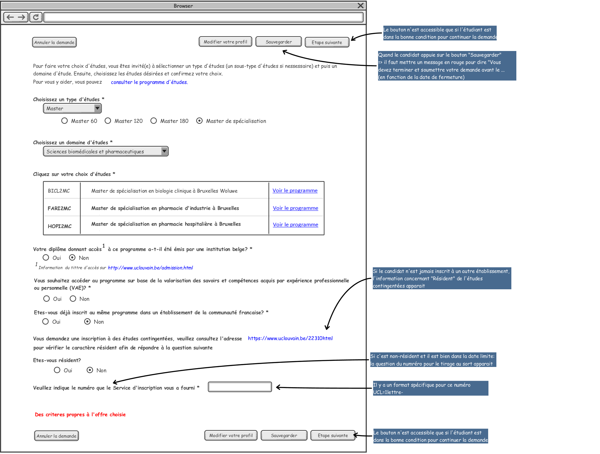
+
*Offre Certificats spécialisées en médecine (MSP9CE et MSC9CE)*
+
Les critères de la distinction d'une demande d'inscription ou une demande d'admission et des dates pour ces offres:
+
image::images/demande_d_inscription/DistinctionEtudiantsMS_9CE.png[]
+
*Offre doctorats*
+
Tous des demandes d'inscription en ligne aux offres doctorats sont considérées comme des demandes d'admission.
+
Il n'y a pas de date d'ouverture, ni fermeture pour des demandes d'inscriptions. Le candidat peut introduire une demande d'inscription n'importe quand (tant que l'année académique n'est pas terminé).
+
. Remplir des diplômes et attestations
+
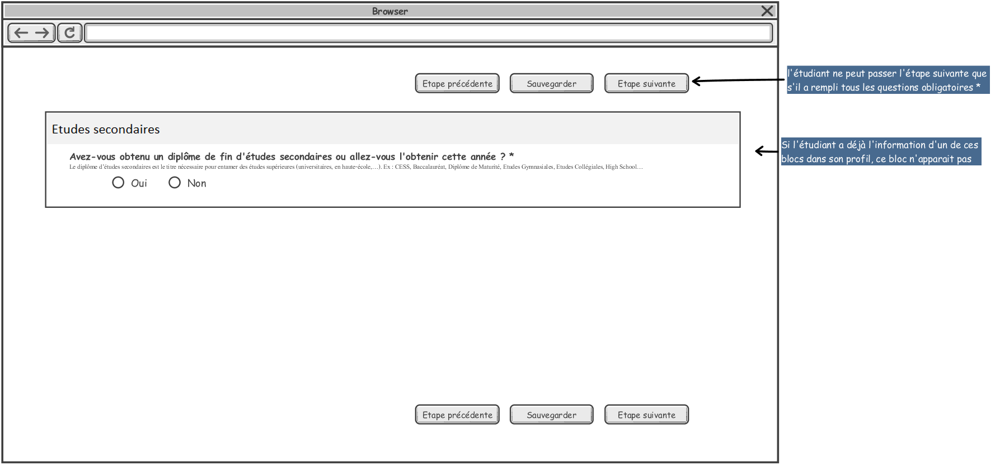
Si le candidat a un diplôme de fin d'études secondaires ou va l'obtenir cette année
+
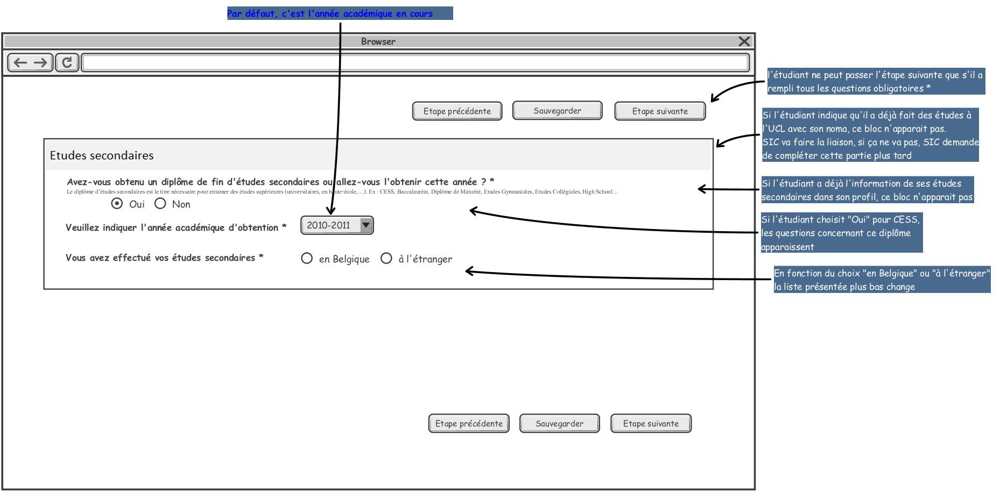
Si le candidat a un diplôme de fin d'études secondaires en Belgique ou va l'obtenir cette année
+
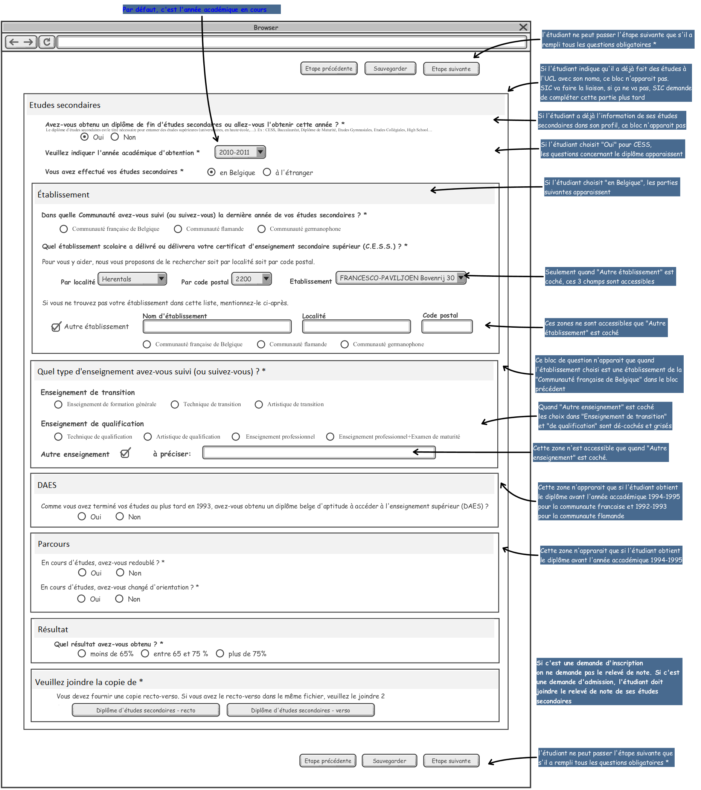
Si le candidat a un diplôme de fin d'études secondaires à l’étranger ou va l'obtenir cette année
+
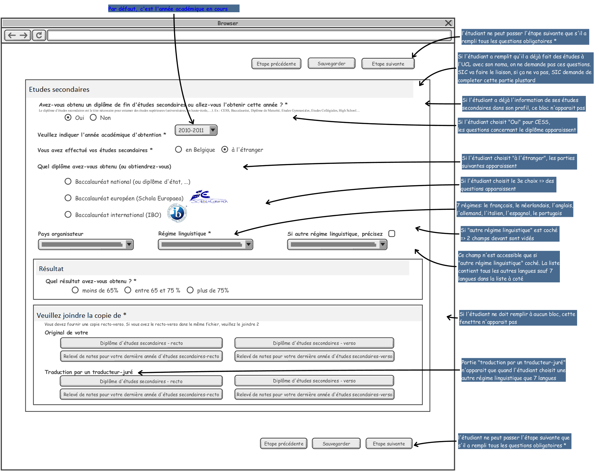
Si le candidat a un diplôme de fin d'études secondaires de type Baccalauréat national  à l’étranger ou va l'obtenir cette année
+
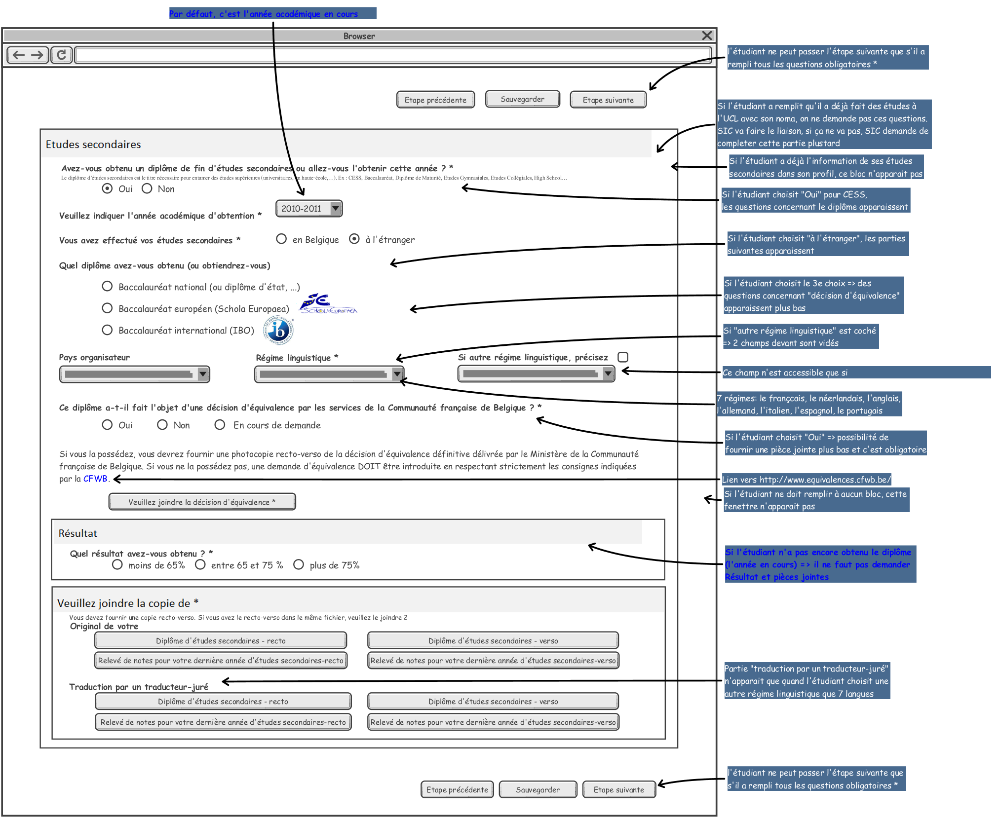
Si le candidat n’a pas fait d'études secondaires, il doit répondre à la question pour l'examen d'admission
+
image::images/demande_d_inscription/remplir_diplome_attestation_state3.png[]
Si le candidat a fait l'examen d'admission
+
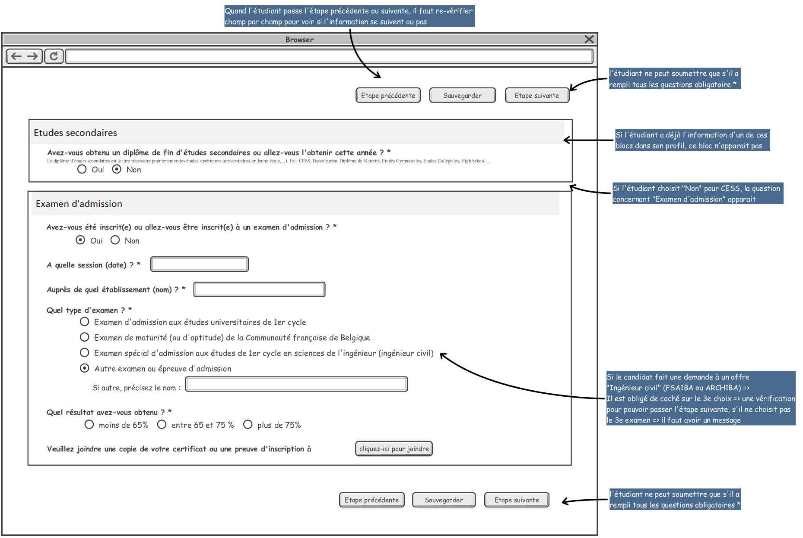
Si le candidat fait une demande d'inscription à un offre "Ingénieur civil" (FSA1BA ou ARCH1BA) => Il est obligé de coché sur le 3e choix
=> une vérification pour pouvoir passer l'étape suivante, s'il ne choisit pas le 3e examen => il faut avoir un message.
Si le candidat n'a pas fait l'examen d'admission, les questions sur le VAE apparaissent
+
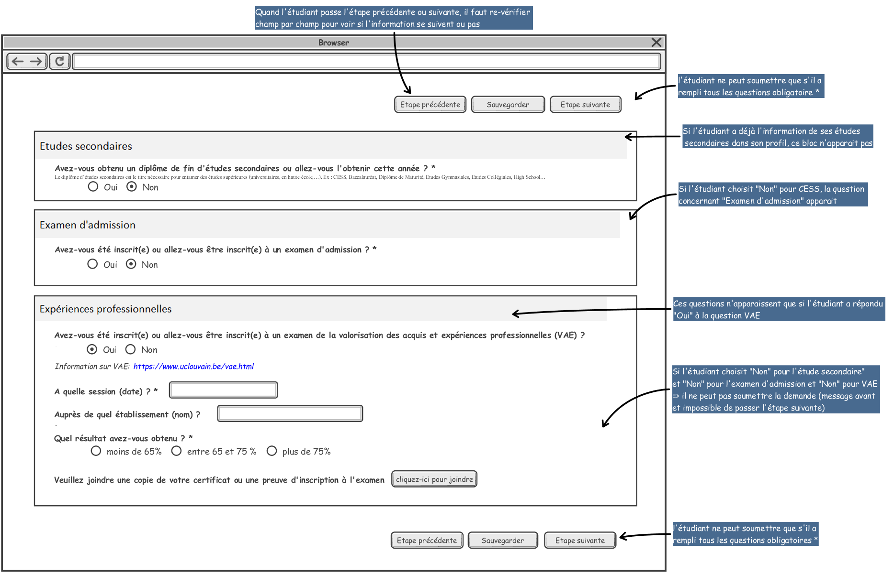
Si le candidat fait une demande à l'offre: Bachelier, Master Didactiques, Agrégation, le bloc des questions concernant l'examen de maîtrise de la langue française apparait.
+
image::images/demande_d_inscription/remplir_diplome_attestation_state4.png[]
+
Si le candidat répond "Oui" à la question de l'examen de maîtrise de la langue française, les autres questions apparaissent
+
image::images/demande_d_inscription/remplir_diplome_attestation_state42.png[]
.	Remplir Curriculum
+
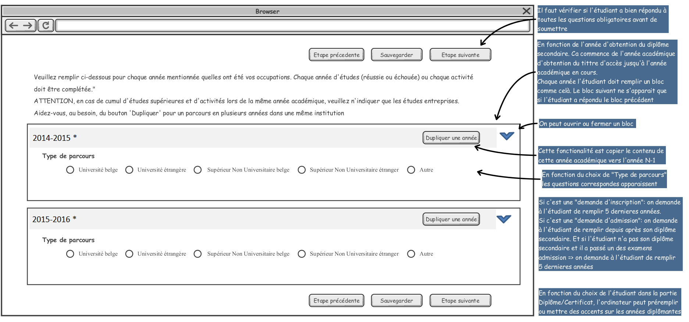
Le candidat a fait "Université belge"
+
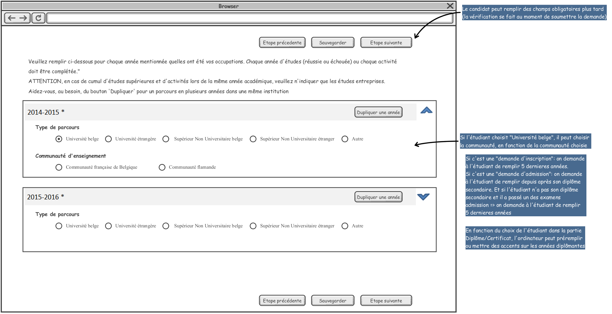
Le candidat a fait "Université belge" et "Communauté française de Belgique"
+
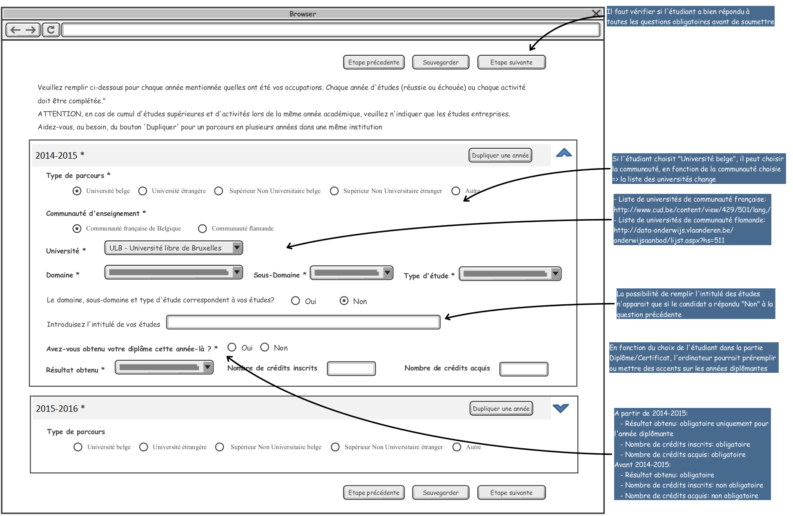
+
 Communauté d'enseignement: on peut le considérer comme le "régime linguistique" pour les études à l'étranger:
    - Communauté française de Belgique => en français
    - Communauté flamande => en néerlandais
+
 Domaine: la liste des domaines d'études du décret Paysage. Le nom de la table dans EPC est epc_dom_decr avec le décret=3 (voir avec la migration de données pour savoir le nom de la table dans OSIS).
+
 Type d'études: la liste des catégories d'études à l'UCL se trouve dans la table etd_etudes_univ_categ (voir avec la migration de données pour savoir le nom de la table dans OSIS).
    - Bachelier
    - Master 60
    - Master 120
    - Master 180 et 240
    - Master de spécialisation
    - Agrégation
    - Certificat
    - Capaes
+
 Résultat obtenu: Réussite, Echec, Pas de résultat
+
Si l'étudiant a obtenu le diplôme pendant l'année indiquée
+
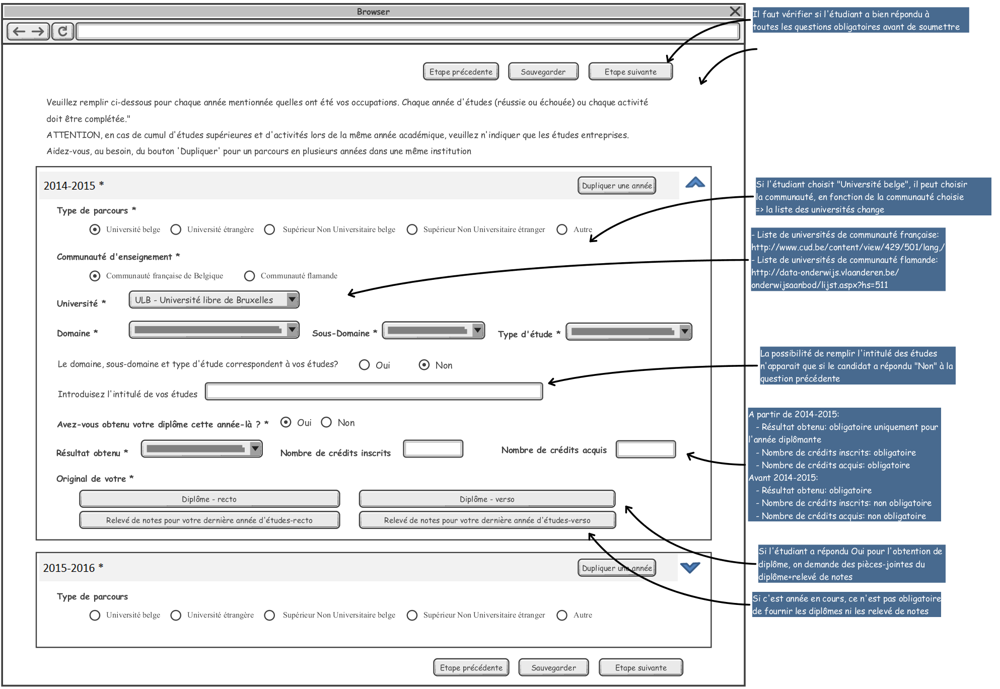
+
Si l'étudiant n'a pas obtenu le diplôme pendant l'année indiquée
+
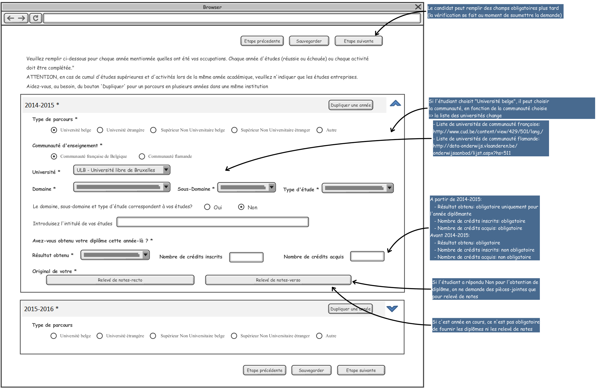
+
L'étudiant a fait "Université étrangère"
+
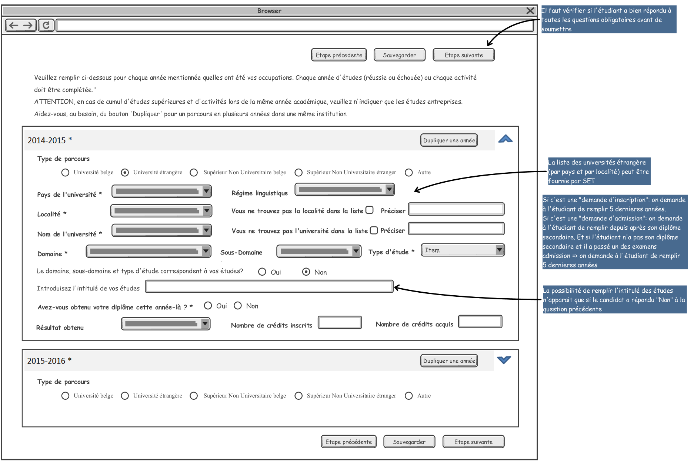
+
 Pays de l'université: il faut utiliser la liste des pays commune de l'application OSIS. Dans EPC c'est la table std.std_pays (voir avec la migration de données pour savoir le nom de la table dans OSIS).
+
 Localité: la liste des localités du pays choisi. Si le candidat choisit une autre localité, il faut avoir le status temporaire de cette localité, les gestionnaires doivant la valider.
+
 Régime linguistique: c'est la liste des langues dans EPC: std.std_langue (voir avec la migration de données pour savoir le nom de la table dans OSIS)
+
 Nom de l'université: la liste des universités de la localité choisie. Si le candidat choisit une autre université et la préciser, il faut prévoir un champ pour stocker l'état d'ajout, c'est l'état temporaire, et les gestionnaires doivent valider.
+
Si l'étudiant indique qu'il a obtenu le diplôme cette année:
+
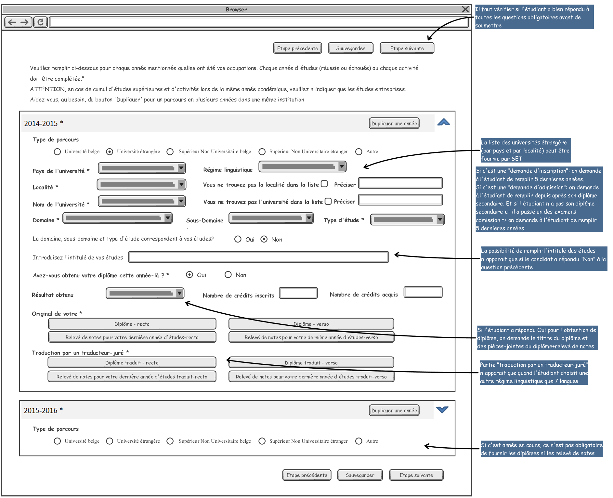
+
L'étudiant a fait "SNU belge"
+
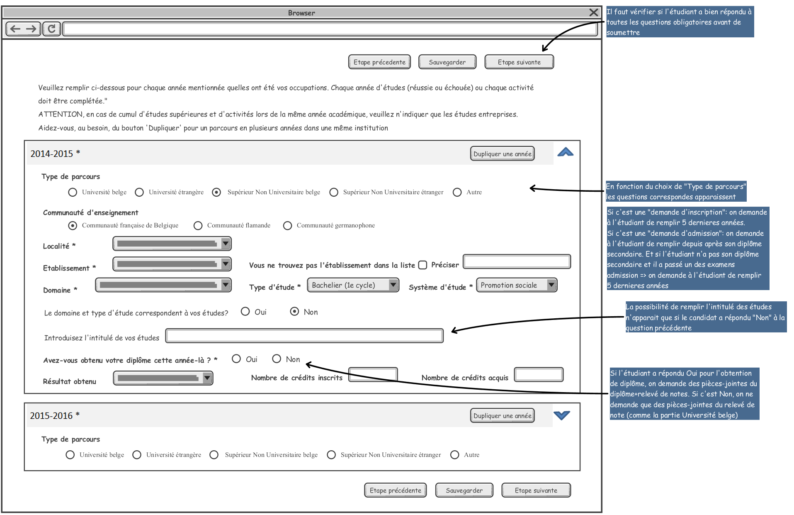
 Communauté d'enseignement: on peut le considérer comme le "régime linguistique" pour les études à l'étranger:
    - Communauté française de Belgique => en francais
    - Communauté flamande => en néerlandais
    - Communauté germanophone => en allemand
+
 Localité: il faut avoir une liste des localités de la Belgique. Dans EPC, c'est la table std.std_localite
+
 Etablissement: la liste des établissements de la localité choisie. Si le candidat choisit un autre établissement et le préciser, il faut prévoir un champ pour stocker l'état d'ajout, c'est l'état temporaire, et le gestionaire doit valider.
+
 Domaine: la liste des domaines des SNU de EPC est dans la table etd_etudes_snu_domaine (voir avec la migration de données pour savoir le nom de la table dans OSIS).
+
 Type d'études: la liste des types d'études de EPC est dans la table etd_etudes_snu_categ (voir avec la migration de données pour savoir le nom de la table dans OSIS).
    - Graduat
    - Baccalauréat (1er cycle)
    - Master (2e cycle)
    - Autres
+
 Système d'étude: "Promotion sociale" ou "Plein exercice". Chaque établissement on doit savoir s'il a quel(s) système d'études. Certain établissement peut avoir 2 systèmes d'étude. Si l'établissement choisi a un seul système d'étude, on ne doit pas cette question. Si le candidat choisit un établissement qui n'est pas dans la liste, il faut apparaitre cette question pour que le candidat précise le système d'étude. Le gestionaire doit repasser pour le valider.
+
L'étudiant a fait "SNU étranger"
+
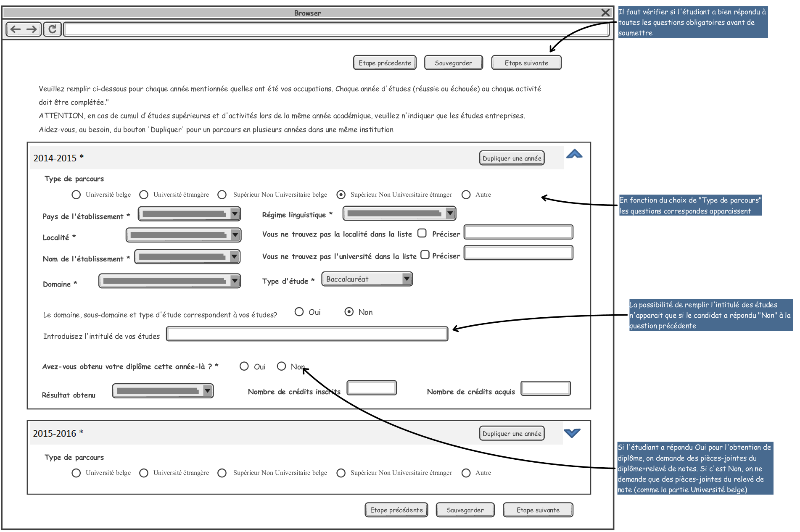
+
 Pays d'établissement: il faut utiliser la liste des pays commune de l'application OSIS
+
 Localité: la liste des localités du pays choisi. Si le candidat choisit une autre localité, il faut avoir le status temporaire de cette localité, les gestionnaires doivant la valider.
+
 Etablissement: la liste des établissements de la localité choisie. Si le candidat choisit un autre établissement et le préciser, il faut prévoir un champ pour stocker l'état d'ajout, c'est l'état temporaire, et le gestionaire doit valider.
+
  Domaine: la liste des domaines des SNU étranger est comme la liste des domaines des SNU belge
+
 Type d'études: la liste des types d'études de EPC est dans la table etd_etudes_snu_categ (voir avec la migration de données pour savoir le nom de la table dans OSIS)
+
Si l'étudiant indique qu'il a obtenu le diplôme cette année:
+
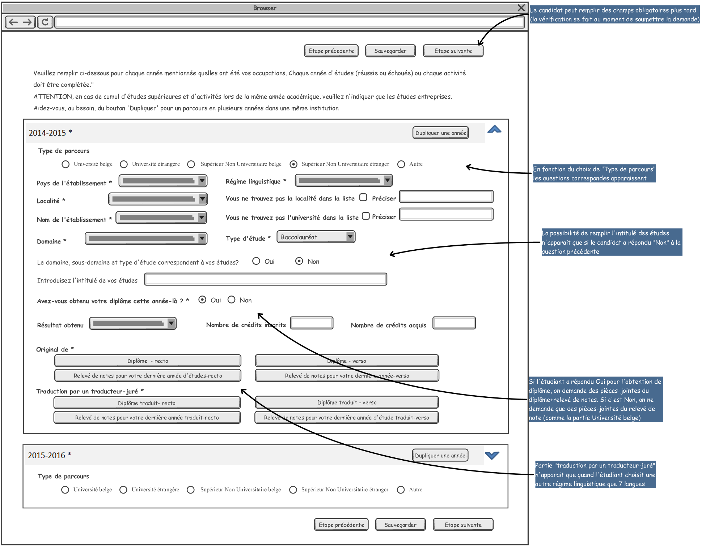
+
Si l'étudiant n'a pas obtenu le diplôme pendant l'année indiquée
+
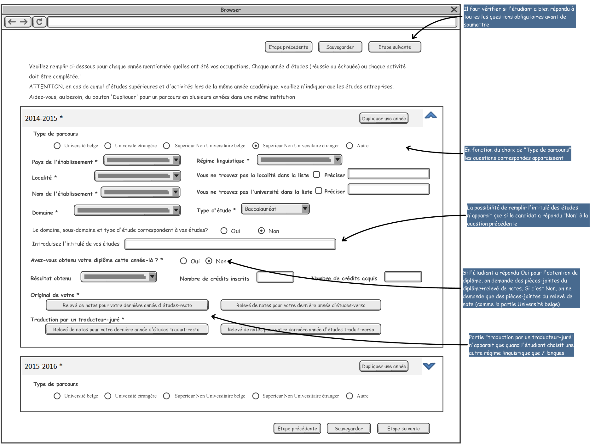
+
Le candidat remplit "Autre":
+
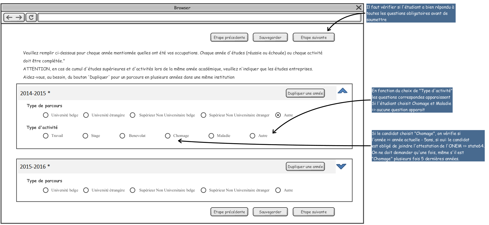
+
Si le candidat remplit "Autre" et choisit: Travail, Stage, Benevalat: la question "À quel endroit?" apparait
+
image::images/demande_d_inscription/remplir_CV_state62.png[]
+
Si le candidat remplit "Autre" et choisit: Chomage ou Maladie => rien qui apparait
+
Si le candidat choisit "Chomage", on vérifie si l'année >= année actuelle - 5ans, si oui: le candidat est obligé de joindre l'attestation de l'ONEM.
+
NOTE: On ne doit demander qu'une fois, même s'il est "Chomage" plusieurs fois 5 dernières années.
+
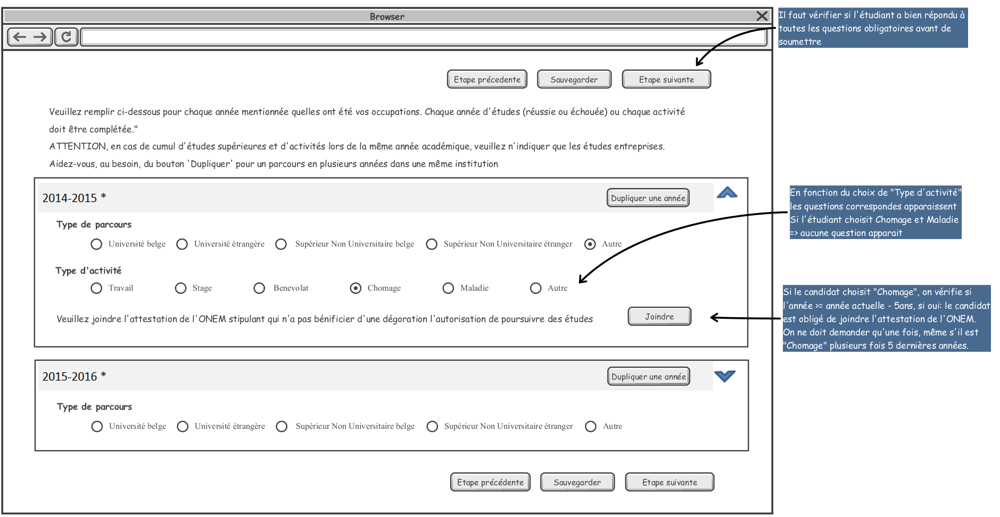
+
Si le candidat remplit "Autre" et choisit "Autre" comme Type d'activité
+
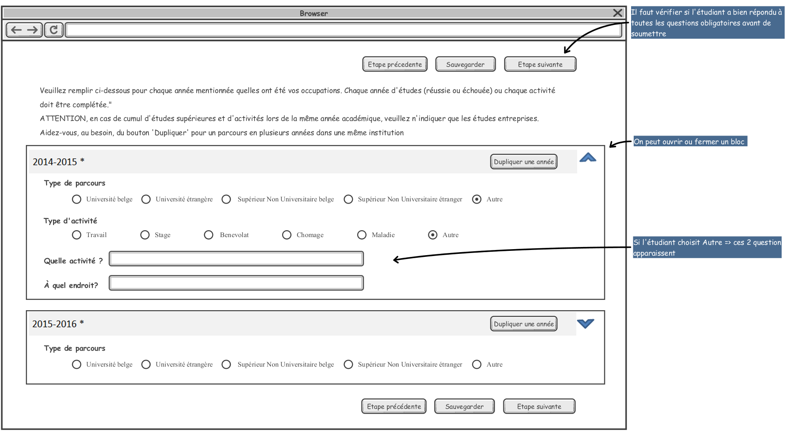
+
. Ajouter les pièces jointes supplémentaires
+
 - Pour les demandes d'inscription: le candidat n'est obligé de joindre aucune pièce. Mais s'il veut il peut ajouter des pièces jointes.
+
image::images/demande_d_inscription/ajouter_les_pieces_jointes_suppl_inscription.png[]
+
 S'il y a plus qu'une pièce jointe, le candidat clique sur le bouton "+" pour ajouter une autre pièce
+
image::images/demande_d_inscription/ajouter_les_pieces_jointes_suppl_inscription_state2.png[]
+
 Si le candidat ne trouve pas le type document dans la liste, il choisit "Autre" et précise le type du document.
+
image::images/demande_d_inscription/ajouter_les_pieces_jointes_suppl_inscription_state22.png[]
+
- Pour les demandes d'admission: le candidat est obligé de joindre le CV et la lettre de motivation
+
image::images/demande_d_inscription/ajouter_les_pieces_jointes_suppl_admission.png[]
+
 Le candidat peut ajouter d'autres types de pièces jointes comme pour les demandes d'inscription.
+
. Remplir Comptabilité
+
Pour la partie "Réduction": les questions changent en fonction du cycle d'offre:
+
 - Pour les offres du premier cycle: Bachelier (1BA), des Masters du 2eme cycle: Master en 1 an (2M1), Master Didactique (2MD), Master Approfondie (2MA), Master spécialisée (2MS/...):
+
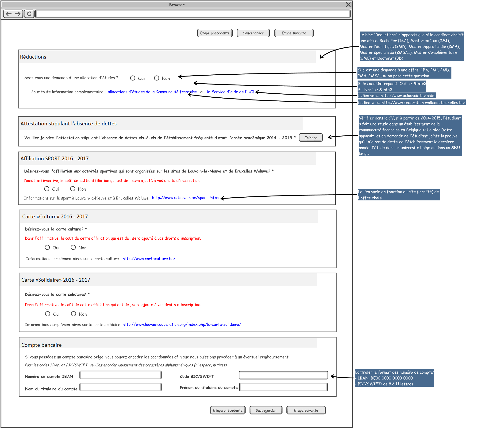
+
Si le candidat répond "Oui" à la question "Allocation d'études"
+
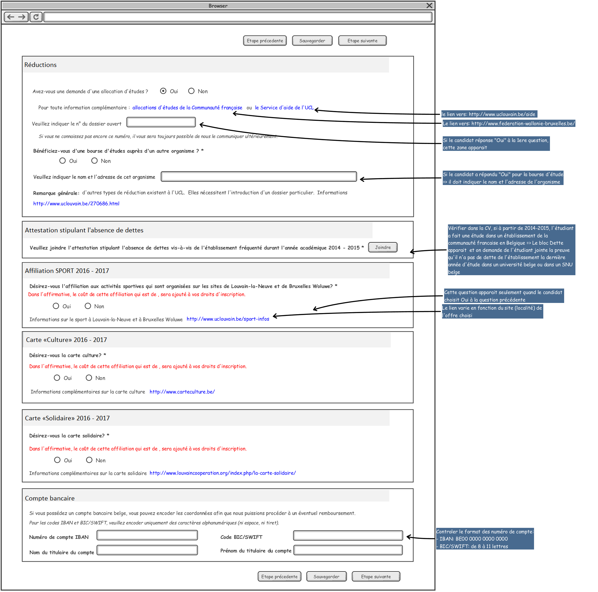
+
Si le candidat répond "Non" à la question "Allocation d'études"
+
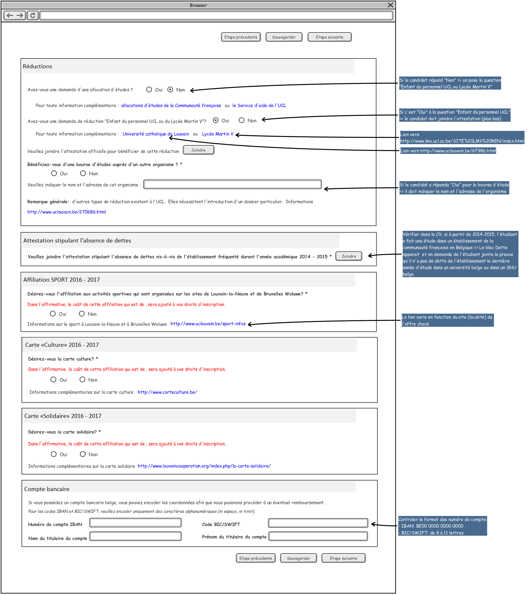
+
 - Pour le 3 cycle Doctorat (3D) et Master Complémentaire (2MC)
+
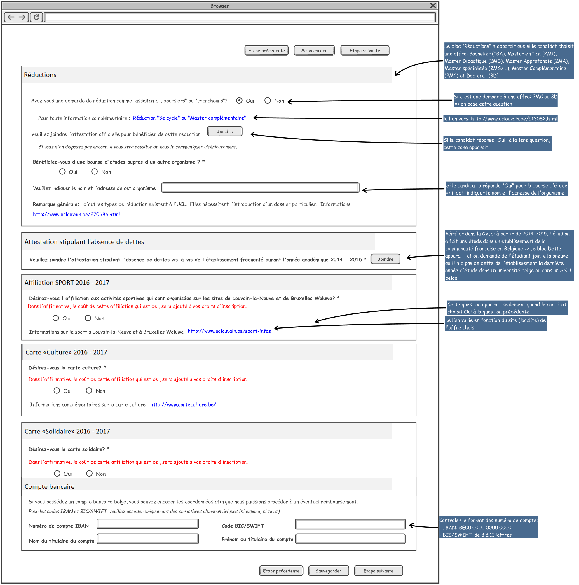
+
. Remplir l'enquête sociologique
+
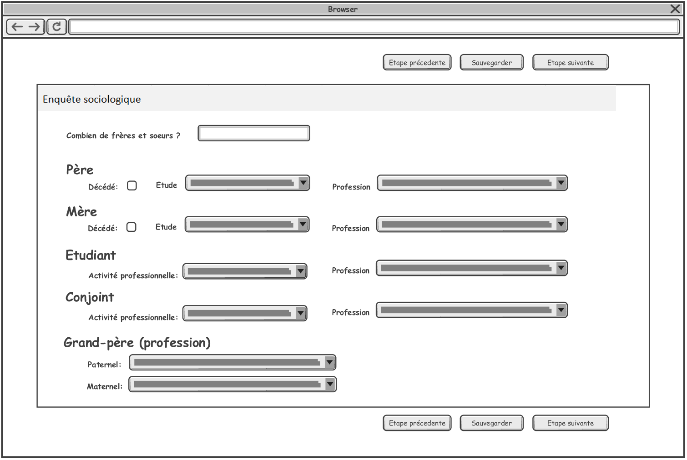
+
. Confirmer la demande
+
image::images/demande_d_inscription/confirmer_la_demande.png[]
. Confirmer la soumission
+
image::images/demande_d_inscription/confirmer_la_soumission_d_inscription.png[]
+
*Le numéro de référence:*
+
- Pour la première demande, on ne voit ce numéro qu'à la soumission
- A partir de la deuxième demande d'un compte, ce numéro est visible avant que la demande soit soumise.
+
*Ce numéro se compose: 2 lettres-2 chiffres-6 chiffres-2 chiffres*
- 2 lettres: est l'initial d'une personne en SIC qui est assigné à la gestionnaire de l'offre choisie. Par exemple: PR est l'initial de Patrick Royez. Un initial par personne en SIC. +
Il y aura une interface permet un utilisateur ayant le droit spécifique configure le lien entre l'initial est l'offre.
- 2 chiffres: 2 derniers chiffres de l'année de création de la demande.
- 6 chiffres: un numéro de séquence est attribué, c'est le numéro qui peut déterminer le compte d'étudiant candidat.
- 2 chiffres: c'est quantième de demande créer par cet étudiant.
+
. Générer le nouveau mot de passe
+
image::images/demande_d_inscription/generer_le_nouveau_mot_de_passe.png[]
. Envoyer un e-mail pour le changement du mot de passe
+
image::images/demande_d_inscription/envoyer_un_e-mail_pour_le_changement_du_mot_de_passe.png[]
+
NOTE: Le type de mail envoyé varie en fonction de type de demande (demande d'incription ou demande d'admission). +
Pour chaque type de mail, ça varie en fonction de l'offre choisie et du site (localité) de l'offre.
+
*A préciser ....*
. Visualiser le compte
+
image::images/demande_d_inscription/visualiser_le_compte.png[]
+
CAUTION: L'étudiant a la possibilité d'introduire une nouvelle demande mais pour *une année académique* le candidat ne peut introduire maximum 2 demandes d'admission et 1 demande d'inscription
+
. Mettre à jour le profil
+
image::images/demande_d_inscription/mettre_a_jour_le_profil.png[]
+
. Visualiser une demande
+
image::images/demande_d_inscription/visualiser_une_demande_d_inscription.png[]
