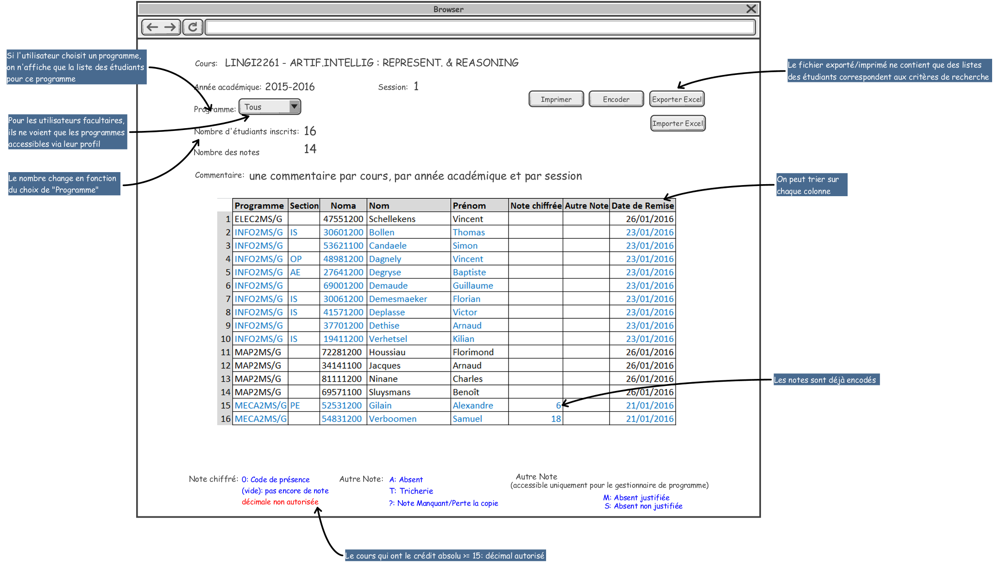
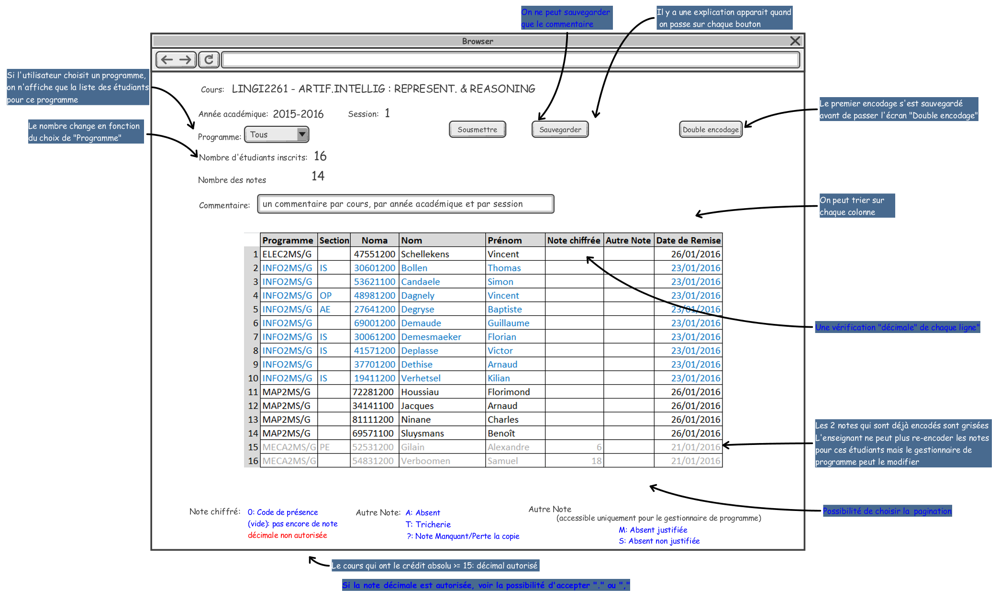
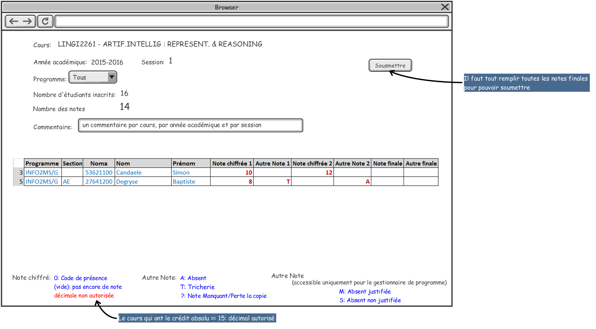
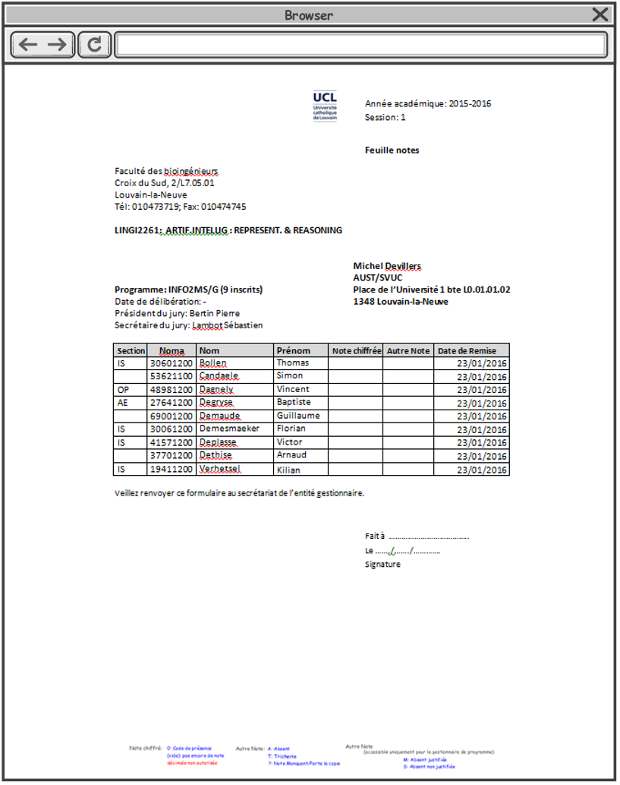
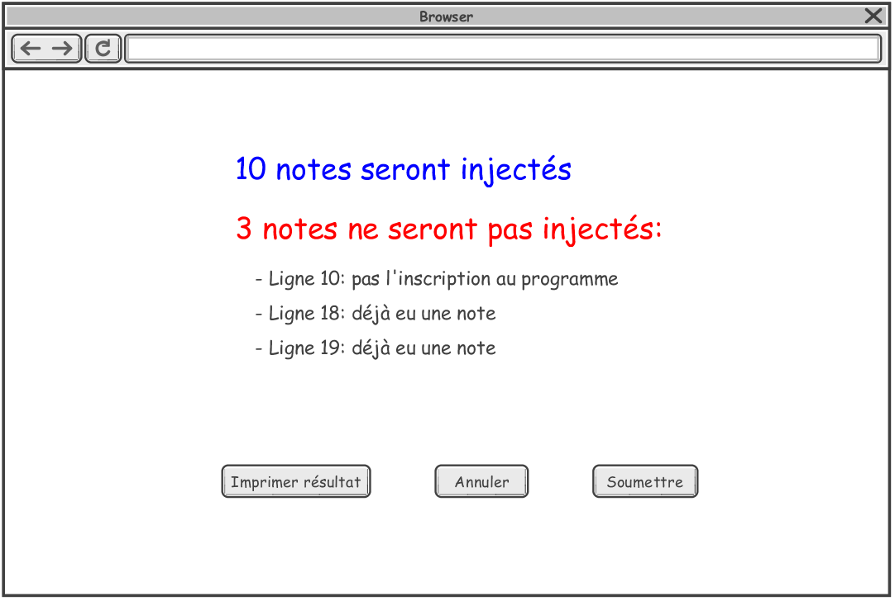

[[scores_encoding]]
==== Encodage des notes
===== Description générale et fonctionnalités
Le module d'encodage des notes est destiné aux gestionnaires de programme et aux enseignants, pour leur permettre,
à l'occasion des sessions d'examens, d'encoder de grandes quantités de notes. L'encodage peut se faire directement
dans l'application (avec une possibilité complémentaire de vérification via le double encodage) ou par importation
de fichier excel (sous un format prédéfini). +

Les 3 sessions d'examens concernées sont:

* Session 1: pour l'examen organisé en Janvier
* Session 2: pour l'examen organisé en Juin
* Session 3: pour l'examen organisé en Septembre

A chaque session d'examen doivent être associées deux dates (et heures) spécifiques, via l'interface adhoc (accessible actuellement via EPC/Parcours):

* date de début de encodage (par défaut calquée sur la date de début de session)
* date limite (fin) pour la remise ou l'encodage des notes par les enseignants (après cette date, l'encodage n'est plus possible)
* date de délibération

L'application permet, à tout moment, de sauvegarder le travail d'encodage déjà réalisé.

Un utilisateur dispose de différentes fonctionnalités suivant son rôle et les responsabilités qui s'y rapportent:

Enseignant:: A chaque unité d'enseignement est associé un ou plusieurs enseignants. A ce titre, il peut encoder et enregistrer
les notes d'examen des tous les étudiants inscrits à son cours.
Ces notes sauvergardées ne sont toutefois pas transmises au secrétariat facultaire automatiquement; une étape complémentaire
de soumission est encore nécessaire (cfr. responsable des notes ci-dessous).

Responsable des notes:: Pour chaque unité d'enseignement, un seul responsable des notes doit être identifié parmi les enseignants.
A ce jour, ce rôle n'est pas défini dans EPC; par conséquent , il a été convenu ce qui suit :
- s'il y a un seul enseignant => c'est cet enseignant. +
- s'il y a plusieurs enseignants et un coordinateur => c'est le coordinateur. +
- s'il y a plusieurs enseignants et il n'y a pas de coordinateur => premier enseignant par ordre alphabétique.

 Si le choix automatique ainsi opéré ne correspond pas à ce qui est souhaité, un coordinateur doit être désigné via le module "atttribution" d'EPC.

La responsabilité spécifique du responsable des notes est de "soumettre" les notes une fois qu'il considère qu'elles sont
vérifiées et valides.  Il peut soumettre (et donc valider) une partie seulement des notes (l'encodage complet du cours n'est
pas nécessaire). Cette soumission transfère la responsabilité de la gestion ultérieure des notes au secrétariat
facultaire (cfr. gestionnaire de programmes ci-dessous).  L'encodage (en ligne ou via importation excel) n'est alors plus disponible pour ces notes.

Gestionnaire de programme:: pour chaque programme, le Directeur administratif de faculté (DAF) désigne un ou plusieurs gestionnaires.+

+
IMPORTANT: Le gestionnaire du programme doit déterminer et encoder (pour l'instant dans EPC/Parcours), par programme, les date limite d'encodage des notes et de délibération.
Une fois la date limite d'encodage des notes passée, les enseignants ne peuventt plus encoder de notes; il n'y a que les gestionnaires de programmes qui peuvent encore les encoder ou les modifier.
De cette manière, les gestionnaires de programmes sont les seuls à garder la main sur la préparation des délibérations.
+
IMPORTANT: Tant que le programme n'a pas été délibéré, le gestionnaire du programme, peut encoder les notes des étudiants
du (des) programme(s) qu'il gère: +
- directement dans l'application (sur base p.ex. d'une feuille de note reçue d'un enseignant)
- par importation d'un fichier excel reçu d'un enseignant
A tout moment, et jusqu'à la délibération, il peut modifier les notes, y compris celles déjà soumise par le responsable des notes. +
Après la délibération, (ou en dehors des sessions en cours) il doit passer à une autre fonctionnalité dans l'application
(aujourd'hui EPC/Parcours, demain dans OSIS) pour modifier ou encoder une note, mais pour **un seul étudiant** à la fois.
+

===== Les fonctionnalités d'encodage

*Trois alternatives sont proposées aux enseignants pour l'encodage des notes:*

. L'encodage direct par l'enseignant:
+
L'enseignant utilise l'application OSIS pour encoder les notes de son cours. Il peut encoder l'ensemble des notes ou une
partie seulement. A tout moment, l'enseignant peut sauvergarder les notes déjà encodées. Pour améliorer la qualité de
l'encodage, l'enseignant peut avoir recours au double encodage.+
Par ailleurs, à n'importe quel moment (avant la date limite d'encodage), le responsable des notes peut soumettre
l'ensemble des notes déjà encodées par les enseignants.  Ce faisant, il les valide et en transfère la responsabilité aux
gestionnaires de programmes.  Cette étape de soumission est obligatoire pour que les notes soient prises en compte par les
gestionnaires.+

+
. L'encodage traditionnel:
+
L'enseignant imprime les feuilles de notes de ses unités d'enseignement via l'application OSIS, les remplit et les envoie
aux responsables de chaque programme. +
Le gestionnaire du programme utilise alors l'application pour encoder les notes reçues des enseignants.
Le gestionnaire bénéficie des mêmes fonctionnalités d'encodage que les enseignants (sauvegarde et double encodage).
Par contre, les notes encodées par le gestionnaire ne nécessitent évidemment pas de soumission

. L'encodage par fichier Excel:
+
L'applicatioon permet de générer un fichier Excel reprenant la liste des étudiants, par cours et par session. Les
enseignants encodent leurs notes dans le fichier Excel, qui peut être ultérieurement injecté dans l'appplication OSIS.
L'enseignant peut, si nécessaire, rajouter des lignes au fichier, mais en respectant le format des colonnes existantes;
il peut également rajouter des colonnes après la dernière. +
L'injection des notes via le fichier Excel est disponible pour le responsable de programme et le responsable de notes.

====== L'encodage de notes en détail

. *Sélectionner une unité d'enseignement*
+
Cette page est la première étape sur le processus d'encodage de notes d'*un enseignant*. +
+
image::images/encodage_notes/selectionner-un-cours.png[]
+
Quand l'enseignant est connecté, son nom complet apparaît automatiquement. +
L'année académique et la session d'examen sont calculées en fonction de la date qui débute chaque session de l'année académique actuelle. +
Le statut: nombre des notes qui sont encodés sur le total, calculé en fonction du nombre d'étudiants accessible par l'utilisateur. :
+
 - Pour l'enseignant: c'est le nombre de tous les étudiants inscrit à la session indiquée.
 - Pour les gestionnaires de programme: c'est le nombre des inscriptions à la session indiquée des programmes qu'il gère.
+
Si l'enseignant choisit le processus d'encodage direct, il clique sur cette unité d'enseignement pour commencer l'encodage. +
+
Si l'enseignant choisit le processus traditionnel, il doit choisir des unités d'enseignement en cochant sur la boîte et sur le bouton "Imprimer les feuilles de notes".
+
. *Choisir le type d'encodage*
+

+
Le tableau contient le résultat de la recherche avec des critères au-dessus du tableau. Toute la liste est présentée, il n'y a pas de pagination.
+
Le fichier exporté contient la liste de même nombre d'étudiants, même ordre que le tableau. Le fichier peut avoir plus des colonnes.
+
La liste des programmes présentés dans le tableau et dans le menu déroulant sont des programmes accessibles à cet utilisateur (en se basant sur son profil).
+
Concrètement:
+
 - pour un gestionnaire de programme, le menu déroulant "Programme" lui permet de filtrer selon les programmes dont il est responsable.
 - pour un enseignant, le menu déroulant "Programme" lui permet de filtrer selon les programmes suivis par au moins un étudiant inscrit à cette unité d'enseignement.
+
Le nombre d'étudiants inscrits et le nombre des notes changent en fonction du choix de "Programme".
+
Commentaire: un commentaire par cours, par année académique et par session.
+
L'unité d'enseignement qui ont le crédit absolu >= 15: décimal autorisé.
+
Les notes déjà encodés sont grisées.
+
On peut trier sur chaque colonne.
+
. *Encoder les notes*
+
NOTE: Tous les enseignants peuvent encoder et sauvegarder les notes, mais seulement le responsable des notes de l'unité d'enseignement peut soumettre les notes.
+

+
On peut sauvegarder uniquement le commentaire.
+
Il y a une explication (info-bulle) apparait quand on passe sur chaque bouton.
+
Les notes qui sont déjà encodées sont grisées. L'enseignant ne peut plus re-encoder les notes pour ces étudiants mais le gestionnaire de programme peut les modifier. +
+
L'unité d'enseignement qui a le crédit absolu >= 15: décimal autorisé, sinon l'utilisateur ne peut pas soumettre des notes avec le décimal.
+
Une vérification "décimale" quand on va à la ligne pour chaque ligne. Mettre la couleur en rouge et un pop-up si la souris passe au-dessus de la note pour dire "Décimal non autorisée pour cette unité d'enseignement".
+
La liste des étudiants à encoder contient maximum 25 étudiants par page. L'utilisateur peut encoder/sauvegarder une page ou plusieurs pages et faire le double encodage pour vérifier tous ce qu'il a déjà encodé.
+
Le premier encodage s'est sauvegardé avant de passer l'écran "Double encodage".
+
. *Double-encoder les notes*
+
image::images/encodage_notes/double-encoder-les-notes.png[]
+
La liste des étudiants pour le double encodage contient tous les étudiants de la recherche, mais l'utilisateur peut re-encoder seulement les notes qui sont déjà encodé la première fois.
+
Pendant le double encodage, si on détecte qu'il y a une erreur par rapport à la première fois, on met la couleur rouge à la note. Et si l'utilisateur met la souris sur une note en rouge, il y a la note du premier encodage qui apparait. +
Tant que l'utilisateur ne fait pas "Comparer", il peut toujours modifier ses notes de double encodage.
+
En même principe que l'encodage, 25 étudiants par page.
+
. *Comparer les notes*
+
image::images/encodage_notes/comparer-2-encodages.png[]
+
Le bouton "Encoder les notes finales" n'est disponible que quand les 2 colonnes notes ou les 2 colonnes motifs ne sont pas identiques. +
Le bouton "Soumettre" n'est disponible que quand les 2 colonnes notes et les 2 colonnes motifs sont identiques.
+
. *Encoder les notes finales*
+

+
La liste ne contient que des erreurs.
+
Il faut remplir toutes les notes finales pour pouvoir soumettre.
+
. *Confirmer la soumission*
+
image::images/encodage_notes/confirmer-la-soumission.png[]
+
Un e-mail récapitulatif de la soumission envoyé à tous les enseignants du cours.
+
. *Imprimer la feuille de notes*
+

+
"Date de délibération": Date de délibération du programme. +
"Président de jury": le mandataire "président de jury" de l'offre. +
"Secrétaire du jury" le mandataire "secrétaire du jury" de l'offre. +
L'adresse interne de l'enseignant.
+
. *Affiner la recherche*
+
image::images/encodage_notes/affiner-la-recherche.png[]
+
La premier l'interface des gestionnaires de programme quand veulent encoder les notes. Le gestionnaire peut filtrer par programmes (dont il est responsable), et par enseignant (qui enseigne les unités d'enseignement qui sont suivis par au moins un étudiant des programmes dont il est responsable. +
La liste présentée est la liste de tous les unités d'enseignement qui ont au moins d'un étudiant du programme donnée.
+
. *Générer le fichier d'importation*
+
image::images/encodage_notes/generer-le-fichier-d-importation.png[]
+
On fournit le fichier excel avec 11 colonnes dans l'ordre donnée. +
Les notes sont déjà encodées se trouvent dans le fichier Excel de manier "grisée". +
La liste des étudiants sont trié par programme et puis par Nom.
+
. *Compléter le fichier Excel*
+
image::images/encodage_notes/completer-le-fichier.png[]
+
Les enseignants et les gestionnaires de programme peuvent injecter le fichier Excel.
Après avoir injecté, les notes sont sauvegardées sous le statut "Enregistré" (pas le statut soumis). L'utilisateur peut injecter autant de fois qu'il veut. Seulement le responsable des notes et les gestionnaires de programme peuvent soumettre des notes. +
L'utilisateur doit garder 10 premières colonnes. L'utilisateur peut ajouter d'autres colonnes après la 10eme colonne. +
S'il existe 2 lignes de même noma => message d'erreur. +
Il finit d'injection à la fin du fichier Excel (même s'il y a des lignes blanches au milieu). +
L'utilisateur peut ajouter des lignes.
+
NOTE: Une note sera enregistré si et seulement si les données de toutes les cellules (de A à J) de la ligne sont corrects
+
. *Importer le fichier compété*
+
image::images/encodage_notes/importer-le-fichier-complete.png[]
+
Des étudiants ont déjà une note => pas d'injection de note pour ces étudiants. +
Si l'information d'une cellule (10 première colonne) n'est pas correct => pas d'injection.
+
. *Récapituler l'importation*
+

+
. *Confirmer l'importation*
+
image::images/encodage_notes/confirmer-l-importation.png[]

image::images/encodage_notes/encodage-de-notes.png[]
