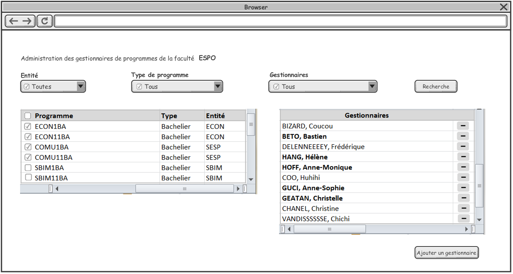
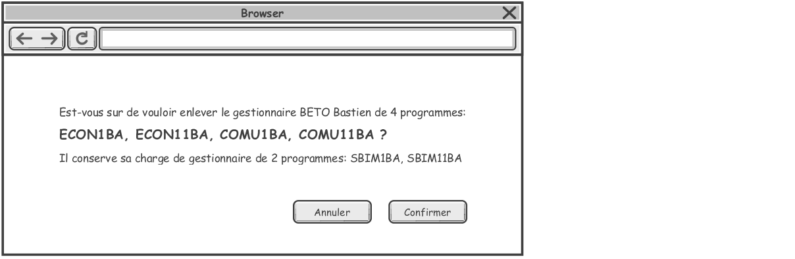

= Gestion des droits

== Administration des gestionnaires de programmes

Pour chaque faculté, il y a une (ou plusieurs) personnes qui ont le droit de
modifier des gestionnaires de programmes de cette faculté. Cette personne est
souvent la ou le DAF (Directeur administratif facultaire) de la faculté.
Cependant ce rôle peut être attribué à une autre personne.

On assignera à la personne un droit d'administrer des gestionnaires de
programmes d'une faculté.

TIP: Il existe des programmes rattachés aux secteurs, aux Commissions
d'enseignement qui sont rattachées aux secteurs (typiquement des doctorats).
Dans un premier temps, on ne donne pas la gestion à ces programmes via notre
interface. Les demandes devront passer par le Service Desk.

Quand la personne en charge se connecte pour gérer les gestionnaires de sa
faculté, elle voit l'écran suivant:

image::images/administrer_gestionnaire_programme/gestion-des-gestionnaires-programme.png[]

=== Le contenu de l'écran

. La faculté indiquée est la faculté à laquelle l'utilisateur est affecté pour
  la gestion des gestionnaires de programme.
. Le menu déroulant "Entité" contient:
 - Toutes (par défaut)
 - L'entité faculté elle-même (ex: ESPO)
 - La liste de toutes les entités qui sont rattachées à cette faculté.
 - L'utilisateur peut choisir soit "Toutes", soit une ou plusieurs entités dans
   la liste en cochant l'entité. Si aucune entité n'est cochée, on considère que
   l'utilisateur a choisi "Toutes".
. La liste des types de programmes: ces types peuvent être identifiés par les
  lettres finales du code du programme.
 - Tous (par défaut)
 - Bachelier (BA)
 - Master en un an (M1)
 - Master approfondi (MA)
 - Master didactique (MD)
 - Master spécialisé (MS/..) (.. peut être "G" ou 2 lettres aux choix
   d'utilisateur). Exemple: COMU2MS/EJ, COMU2MS/SE, ARCH2MS/G
 - Master de spécialisation (MC) (avant 2014 c'est Master complémentaire)
 - Agrégation (A)
 - Formation Continue (FC)
 - Certificat (CE)
 - Doctorat (D et DP)
 - Formation doctorat (FD et FP)
 - Cours isolés (IS)
 - Junior Year (JY)
 - Cours de langue (LV)
 - Stagiaire (ST)
 - Concours d'accès (CA)
. Gestionnaire:
 - Tous (par défaut)
 - La liste de tous les gestionnaires qui gèrent au moins un programme de la
   faculté concernée.
 - L'utilisateur peut choisir soit Tous, soit un ou plusieurs gestionnaires dans
   la liste des gestionnaires.

TIP: Il existe d'autre types de programmes mais qui ne nécessitent pas d'être
présentés dans cette partie de l'application. L'on ne présentera donc pas dans
la liste.

=== Le comportement de l'écran

. La liste des programmes:
 - Par défaut, on affiche la liste des programmes en fonction du résultat de la
   recherche. Les programmes ne sont pas cochés par défaut. A chaque résultat
   d'une nouvelle recherche, des programmes ne sont pas cochés.
 - L'utilisateur peut choisir une ou plusieurs programmes.
 - L'utilisateur peut choisir toutes les programmes en cochant la boite à côté
   "Programme"
 - On peut trier sur chaque colonne (Programme, Type de programme, Entité)
. La liste des gestionnaires:
 - C'est la liste de tous les gestionnaires des programmes sélectionnées du
   tableau des programmes.
 - Le choix dans le menu déroulant "Gestionnaires" est servi uniquement pour
   faire des critères de recherche. Il n'y a pas de lien direct vers le tableau
   de Gestionnaires.
 - Quand la souris passe sur "-", afficher l'info-bulle "Enlever le
   gestionnaire"
 - Si l'utilisateur clique sur le bouton "-" pour enlever un gestionnaire, le
   message pour demander la confirmation:

Si l'utilisateur choisit "Confirmer", on supprime pour la personne pointée le
droit de gestionnaires de programme pour tous les programmes sélectionnés.

Le bouton "Ajouter un gestionnaire" est actif seulement si au moins un programme
coché. Si l'utilisateur veut "Ajouter un gestionnaire", on aura l'écran de
recherche des personnes à l'UCL.

image::images/administrer_gestionnaire_programme/chercher-gestionnaires-de-programme.png[]

IMPORTANT: Pour réduire les erreurs, il ne faut présenter que les personnels de
l'UCL. On ne peut ajouter que les personnels comme gestionnaires de programme.

== Administration des Responsables de notes pour les cours d’une faculté

Pour chaque faculté, il y a une ou plusieurs personnes qui sont
*Administrateurs de responsables de de notes*.

Pour chaque UE qui est attribuée à au moins un professeur, il
y a un et un seul *Responsable de notes*, qui est
le ou l’un des professeurs auxquels le cours est attribué.
C’est donc une propriété de l’attribution d'une UE
à un professeur, qui donne à ce dernier un accès au bouton
[Soumettre] pour l'UE concernée.

Le droit d’Administrateur de responsables de notes sera typiquement attribué
à la/le DAF mais peut aussi être assigné à d’autres personnes.
L’ « Administrateurs de responsables de de notes » peut choisir le responsable
de notes parmi les titulaires du cours. Toute autre demande doit être transmise
par la DAF à SIPS.
Quand l’Administrateur de responsables de notes d’une faculté accède à la
fonctionnalité « Administration des gestionnaires de notes », il voit l’écran
suivant :

image::images/administrer_gestionnaire_programme/Admin_resp_notes.jpg[]

=== Contenu de l’écran
*	Intitulé de l’écran : La faculté concernée, indiquée dans le titre, est celle pour laquelle l’utilisateur est chargé de la gestion des responsables de notes.
*	Formulaire de sélection de cours
**	Le menu déroulant « Entité » présente :
***	Toutes (valeur initiale)
***	La faculté concernée
***	Les CE de la faculté concernée ; l’utilisateur peut sélectionner soit Toutes soit une ou plusieurs entités de la liste déroulante.
**	Code cours
**	Mot(s) de l’intitulé du cours

**	Le menu « Professeur » présente la liste de tous les professeurs titulaires de [ cours rattachés à la Faculté concernée ].
**	Le menu « Responsable de note » présente la liste des professeurs qui sont responsables de notes de [ cours rattachés à la Faculté concernée ].
*	Tableau de la liste des cours sélectionnés
**	Entité
**	Code cours
**	Intitulé officiel
**	Nombre de titulaires
**	Gestionnaire de notes du cours
*	Tableau des titulaires d’un cours
**	Intitulé du tableau : « Titulaires du cours [code cours] »
**	Colonne professeur
**	Colonne Statut d’attribution : Cotitulaire / coordonateur / etc…  Si la personne est une personne ajoutée, son statut (Professeur ou Assistant) est indiqué entre parenthèses car il ne s’agit pas d’un statut d’attibution. À côté de ce pseudo-statut est ajouté un bouton [ - ] pour supprimer la personne ajoutée.
**	Colonne Responsable de notes : bouton-radio (un seul titulaire peut être responsable de notes). Les personnes ajoutées ne peuvent pas être responsables de notes.
**	Bouton [Ajouter] pour ajouter une personne
**	Bouton [Enregistrer] pour enregistrer un changement de Responsable de notes

=== Comportement de l’écran
*	La sélection de cours est définie dans le formulaire et appelée par le bouton [Rechercher].
*	Les résultats de cette sélection sont affichés dans le tableau de cours.
**	Le tri initial se fait selon Entité, Code cours (acronyme).
**	On peut trier le tableau sur tous les champs
**	Les tris se font avec mémoire des trix précédents
*	Quand on clique sur l’un des cours sélectionnés, le tableau des titulaires et son intitulé sont mis à jour.
*	Si, dans le tableau des titulaires d’un cours on change de responsable de notes, les boutons deviennent rouges jusqu’à ce qu’on enregistre ou qu’on resélectionne le responsable actuel.
*	Quand on ajoute une personne, on peut lui préciser un statut « (Professeur) «  ou « (Assistant) », pour information.
* Info-bulles
**
