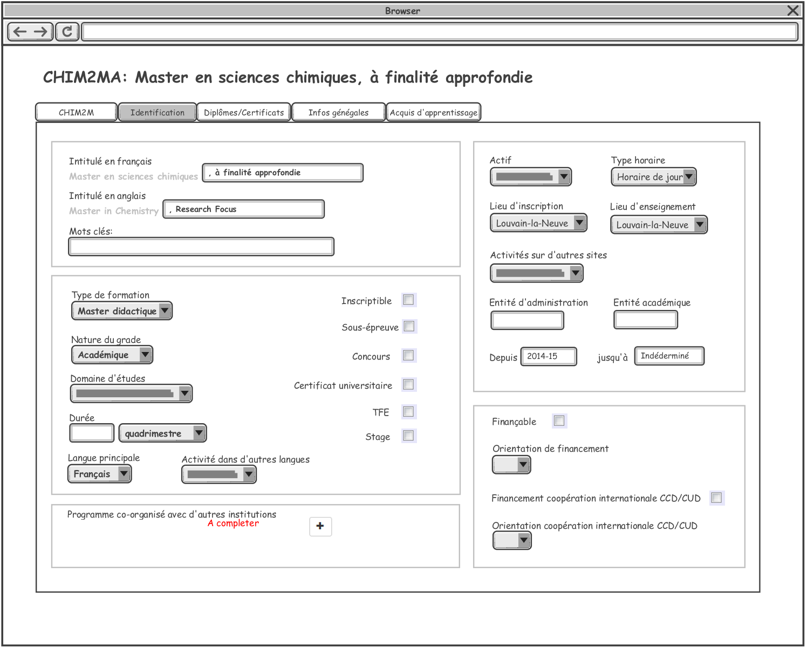
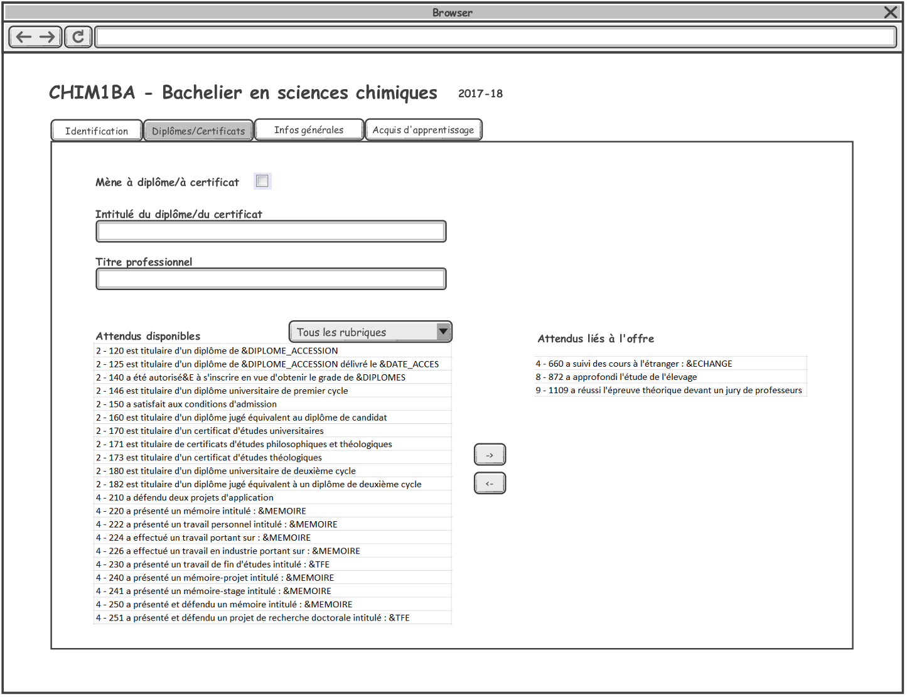
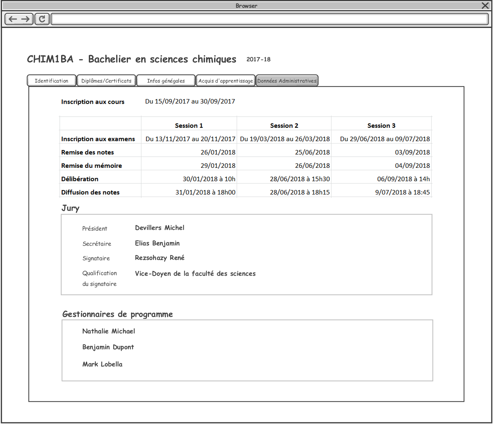

= Rechercher des organisations de formation

Des critères de recherche d'une organisation de formation:

image::images/gestion_organisations_de_formation/rechercher_une_o_f.png[]

Explication des champs

 . Année académique: liste des années académiques trié par l'ordre décroissant.
 L'année académique en cours est par défaut.
 . Faculté: la liste des facultés de l'UCL.
 . Sigle: c'est le sigle des formations. Ex: CHIM1BA
 . Intitulé de formation: Exemple: Bachelier en sciences chimiques
 . Type d'organisation de formation: 3 valeurs possibles: Formation (par défaut),
 Mini-formation, Groupement.
 . Type de formation: ça varie en fonction de type d'organisation de formation:
 .. Si c'est une Formation: la liste des types de formation est:
- Bachelier
- Programme de Master 120 (c'est un regroupement de Master Approfondi, Master
Didactique et Master Spécialisé du programme de Master  => dans le résultat, on
n'affiche que les finalités de ce type de master).
- Programme de Master 180 ou 240 (c'est un regroupement de Master Approfondi,
Master Didactique et Master Spécialisé du programme de Master 180 ou 240 => dans
le résultat, on n'affiche que les finalités de ce type de master).
- Master en un an
- Master de spécialisation
- Agregation
- Certificat de recherche
- Certificat de médecine
- Certificat CAPAES
- Certificat de formation continue
- Attestation de formation continue
- Cours de langue
- Doctorat
- Formation doctorat
- Cours isolés
- Concours d'accès
- Stagiaire
- Junior year
+
(dans un premier temps, on trie la liste par ordre alphabetique. A voir avec
l'utilisateur l'ordre qu'ils préfèrent )
+
.. Si c'est une Mini-formation: ça concernent des mineures, majeures,
approfondissements, options (à faire plus tard)
.. Si Groupement: (ça concerne programme-type, pour le premier
temps, met "Vide" dans la liste des type de groupement, on vera plutard).

NOTE: Il y a 3 types d'organisation des formations (des OFs). En fonction de
type des OFs dans la recherche que le tableau de résultat est différent.

== Résultat de recherche des formations:

image::images/gestion_organisations_de_formation/rechercher_une_formation.png[]

NOTE: Comme on regroupe des finalités des masters en Programme de master => On
n'affiche que des formations qui n'ont pas d'enfant. On n'affiche pas de
programme de master 120, ni de programme de master 180 ou 240.

== Résultat de recherche des mini-formations:

(à completer)

== Résultat de recherche des groupements:

(à completer)

= Consultation/Modification/Création des organisations de formation
== Consultation/Modification d'une formation (une offre)
Quand l'utilisateur choisit une formation, on affiche des informations concernant
cette formation dans plusieurs onglets:

=== Onglet Identification

image::images/gestion_organisations_de_formation/consulter-une-formation-identification.png[]
. Pavé Intitulé:
- Intitulé en français
- Intitulé en anglais
- Mots clés
. Nature de la formation:
- Type de formation: des types de formation qui n'ont pas d'enfant.
- Nature du grade: valeurs possibles: Académique, Non acad "autres", Non acad
"CREF".
- Domaine d'études: un des domaines ou sous-domaines. Il faut afficher le numréro
du domaine et aussi préciser le décret. Exemple: Pasage-17-Science.
- Durée: Un nombre durée et Un type durée (quadrimetre, trimestre, mois, semaine,
 jour). Par défaut: quadrimestre.
- Nombre de crédits: un nombre entier, il doit être entre 0 à 360
- Langue principale: valeurs possibles: Français (par défaut), Anglais, Français
ou Français, Français et Anglais.
- Activité dans d'autres langues: valeurs possibles: Oui, Non, Optionnel, vide
(cette valeur est servir pour ne pas afficher cette information sur Portail).
- Inscriptible
- Sous-épreuve
- Concours
- Certificat universitaire
- Travail de fin d'étude
- Stage: valeur possible: vide, Oui, Non, Optionnel
. Pavé Organisation:
- Actif: valeur possbile: Actif (par défaut), Inactif, Actif uniquement pour des
réinscriptions.
- Type horaire: Horaire de jour (par défaut), Horaire décalé, Horaire adapté.
- Lieux: la lites des campus de l'UCL.
- Activité sur d'autres lieux: valeurs possibles: vide, Oui, Non, Optionnel
- Entité d'administration et Entité academique de la formation.
- Début d'enseignement et fin d'enseignement de l'offre.
. Pavé Financement:
- Orientation et Orientation coopération internationale CCD/CUD: valeurs
possibles: A, B, C, D, E, S.
- Code tarif: il y a un numéro et un libellé:
  * 1. Sans frais complémentaire
  * 3. AESS et CAPAES
  * 5. Minerval complet
  * 6. Certificat universitaire
  * 7. Master complémentaire spécialisation médicale
  * 8. Concours d'accès
  * 10. Certificat universitaire 30 crédits
  * 11. Certificat compétence medecine
. Pavé partenariat/co-diplômation:
- Diplôme: 3 valeurs possibles: Diplôme unique, Diplôme séparé, Non
concerné.
- Info bulle du bouton "+": Ajouter une institution
- Avoir la possibilité de trier sur tous les colonnes.
- Quand l'utilisateur choisit le bouton "+", le popup pour ajouter un partenariat
apparaît.

(à completer)

IMPORTANT: Pour des formations de type Master 120, 180 ou 240 (Master
Approfondise, Master Didactique, Master spécialisé), ce sont des formations qui
ont une formation parent, on a un onglet "2M" en plus et l'onglet Identification
est un peu différent

- Onglet 2M: contient:

image::images/gestion_organisations_de_formation/consulter-une-formation-master-2M.png[]

  * la liste des finalités de ce programme 2M
  * les attributs comme dans l'onglet Identification des formations qui n'ont
pas de sont des on a la liste des finalités de ce programme de
master.

- Onglet Identification: au niveau d'affichage, c'est légèrement différent par
rapport d'autres formations qui n'ont pas de niveaux:

  * Des intitulés: affiche d'abord l'intitulé de formation parent en
  couleur grise et puis l'intitulé de la finalité.
  * D'autres champs: sont affichés de manière distincte si le valeur est hérité
 de son parent ou c'est un valeur propre de cette formation. Par exemple: en
 couleur grise si c'est hérité et en noir couleur s'il s'agit une surchage de
 sa formation parent.
  * Pavé partenariat: affiche en grise tous les Institutions partenariats qui
  hérihent du parent. Et les institutions partenariats de la finalité.

- La navigation quand l'utilisateur passe à une autre finalité, des informations
propres à cette finalité apparaissent dans tous les onglets.

=== Onglet Diplômes/Certificats

=== Onglet Données administratives

*Partie des dates*: ce sont des évènements liés à une formation pour chaque année
académique. On souhait d'avoir un contrôle lors de l'encodage de ces dates.
On met un intervalle de temps (une date minimum et une date maximum) pour chaque
évènement. Les gestionnaires ne peuvent pas encoder des dates (pour leurs formations)
qui ne respectent pas cet intervalle.

Les intervalles par défaut de ces évènements sont:

* La période d’inscription aux cours : d’une date à une autre date

   01/09/2017 – 31/10/2018

*	Par chaque session (1, 2, 3) on a:
** La période d’inscription aux examens : d’une date à une autre date
*** Session 1 : 01/11/1017 – 31/11/2017
*** Session 2 : 01/03/2018 – 30/03/2018
*** Session 3 : 15/06/2018 – 15/07/2018
**	La date de remise des notes : une date
*** Session 1 : 5/12/2018 – 31/01/2018
*** Session 2 : 01/05/2018 – 15/07/2018
*** Session 3 : 01/08/2018 – 15/09/2018
**	La date de remise du mémoire : une date
*** Session 1 : 01/12/2017 – 31/01/2018
*** Session 2 : 01/05/2018 – 15/07/2018
*** Session 3 : 01/08/2018 – 15/09/2018
**	La date et heure de délibération : une date et une heure
*** Session 1 : 15/01/2018 – 15/02/2018
*** Session 2 : 01/06/2018 – 15/07/2018
*** Session 3 : 01/09/2018 – 15/09/2018
**	La date et heure de diffusion des notes : une date et une heure
*** Session 1 : 15/09/2017 – 15/02/2018
*** Session 2 : 01/02/2018 – 15/07/2018
*** Session 3 : 01/07/2018 – 15/09/2018

*Partie Jury*: On affiche les mandataires de 3 mandats: Président, Secrétaire, Signataire.
Chaque mandataire il y a une date de début et une date de fin. On n'affiche que
les mandataires actifs de l'année académique choisie.
Pour le mandat de "Signataire", on a l'information sur le titre du signataire,
"En tant que ..." Ex: "Adjointe au directeur administratif"

NOTE: Dans EPC: +
    Les mandats des offres se trouvent dans la table MND_MND avec le code_organe
= sigle de l'offre. (Attention pour des offres qui n'ont pas de cycle, ni de niveau:
il y a une espace entre le sigle et les lettres finales). La qualification se trouve
à MND_MND.EN_TANT_QUE. Ces 3 types de mandat ont CODE_TYPE = JURYEX. Et
CODE_FONCTION = PRESI pour Président; CODE_FONCTION = SECRET pour Secrétaire;
CODE_FONCTION = SIGN pour Signataire. +
    Les mandataires se trouvent dans la table
MND_MNA, pour chaque mandat, on peut avoir plusieurs mandataires, il faut tenir
compte la période (date_debut, date_fin) et afficher les mandataires qui sont
actifs pour l'année académique choisie.

*Partie Gestionnaires de programme*: La liste des gestionnaires de programme
se trouve sur des formations (elle n'est pas liée à la version annualisé de
formation).

=== Onglet Infos générales

image::images/gestion_organisations_de_formation/consulter-une-formation-infos-generales.png[]

=== Onglet Infos acquis d'apprentissage

(à préciser avec l'utilisateur)

== Consultation d'une mini-formation
== Consultation d'un groupement
= Suppression des organisations de formations
