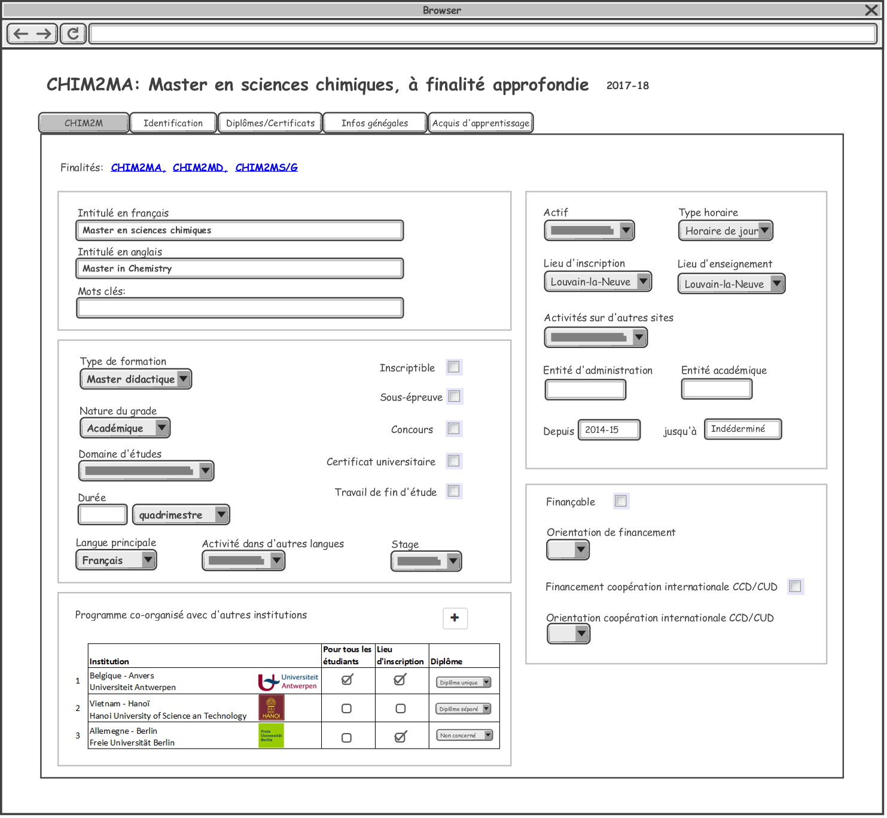

= Rechercher des organisations de formation

Des critères de recherche d'une organisation de formation:

image::images/gestion_organisations_de_formation/rechercher_une_o_f.png[]

Explication des champs

 . Année académique: liste des années académiques trié par l'ordre décroissant.
 L'année académique en cours est par défaut.
 . Faculté: la liste des facultés de l'UCL.
 . Sigle: c'est le sigle des formations. Ex: CHIM1BA
 . Intitulé de formation: Exemple: Bachelier en sciences chimiques
 . Type d'organisation de formation: 3 valeurs possibles: Formation (par défaut),
 Mini-formation, Groupement.
 . Type de formation: ça varie en fonction de type d'organisation de formation:
 .. Si c'est une Formation: la liste des types de formation est:
- Bachelier
- Programme de Master 120 (c'est un groupement de Master Approfondi, Master
Didactique et Master Spécialisé du programme de Master 120).
- Programme de Master 180 ou 240 (c'est un groupement de Master Approfondi,
Master Didactique et Master Spécialisé du programme de Master 180 ou 240).
- Master Approfondi
- Master Didactique
- Master Spécialisé
- Master en un an
- Master de spécialisation
- Agregation
- Certificat de recherche
- Certificat de médecine
- Certificat CAPAES
- Certificat de formation continue
- Attestation de formation continue
- Cours de langue
- Doctorat
- Formation doctorat
- Cours isolés
- Concours d'accès
- Stagiaire
- Junior year
+
(dans un premier temps, on trie la liste par ordre alphabetique. A voir avec
l'utilisateur l'ordre qu'ils préfèrent )
+
.. Si c'est une Mini-formation: ça concernent des mineures, majeures,
approfondissements, options (à faire plus tard)
.. Si Groupement: (ça concerne programme-type, pour le premier
temps, met "Vide" dans la liste des type de groupement, on vera plutard).

NOTE: Il y a 3 types d'organisation des formations (des OFs). En fonction de
type des OFs dans la recherche que le tableau de résultat est différent.

== Résultat de recherche des formations:

image::images/gestion_organisations_de_formation/rechercher_une_formation.png[]

== Résultat de recherche des mini-formations:

(à completer)

== Résultat de recherche des groupements:

(à completer)

= Consultation/Modification/Création des organisations de formation
== Consultation/Modification d'une formation (une offre)
Quand l'utilisateur choisit une formation, on affiche des informations concernant
cette formation dans plusieurs onglets:

=== Onglet Identification

image::images/gestion_organisations_de_formation/consulter-une-formation-identification.png[]
. Pavé Intitulé:
- Intitulé en français
- Intitulé en anglais
- Mots clés
. Nature de la formation:
- Type de formation: des types de formation qui n'ont pas d'enfant.
- Nature du grade: valeurs possibles: Académique, Non acad "autres", Non acad
"CREF".
- Domaine d'études: un des domaines ou sous-domaines.
- Durée: Un nombre durée et Un type durée (quadrimetre, trimestre, mois, semaine,
 jour). Par défaut: quadrimestre.
- Langue principale: valeurs possibles: Français (par défaut), Anglais, Français
ou Français, Français et Anglais.
- Activité dans d'autres langues: valeurs possibles: Oui, Non, Optionnel, vide
(cette valeur est servir pour ne pas afficher cette information sur Portail).
. Pavé Organisation:
- Actif: valeur possbile: Actif (par défaut), Inactif, Actif uniquement pour des
réinscriptions.
- Type horaire: Horaire de jour (par défaut), Horaire décalé, Horaire adapté.
- Lieux: la lites des campus de l'UCL.
- Entité d'administration et Entité academique de la formation.
- Début d'enseignement et fin d'enseignement de l'offre.
. Pavé Financement:
- Orientation et Orientation coopération internationale CCD/CUD: valeurs
possibles: A, B, C, D, E, S.
. Pavé partenariat/co-diplômation:
(à completer)

=== Onglet Diplômes/Certificats

(à completer)

=== Onglet Infos générales

image::images/gestion_organisations_de_formation/consulter-une-formation-infos-generales.png[]

IMPORTANT: Pour des formations de type Master 120, 180 ou 240 (Master
Approfondise, Master Didactique, Master spécialisé), ce sont des formations qui
ont une formation parent, on a un onglet "2M" en plus et l'onglet Identification
est un peu différent

- Onglet 2M:

  * la liste des finalités de ce programme 2M
  * les attributs comme dans l'onglet Identification des formations qui n'ont
pas de sont des on a la liste des finalités de ce programme de
master.

- Onglet Identification: au niveau d'affichage, c'est légèrement différent par
rapport d'autres formations qui n'ont pas de niveaux:
  * Des intitulés: affiché (en héritant) l'intitulé de formation parent.
  * D'autres champs: sont affichés de manière distincte si le valeur est hérité
 de son parent ou c'est un valeur propre de cette formation. Par exemple: en
 même couleur si c'est hérité et une autre couleur s'il s'agit une surchage de
 sa formation parent.

- La navigation quand l'utilisateur passe à une autre finalité, des informations
propres à cette finalité apparaissent dans tous les onglets.

== Consultation d'une mini-formation
== Consultation d'un groupement
= Suppression des organisations de formations
