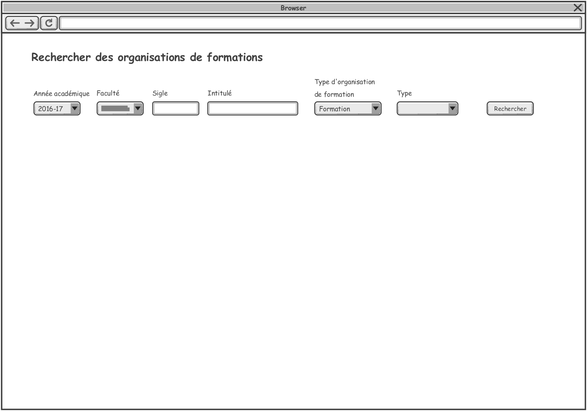
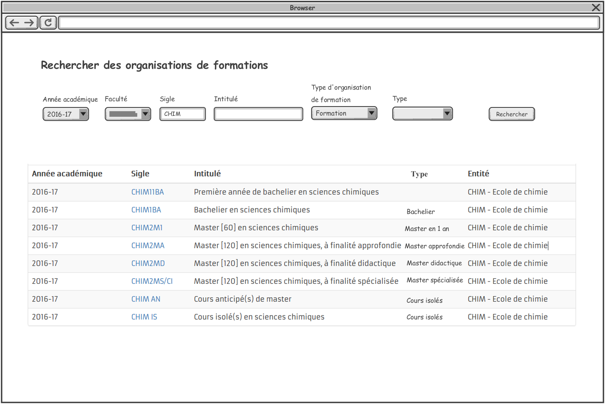
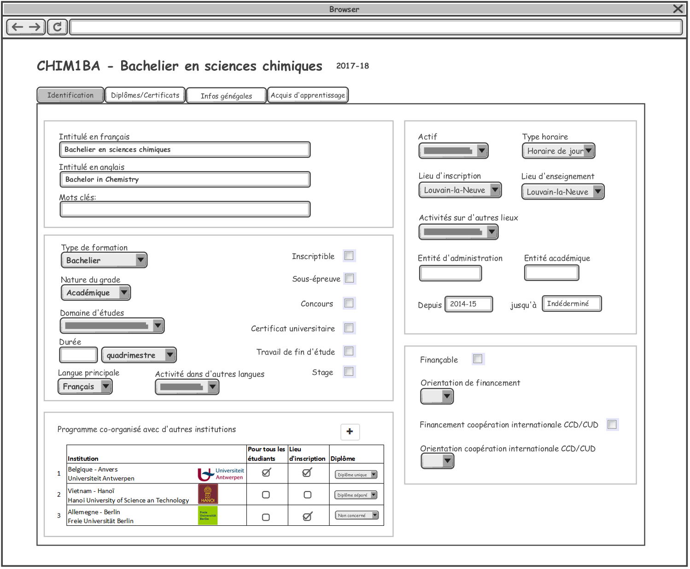
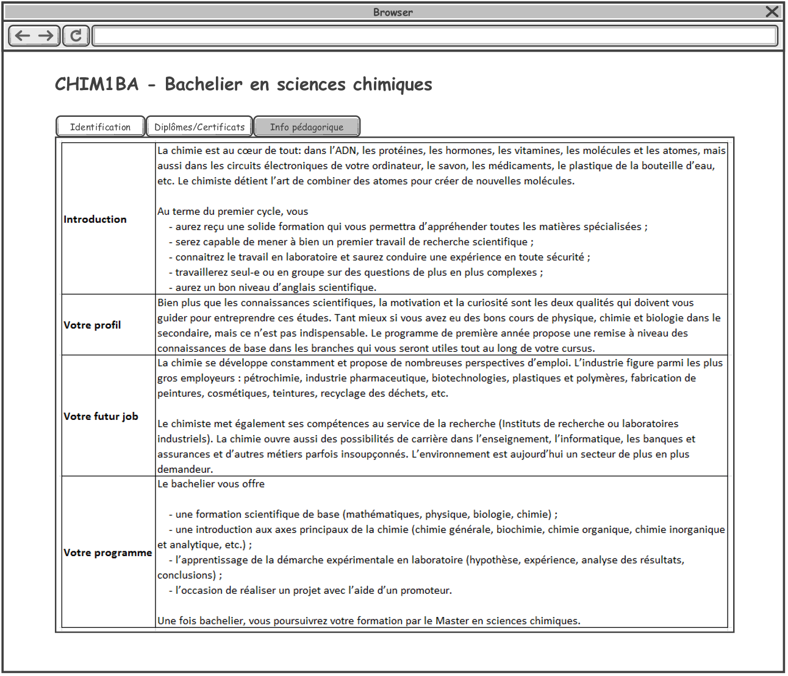

= Rechercher des organisations de formation

Des critères de recherche d'une organisation de formation:

Explication des champs

 . Année academique: liste des année academique
 . Faculté: la liste des facultés de l'UCL
 . Sigle: c'est le sigle des formations. Ex: CHIM1BA
 . Intitulé de formation: Exemple: Bachelier en sciences chimiques
 . Type d'organisation de formation: 3 valeurs possibles: Formation,
 Mini-formation, Groupement. Par défaut: Formation
 . Type de formation: ça varie en fonction de type d'organisation de formation:
 .. Si Formation: la liste des types de formation est:
- Bachelier
- Programme de Master
- Master Approfonsie
- Master Didactique
- Master spécialisée
- Master en un an
- Master de spécialisation
- Agregation
- Certificat de recherche
- Certificat de médecine
- Certificat CAPAES
- Certificat de formation continue
- Attestation de formation continue
- Cours de langue
- Doctorat
- Formation doctorat
- Cours isolés
- Concours d'accès
- Stagiaire
- Junior year
.. Si Mini-formation: la liste des types de mini-formations est:
- Approfondissement
- Mineure
- Majeure
- Option
.. Si Groupement: (ça concerne programme-type, pour le premier
temps, met "Vide" dans la liste des type de groupement, on vera plutard).

NOTE: Il y a 3 types d'organisation des formations (des OFs). En fonction de
type des OFs dans la recherche que le tableau de résultat est différent.

== Résultat de recherche des formations:

== Résultat de recherche des mini-formations:

(à completer)

== Résultat de recherche des groupements:

(à completer)

= Consultation des organisations de formation
== Consultation d'une formation (une offre)
Quand l'utilisateur choisit une formation, on affiche des informations concernant
cette formation:

=== Onglet Identification

=== Onglet Diplômes/Certificats

(à completer)

=== Onglet Infos générales

IMPORTANT: Pour des formations de type Master 120, 180 ou 240 (Master Approfondise,
Master Didactique, Master spécialisé), on a un onglet "2M" en plus et l'onglet
Identification est un peu différent

- Onglet 2M
(à completer)

- Onglet Identification
(à completer)

== Consultation d'une mini-formation
== Consultation d'un groupement
= Création des organisations de formations
= Modification des organisations de formaitons
= Suppression des organisations de formations
