== Gestion des demandes d'inscription en ligne

=== Le workflow

image::images/inscription_en_ligne/gestion_demande_inscription_en_ligne.png[]

=== Les fonctionnalités

==== S'identifier

image::images/inscription_en_ligne/se_connecter.png[]

==== Créer un compte

image::images/inscription_en_ligne/creer_un_compte.png[]

==== Envoyer un e-mail

image::images/inscription_en_ligne/envoyer_un_e-mail.png[]

==== Compléter le profil

image::images/inscription_en_ligne/valider_du_compte.png[]

Pour les étudiants qui n’ont pas la nationalité dans UE, des questions
d'assimilation apparaissent.

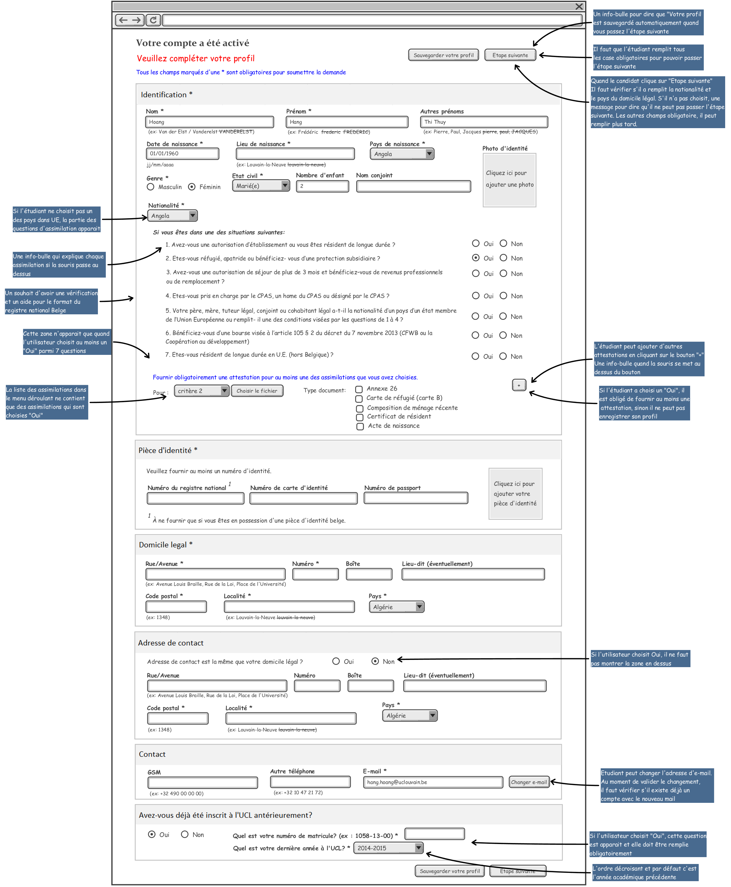

La liste des documents à fournir par critère: http://uclouvain.be/14095.

On doit présenter *tous* les types de documents par critère comme une liste
plate (peu importe ET et OU): dans le même bullet ce sont des ET. Entre des
bullets, ce sont des OU

* *Critère 1*:
** _Carte de "résident longue durée"_ (Carte D)
** _Carte d'identité des étrangers séjour illimité "établissement"_ (Carte C)
* *Critère 2*:
** _Annexe 26_
** _Carte de réfugié_ (Carte B) ET _Composition de ménage récente_ ET _Acte de
   naissance_.
** _Carte de réfugié_ (Carte B) ET _Certificat de résidence récent_ ET _Acte de
   naissance_.
** _Document officiel de la commune ou de l’Office des étrangers prouvant le
   statut d’apatride_.
** _Certificat d’inscription au registre des étrangers d’une durée limitée d’un
   an renouvelable_ ET _Décision de l’Office des étrangers attestant de la
   situation de la protection subsidiaire_ ET _Permis de séjour de un an
   minimum_.
* *Critère 3*:
** _Composition de ménage récente_ ET _6 fiches de salaires sur les 12 mois
   précédant l’inscription prouvant que votre rémunération correspond à la
   moitié de la rémunération brute mensuelle moyenne minimum garantie fixée par
   le http://www.cnt-nar.be/CAO-CCT-BEDRAGEN/BEDRAGEN-2013-01-01.pdf[CNT]_ ET
   _Carte d'identité récente_.
** _Certificat de résidence récent_ ET _6 fiches de salaires sur les 12 mois
   précédant l’inscription prouvant que votre rémunération correspond à la
   moitié de la rémunération brute mensuelle moyenne minimum garantie fixée par
   le http://www.cnt-nar.be/CAO-CCT-BEDRAGEN/BEDRAGEN-2013-01-01.pdf[CNT]_ ET
   _Carte d'identité récente_.
* *Critère 4*:
** _Attestation récente du CPAS_
* *Critère 5*:
** _Carte d’identité valide_ (Carte F ou Carte F+) ET _Composition de ménage_ OU
   _l'attestation de l’administration communale justifiée la cohabitation légale
   ou le jugement de tutelle_. *Attention*: Documents demandés de la personne (père, mère,
   tuteur légal, conjoint légal, cohabitant légal) qui remplit une des
   conditions visées par les critères d'assimilation de 1 à 4.
* *Critère 6*:
** _Attestation de bourse délivrée par la CFWB ou la Coopération au
   développement_ ET _Attestation émanant de l’administration communale et la
   tutelle légale par un jugement de tutelle_ (NB : l’âge de la majorité peut
   varier suivant la nationalité) (Optionnel).
* *Critère 7*:
** _Certificat de résident de longue durée du pays de l’Union européenne
   concerné_.

S’il y a plus qu'un document à fournir :

image::images/inscription_en_ligne/valider_du_compte_state22.png[]

La liste des types de documents à cocher réduite, il ne contient pas de types
que le candidat a déjà cochés.

==== Choisir l'offre d'études

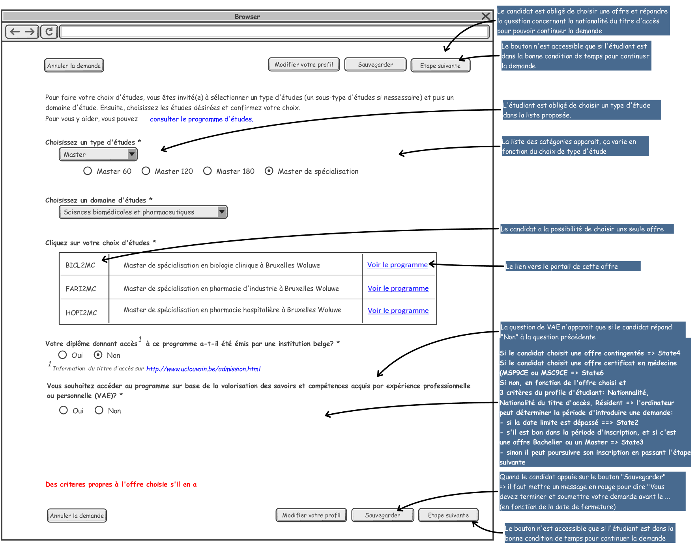

Après avoir choisi l'offre, le candidat doit répondre à une ou deux questions en
fonction de la première réponse) pour indiquer la nationalité du titre d'accès.

En se basant sur des informations saisies par le candidat:

 - 3 caractéristiques du candidat: la nationalité du candidat (il faut tenir
   compte des cas d'assimilation), la nationalité du diplôme (titre d'accès),
   résident en Belgique.
 - l'offre à laquelle il s'inscrit.

Selon le schéma ci-dessous, on peut déterminer:

 - le type de la demande (une demande d'inscription ou une demande d'admission).
 - la période d'introduire la demande en ligne (l'ouverture et la fermeture).

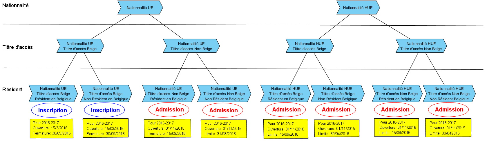

Si la période d'introduction la demande en ligne n'est pas encore commencée, on
met le message "La période d'inscription à ces études ne sera ouverte qu'à
partir de ..." et le candidat ne peut pas poursuivre la demande.

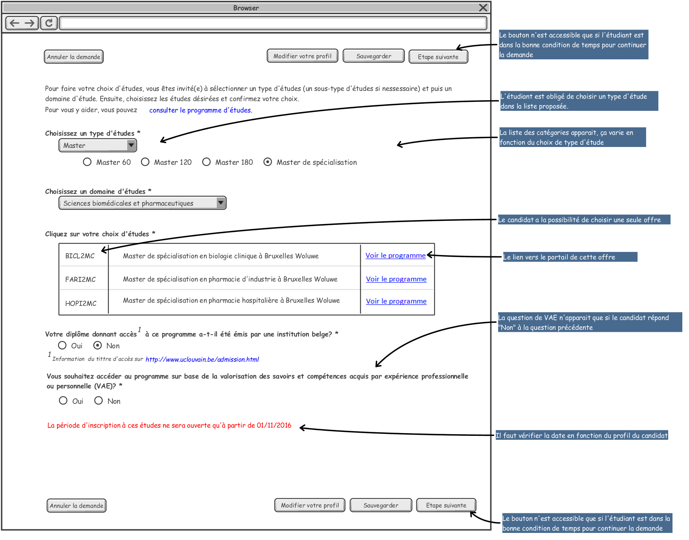

Si la période d'introduction la demande en ligne est terminée, on met le message
"Pour 2016-2017, la période d'inscription au Master de spécialisation est
clôturée depuis le ... . Nous vous invitons à introduire une demande
d'incription à partir du ... pour l'année académique 2017-2018". Et le candidat
ne peut pas poursuivre la demande.

image::images/inscription_en_ligne/choisir_l_offre_d_etude_state2.png[]

S'il est bien dans la période d'introduction la demande, on vérifie si le
candidat a choisi une offre "Bachelier" ou "Master" => on pose la question pour
savoir si le candidat a déjà fait des études similaires et qu'il veut valoriser
des crédits. (Cette information est importante car elle demande des traitements
spécifiques du côté des facultées par la suite.)

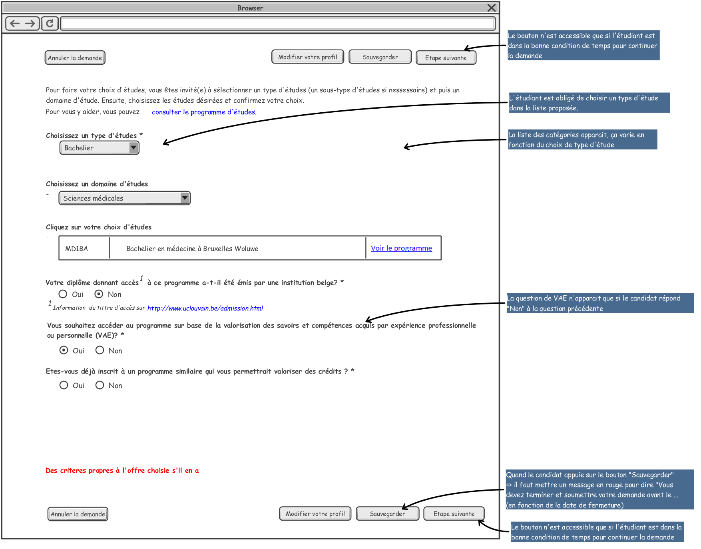

Il y a des exceptions pour déterminer le type de la demande (demande
d'inscription ou demande d'admission) et pour déterminer des périodes
d'introduire la demande, ça concerne des offres suivantes:

 * Les offres d'études contingentées: KINE1BA, VETE1BA, LOGO1BA, MD1BA, DENT1BA
 * Les offres de certificats en médecine: MSP9CE et MSC9CE
 * Les offres doctorats

===== Offre d'étude contingentée

Les critères de distinction du type de demande et les dates pour des études
contingentées sont:

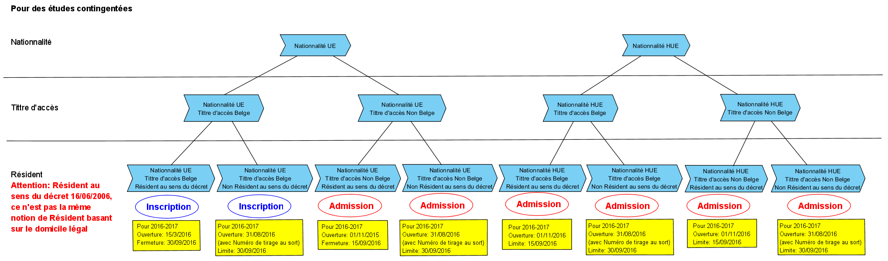

* Si le candidat choisit une offre contingentée (KINE1BA, VETE1BA, LOGO1BA,
MD1BA, DENT1BA). La première question est pour savoir si le candidat est déjà
inscrit au même programme dans un établissement de la communauté française.

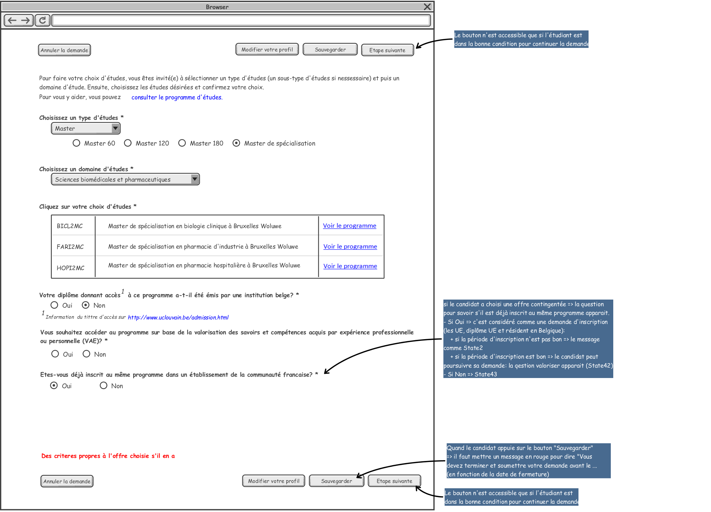

* Si le candidat est déjà inscrit au même programme  => la demande est
  considérée comme une demande d'inscription (= les UE, diplôme UE et résident
  en Belgique). On vérifie la période d'introduction la demande:
* S'il n'est pas dans la période d'introduction la demande => le message pour
  dire que c'est fermé ou ce n'est pas encore commencé (comme pour les autres
  offres)
* S'il est dans la période d'introduction => la question pour valoriser apparait

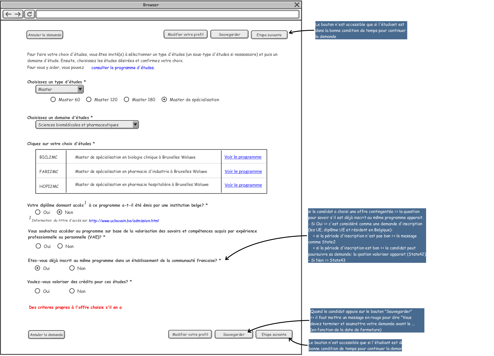

* Si le candidat n'est pas inscrit au même programme => on invite le candidat à
  aller voir la page réservée aux études contingentées et le candidat doit
  répondre à la question "Résident" ou "Non-résident".

NOTE: la notion de résident dans des études contingentées est différente
que la notion de résident pour les autres offres. Et donc la façon de
déterminer une demande d'inscription ou une demande d'admission est différente.

image::images/inscription_en_ligne/choisir_l_offre_d_etude_state43.png[]

* Si le candidat est résident => il ne doit pas passer la procédure de tirage au
  sort, on vérifie la période d'inscription pour des études contingentées
  correspond au profil du candidat:

** S'il n'est pas dans la période => le message pour dire que c'est fermé ou que
   ce n'est pas ouvert (comme pour les autres offres)

** S'il est dans la période: il peut passer l'étape suivante pour poursuivre sa
   demande.

* Si le candidat est Non-résident  => il doit passer la procédure de tirage au
  sort organisée par la communauté française.

NOTE: La communauté française chaque année détermine la date d'ouverture pour
les études contingentées. Ca change chaque année (souvent c'est fin Aout).

On vérifie la date d'ouverture pour les études contingentées correspond au
profil du candidat:

* Si la période n'est pas encore commencée => le message pour demander au
  candidat de suivre les modalités prévues sur la page réservée aux études
  contingentées.

image::images/inscription_en_ligne/choisir_l_offre_d_etude_state432.png[]

* Si la période est finie => le message pour dire que c'est fermé (comme pour
  les autres offres)
* S'il est dans la période d'introduction: la question du numéro du tirage au
  sort apparait et le candidat est obligé d'encoder le numéro de tirage au sort
  afin de poursuivre la demande.

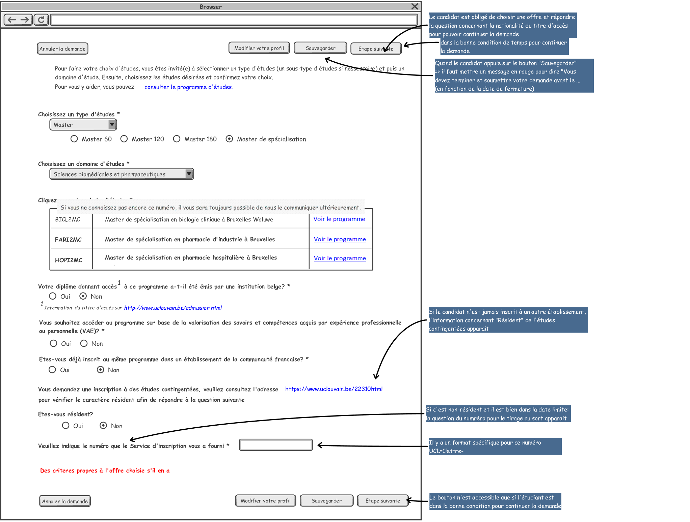

===== Offre Certificats spécialisés en médecine (MSP9CE et MSC9CE)

Les critères de distinction d'une demande d'inscription ou une demande
d'admission et des dates pour ces offres sont:

image::images/inscription_en_ligne/DistinctionEtudiantsMS_9CE.png[]

Comme les critères pour déterminer le type de demande pour des certificats en
médecine dépendent de la nationalité du titre d'accès => la question concernant
la nationalité du diplôme est adaptée:

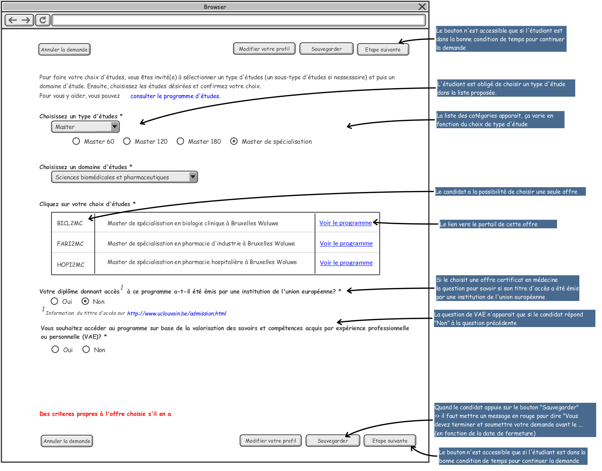

===== Offre doctorats

Il n'y a pas de date d'ouverture, ni fermeture pour des demandes d'inscriptions
en ligne aux offres doctorats. Le candidat peut introduire une demande
d'inscription n'importe quand (tant que l'année académique n'est pas terminée).

*A compléter*: des questions sur "Double diplomation", "Boursier", "Erasmus
Mundus".

==== Remplir des diplômes et attestations

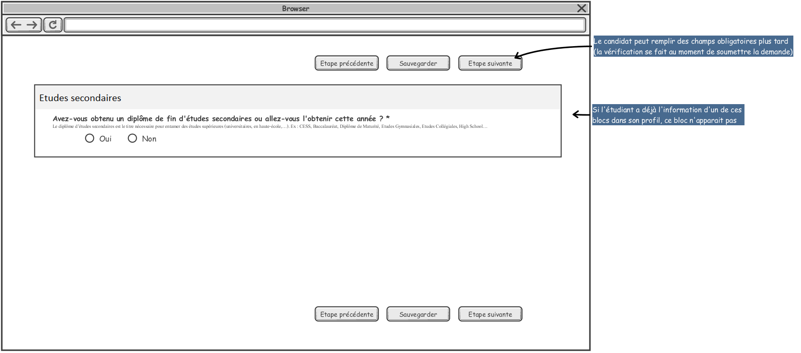

Si le candidat a un diplôme de fin d'études secondaires ou va l'obtenir cette
année.

image::images/inscription_en_ligne/remplir_diplome_attestation_state2.png[]

Si le candidat a un diplôme de fin d'études secondaires en Belgique ou va
l'obtenir cette année.

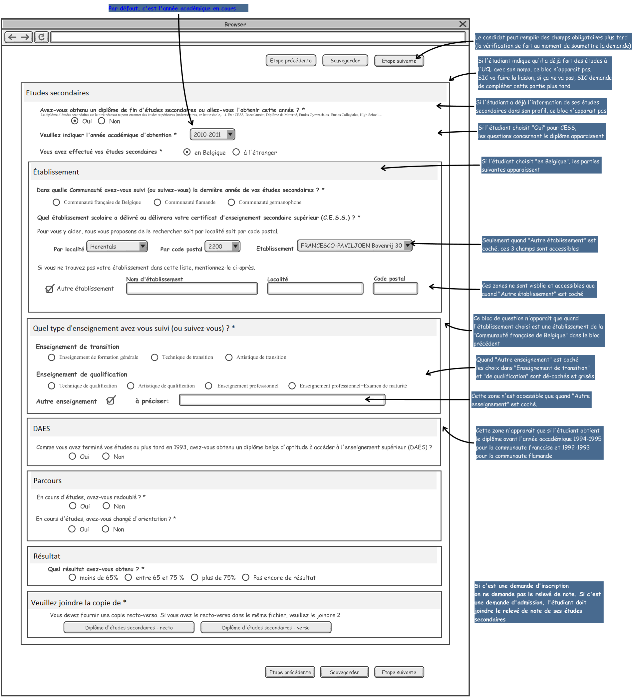

Si le candidat a un diplôme de fin d'études secondaires à l’étranger ou va
l'obtenir cette année.

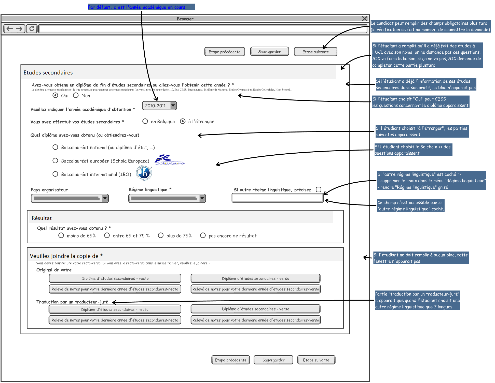

Si le candidat a un diplôme de fin d'études secondaires de type Baccalauréat
national  à l’étranger ou va l'obtenir cette année.

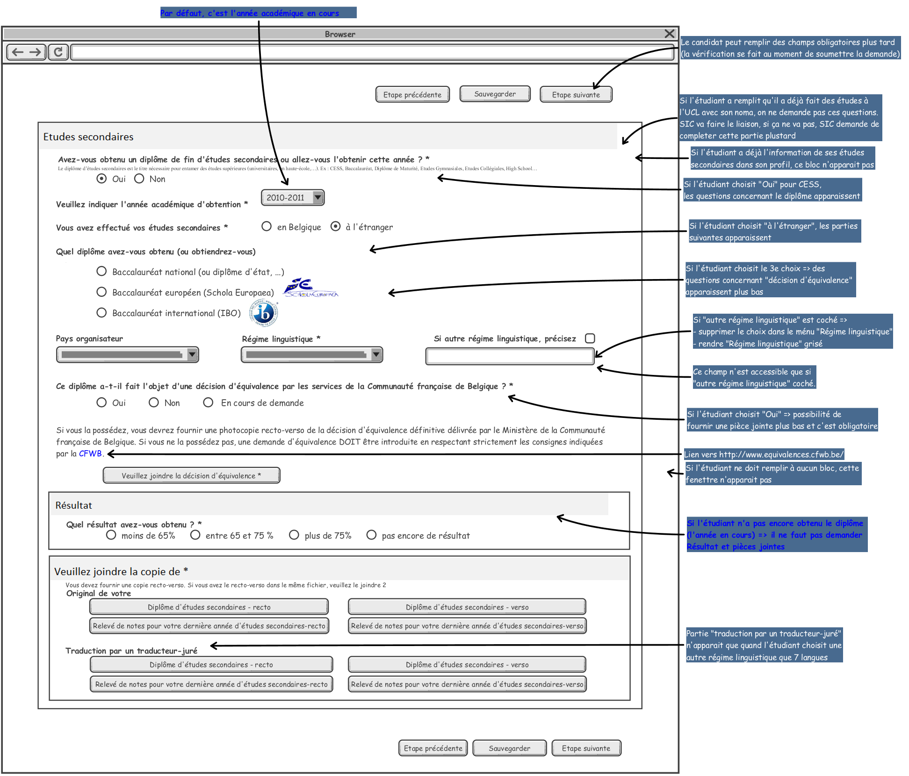

Si le candidat n’a pas fait d'études secondaires, il doit répondre à la question
pour l'examen d'admission.

image::images/inscription_en_ligne/remplir_diplome_attestation_state3.png[]

Si le candidat a fait l'examen d'admission.

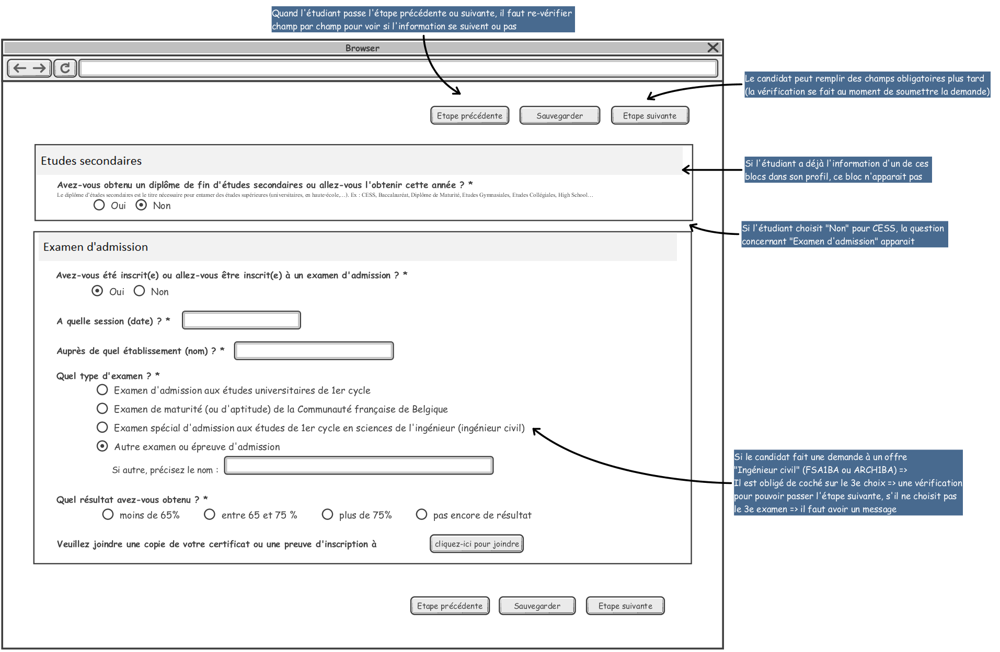

Si le candidat fait une demande d'inscription à un offre "Ingénieur civil"
(FSA1BA ou ARCH1BA) => Il est obligé de cocher sur le 3e choix => une
vérification pour pouvoir passer l'étape suivante, s'il ne choisit pas le 3e
examen => il faut avoir un message. Si le candidat n'a pas fait l'examen
d'admission, les questions sur le VAE apparaissent.

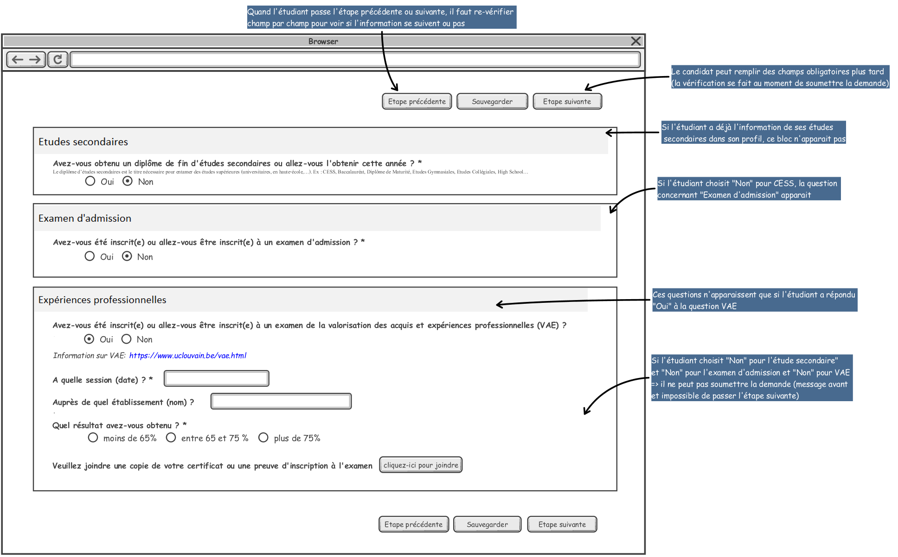

*Pour les offres "Bachelier", "Master Didactique", "Agrégation"* le bloc des
questions concernant l'examen de maîtrise de la langue française apparait.

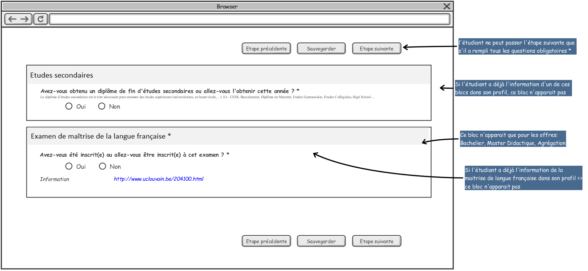

Si le candidat répond "Oui" à la question de l'examen de maîtrise de la langue
française, les autres questions apparaissent.

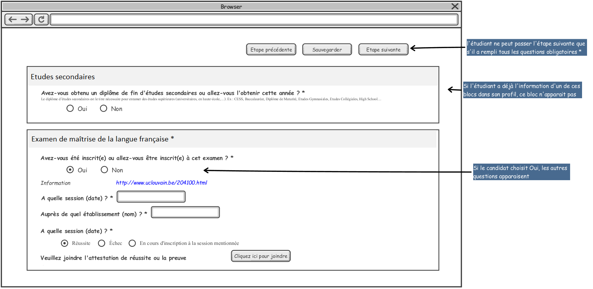

====	Remplir Curriculum

image::images/inscription_en_ligne/remplir_CV.png[]

Le candidat a fait "Université belge".

image::images/inscription_en_ligne/remplir_CV_state2.png[]

Le candidat a fait "Université belge" et "Communauté française de Belgique".

image::images/inscription_en_ligne/remplir_CV_state22.png[]

Communauté d'enseignement: on peut le considérer comme le "régime linguistique"
pour les études à l'étranger:

- Communauté française de Belgique => en français
- Communauté flamande => en néerlandais

Domaine: la liste des domaines d'études du décret Paysage.

Type d'études:

- Bachelier
- Master 60
- Master 120
- Master 180 ou 240
- Master de spécialisation
- Agrégation
- Certificat
- Capaes
- Dotorat

Résultat obtenu: Réussite, Echec, Pas de résultat.

Si l'étudiant a obtenu le diplôme pendant l'année indiquée.

image::images/inscription_en_ligne/remplir_CV_state222.png[]

Si l'étudiant n'a pas obtenu le diplôme pendant l'année indiquée.

image::images/inscription_en_ligne/remplir_CV_state223.png[]

L'étudiant a fait "Université étrangère".

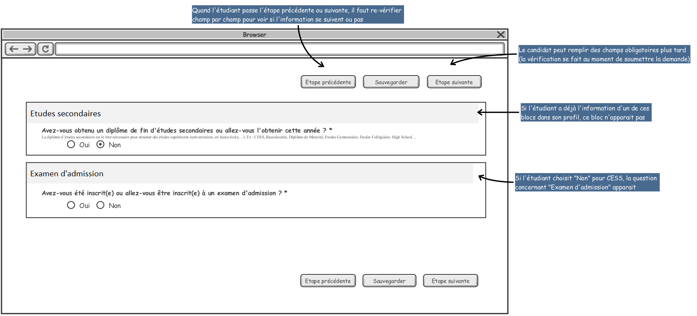

NOTE: Pays de l'université: il faut utiliser la même liste des pays commune de
l'application OSIS.

Localité: la liste des localités du pays choisi. Si le candidat choisit une
autre localité, il faut avoir le statut temporaire de cette localité, les
gestionnaires doivant la valider.

Régime linguistique: c'est la liste des langues.

Nom de l'université: la liste des universités de la localité choisie. Si le
candidat choisit une autre université et la préciser, il faut prévoir un champ
pour stocker l'état d'ajout, c'est l'état temporaire, et les gestionnaires
doivent valider.

Si l'étudiant indique qu'il a obtenu le diplôme cette année:

image::images/inscription_en_ligne/remplir_CV_state32.png[]

L'étudiant a fait "SNU belge"

image::images/inscription_en_ligne/remplir_CV_state4.png[]

Communauté d'enseignement: on peut le considérer comme le "régime linguistique"
pour les études à l'étranger:

- Communauté française de Belgique => en francais
- Communauté flamande => en néerlandais
- Communauté germanophone => en allemand

Localité: il faut avoir une liste des localités de la Belgique.

Etablissement: la liste des établissements de la localité choisie. Si le
candidat choisit un autre établissement et le préciser, il faut prévoir un champ
pour stocker l'état d'ajout, c'est l'état temporaire, et le gestionaire doit
valider.

Domaine: la liste des domaines des SNU.

Type d'études: la liste des types d'études.

- Graduat
- Baccalauréat (1er cycle)
- Master (2e cycle)
- Autres

Système d'étude: "Promotion sociale" ou "Plein exercice". Pour chaque
établissement on doit savoir quel(s) est le système d'études. Certains
établissements peuvent avoir 2 systèmes d'études. Si l'établissement choisi a un
seul système d'études, on ne doit pas poser cette question.

Si le candidat choisit un établissement qui n'est pas dans la liste, il faut
afficher cette question pour que le candidat précise le système d'études. Le
gestionaire doit repasser pour le valider.

L'étudiant a fait "SNU étranger".

image::images/inscription_en_ligne/remplir_CV_state5.png[]

Pays d'établissement: il faut utiliser la liste des pays standards de
l'application OSIS.

Localité: la liste des localités du pays choisi. Si le candidat choisit une
autre localité, il faut avoir le statut temporaire de cette localité, les
gestionnaires doivent la valider.

Etablissement: la liste des établissements de la localité choisie. Si le
candidat choisit un autre établissement et le précise, il faut prévoir un champ
pour stocker l'état d'ajout, c'est l'état temporaire, et le gestionaire doit
valider.

Domaine: la liste des domaines des SNU étrangers est identique à la liste des
domaines des SNU belge.

Type d'études: c'est la même liste des types d'études des SNU belge.

Si l'étudiant indique qu'il a obtenu le diplôme cette année: il doit joindre le
diplôme et le relevé de notes.

image::images/inscription_en_ligne/remplir_CV_state52.png[]

Si l'étudiant n'a pas obtenu le diplôme pendant l'année indiquée: le candidat ne
doit fournir que le relevé de notes.

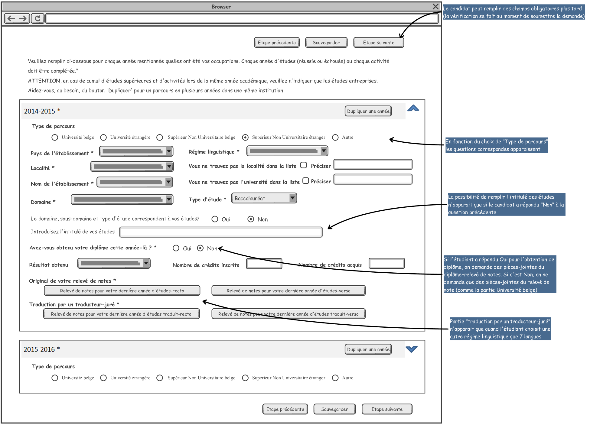

Le candidat remplit "Autre":

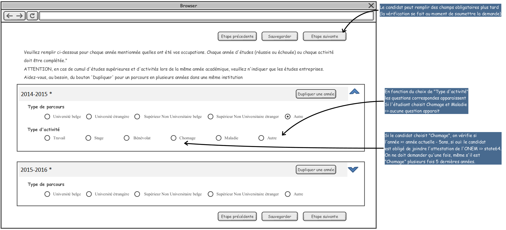

Si le candidat remplit "Autre" et choisit: Travail, Stage, Bénévolat: la
question "À quel endroit?" apparait.

image::images/inscription_en_ligne/remplir_CV_state62.png[]

Si le candidat remplit "Autre" et choisit: Chomage ou Maladie => rien n'apparait.

Si le candidat choisit "Chomage", on vérifie si l'année >= année actuelle - 5ans,
si oui: le candidat est obligé de joindre l'attestation de l'ONEM.

NOTE: On ne doit demander qu'une fois, même s'il est au "Chomage" plusieurs fois
5 dernières années.

image::images/inscription_en_ligne/remplir_CV_state64.png[]

Si le candidat remplit "Autre" et choisit "Autre" comme Type d'activité

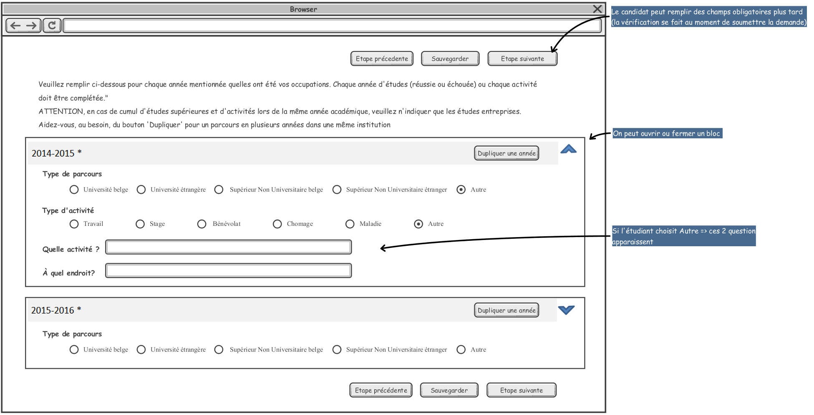

==== Ajouter les pièces jointes supplémentaires

Pour les demandes d'inscription: le candidat n'est pas obligé de joindre des
pièces. Mais s'il veut il peut ajouter des pièces jointes.

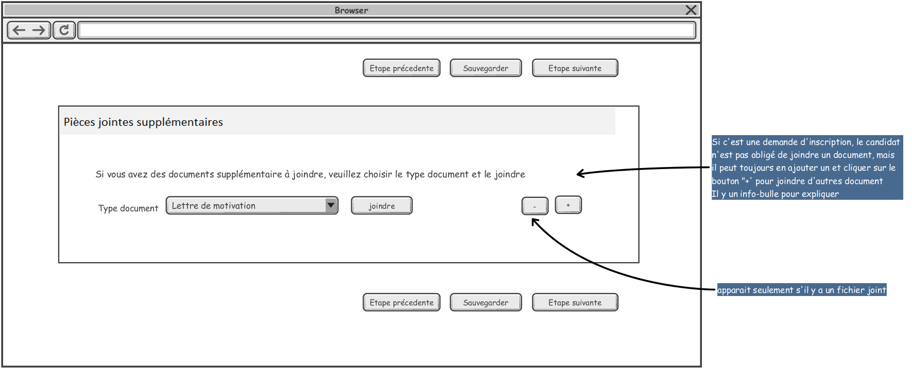

S'il y a plus d'une pièce jointe, le candidat clique sur le bouton "+" pour
ajouter une autre pièce.

image::images/inscription_en_ligne/ajouter_les_pieces_jointes_suppl_inscription_state2.png[]

Si le candidat ne trouve pas le type document dans la liste, il choisit "Autre"
et précise le type du document.

image::images/inscription_en_ligne/ajouter_les_pieces_jointes_suppl_inscription_state22.png[]

Pour les demandes d'admission: le candidat est obligé de joindre le CV et la
lettre de motivation.

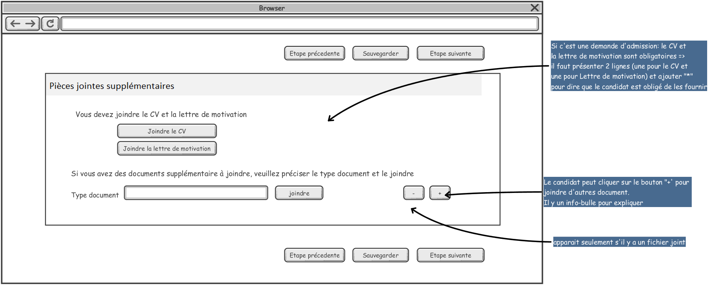

Le candidat peut ajouter d'autres types de pièces jointes comme pour les
demandes d'inscription.

==== Remplir Comptabilité

Pour la partie "Réduction": les questions changent en fonction du cycle d'offre.

Pour les offres du premier cycle: Bachelier (1BA).

Pour les Masters du 2eme cycle: Master en 1 an (2M1), Master Didactique (2MD),
Master Approfondie (2MA), Master spécialisée (2MS/...).

image::images/inscription_en_ligne/remplir_comptabilite_1er_2e_cycle.png[]

Si le candidat répond "Oui" à la question "Allocation d'études".

image::images/inscription_en_ligne/remplir_comptabilite_1er_2e_cycle_state2.png[]

Si le candidat répond "Non" à la question "Allocation d'études".

image::images/inscription_en_ligne/remplir_comptabilite_1er_2e_cycle_state3.png[]

Pour le 3 cycle Doctorat (3D) et Master Complémentaire (2MC)

image::images/inscription_en_ligne/remplir_comptabilite_3e_cycle.png[]

Pour la carte de sport: en fonction du site de l'offre choisie.

- Si c'est une offre de Mons, le candidat doit choisir un parmi 3 choix: sur
  toutes les sites, sur Mons et Non.
- Si c'est à Saint Gilles, le candidat doit choisir un parmi 3 choix: sur toutes
  les sites, sur Saint Gille et Non.
- Pour les autres sites, le candidat doit choisir un parmi 2 choix: Oui et Non.

Le tarif des cartes de sport varie en fonction du site et ça peut être changé
chaque année. 0 euros s'il choisit Non. Pour l'année académique 2016-2017: la
carte de tous les sites = 50 euros, la carte de Mons = 10 euros, la carte de
Saint Gille = 10 euros.

Pour la carte "Culture" et "Solidaire", pour le moment, c'est le même tarif pour
tous les sites.

==== Remplir l'enquête sociologique

image::images/inscription_en_ligne/remplir_enquete_sociologique.png[]

Des études sont:

* Inconnu
* Primaire
* Secondaire inférieur
* Secondaire supérieur
* Supérieur non universitaire
* Universitaire

Des professions sont:

* 00 - Inconnu.
* 01 - Chef d'une exploitation agricole de moins de 30 ha.
* 02 - Chef d'une exploitation agricole de plus de 30 ha.
* 03 - Indépendant isolé ou chef d'une entreprise occupant moins de 5 personnes
  (ex: artisan, commerçant, détaillant, coiffeur, cordonnier, tailleur, modiste,
  etc).
* 04 - Chef d'une entreprise industrielle ou commerciale occupant en moyenne de
  5 à 49 personnes.
* 05 - Chef d'une entreprise industrielle ou commerciale occupant en moyenne 50
  personnes et plus.
* 06 - Titulaire d'une profession libérale, soit uniquement: médecin, pharmacien,
  dentiste, vétérinaire, avocat, notaire, ingénieur-conseil, architecte.
* 07 - Titulaire d'une autre profession indépendante non reprise ci-dessus,
  telle que courtier, agent d'assurances, agent de change, expert immobilier,
  kinésithérapeute, huissier de justice, commerce de luxe, hôtellerie, etc.
* 11 - Ouvrier, ouvrier agricole, manoeuvre, mineur, cheminot, cuisiner,
  chauffeur de camion, etc.
* 12 - Contremaître, chef d'équipe.
* 21 - Employé (niveau enseignement primaire ou secondaire inférieur),
  puéricultrice, sous-officier sans qualification.
* 22 - Employé qualifié (niveau enseignement secondaire supérieur complet), sous
  officier avec qualification.
* 23 - Cadre (niveau enseignement supérieur non universitaire), instituteur,
  régent, directeur d'école primaire, assistant social, officier subalterne, etc.
* 24 - Cadre supérieur (niveau universitaire), professeur dans le secondaire
  supérieur, chercheur, officier supérieur, etc.
* 25 - Cadre dirigeant (directeur général, secrétaire général, PDG, professeur
  d'université, etc), président de cour d'appel, officier général.
* 31 - Administrateur de société.
* 32 - Homme politique, sénateur, député, bourgmestre d'une commune de plus de
  30.000 habitants.
* 33 - Comédien, artiste, sportif, musicien.
* 34 - Autre (sauf chômeur).
* 35 - Sans profession.
* 36 - Chômeur.

La liste des "Activité professionlle" sont:

* Oui, temps plein
* Oui, temps partiel
* Non

NOTE: La liste des professions de l'étudiant et conjoint doit être réduite si le
candidat choisit "Oui, temps plein" ou "Oui, temps partiel".

Le liste ne contient pas: 00, 35, 36 si le candidat choisit "Autre" comme
Profession de son père, sa mère, lui même, ou son grande père, il doit préciser
le titre de la profession.

image::images/inscription_en_ligne/remplir_enquete_sociologique_state2.png[]

==== Confirmer la demande

image::images/inscription_en_ligne/confirmer_la_demande.png[]

==== Confirmer la soumission

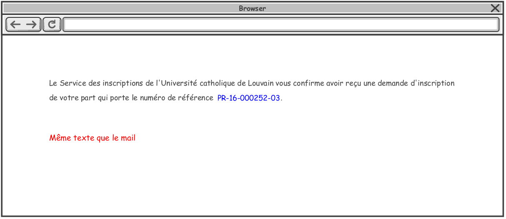

===== Le numéro de référence

Pour la première demande, on ne voit ce numéro qu'à la soumission. A partir de
la deuxième demande d'un compte, ce numéro est visible avant que la demande soit
soumise.

Ce numéro se compose: 2 lettres-2 chiffres-6 chiffres-2 chiffres. Les 2 lettres
sont soit l'initial d'un gestionnaire en SIC qui est assigné pour la gestion des
suivis de la demande (Exemple: CM = Chantal Manga), soit les initiales d'un
groupe qui assume des suivis (Exemple: EG - Equipe de gestion des offres de
Woluwé).

Le gestionnaire en SIC gère des demandes d'une ou plusieurs facultés. Le
gestionnaire des demandes d'inscription et des demandes d'admission d'une
faculté peut être différent.

Dans une faculté, le gestionnaire peut être différent d'un site à l'autre
(exemple de la faculté LOCI: il y a 3 gestionnaires corresponde à 3 sites: LLN,
Saint-Gilles, Tournai).

Les exceptions:

* L'offre CAPAES (CAPA2CE):
** un gestionnaire pour des demandes d'inscription
** un gestionnaire pour des demandes d'admission
* Des doctorats: c'est répartir par des CDD (Commission doctorale):
** des demandes aux offres de LLN, Saint-Gilles, Tournai:
*** pour des demandes d'inscription: c'est le groupe des gestionnaires EB.
*** pour des demandes d'admission: un gestionnaire par une ou plusieurs CDD.
** des demandes aux offres de Mons: un gestionnaire qui gère tous les demandes.
** des demandes aux offres de Woluwé: c'est le groupe des gestionnaires de
   Woluwé qui gère tous les demandes.

NOTE: Dans le mail de confirmation lors de la soumission, il contient le nom
complet de cet initial, une adresse postale, une adresse mail.

- 2 chiffres: 2 derniers chiffres de l'année de création de la demande.
- 6 chiffres: un numéro de séquence est attribué, c'est le numéro qui peut
  déterminer le compte du candidat.
- 2 chiffres: c'est quantième de demande créer par ce candidat.

==== Générer le nouveau mot de passe

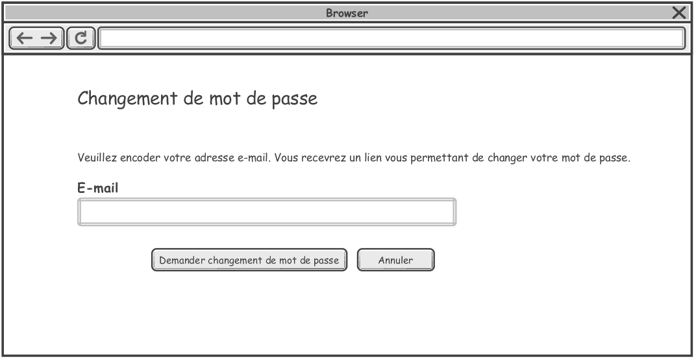

==== Envoyer un e-mail pour le changement du mot de passe

image::images/inscription_en_ligne/envoyer_un_e-mail_pour_le_changement_du_mot_de_passe.png[]

==== Envoyer le mail de confirmation

Le type de mail envoyé varie en fonction du type de demande (demande
d'incription ou demande d'admission) et en fonction de l'offre choisie et du
site (localité) de l'offre.

Mail pour des demandes d'inscription: des informations dans le mail peut varier
en fonction du profil du candidat, de l'offre choisie. Voir le détail dans le
fichier doc/business/mail_inscription_soumettre.pdf.

Mail pour des demandes d'admission: des informations dans le mail peut varier en
fonction du profil du candidat, de l'offre choisie. Voir le détail dans le
fichier doc/business/mail_admission_soumettre.pdf.

Le lien URL dans le mail pour des demandes d'admission change en fonction du
catégorie du décret:

- Bachelier : http://www.uclouvain.be/357537.html et
              http://www.uclouvain.be/en-357537.html si c’est en anglais.
- Master en 60 crédit, Master en 180 ou en 240 crédits, Master en 120 crédits à
  finalité didactique, Master en 120 crédits à finalité approfondie, Master en
  120 crédits à finalité spécialisée: http://www.uclouvain.be/357538.html
- Master de spécialisation: http://www.uclouvain.be/357540.html
- Certificat en médecine: http://www.uclouvain.be/408906.html
- CAPAES: http://www.uclouvain.be/591795.html
- Agrégations: http://www.uclouvain.be/357539.html
- Doctorat: http://www.uclouvain.be/357541.html
- Par défaut: http://www.u0clouvain.be/591795.html

Le mail envoyé au candidat contient un fichier pdf qui résume les informations
encodées par le candidat. Voir le détail dans le fichier
doc/business/fichier_pdf_soumission.pdf.

==== Visualiser le compte

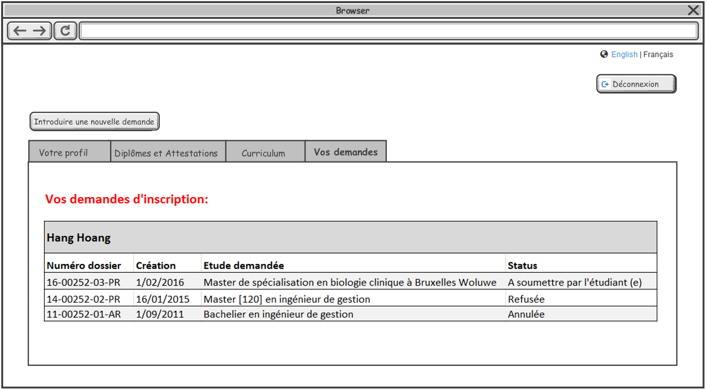

L'étudiant a la possibilité d'introduire pluseurs demandes, mais
pour le même année académique le candidat ne peut introduire que un maximum de
2 demandes d'admission et 1 demande d'inscription.

==== Mettre à jour le profil

image::images/inscription_en_ligne/mettre_a_jour_le_profil.png[]

==== Visualiser une demande

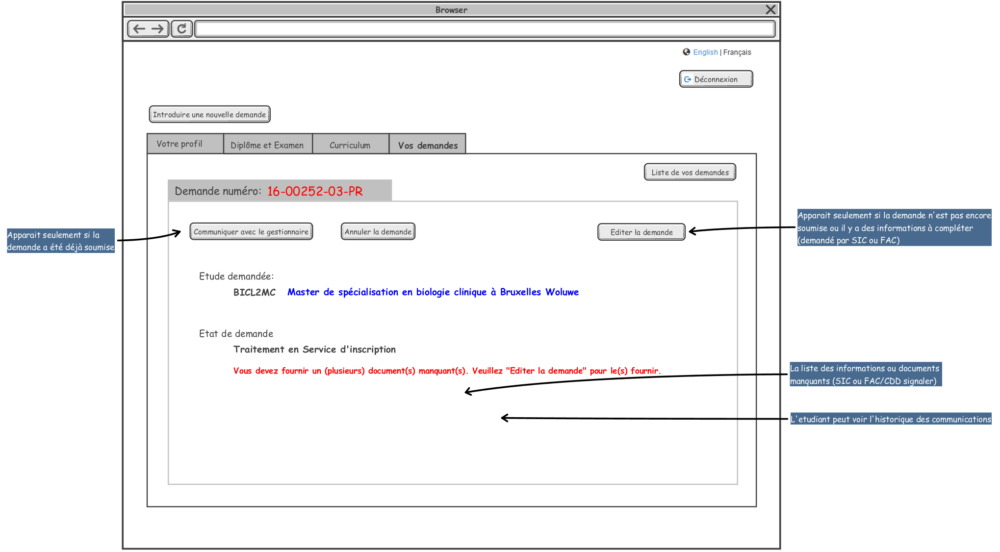

==== Des critères spécifiques de l'offre

Certaine offres ont des critères spécifiques: des documents à fournir en plus,
des questions à répondre en plus, des liens à indiquer en plus. Des réponses
sont parfois obligatoires, parfois c'est optionnel.

Certaines critères sont affichés pour toute les demandes, certaines critères ne
sont affichés que pour des demandes d'admission.

Des réponses à ces critères sont parfois obligatoires, parfois non.

Des critères peuvent être:

* Texte

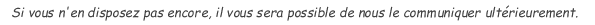

* Champ de texte libre

image::images/inscription_en_ligne/composantsDynamiques/champTexte.png[]

* Zone de texte libre

image::images/inscription_en_ligne/composantsDynamiques/zoneTexte.png[]

* Lien hypertexte

image::images/inscription_en_ligne/composantsDynamiques/lien.png[]

* Pièce jointe: peut etre une image ou un pdf

image::images/inscription_en_ligne/composantsDynamiques/pieceJointe.png[]

* Check box: qui peut contient un ou plusieurs lignes. Il peut avoir 1 ou
  plusieurs réponses

image::images/inscription_en_ligne/composantsDynamiques/checkbox.png[]

Les outils de configuration:

* Les gestionnaires de SIC avec leur lettres initiales et les répartitions des
  offres
* Les gestionnaires facultaire
* Configuration des mails
* Configuration des dates
* Configuration des critères spécifiques de l'offre
