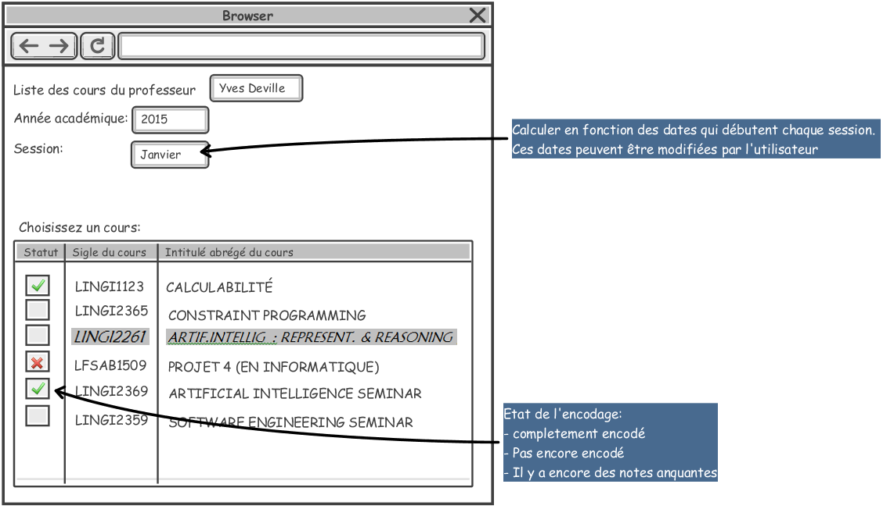

= Open Student Information System - OSIS
:toc: left
:toclevels: 4
:numbered:

:sectnums!:

== Introduction

=== Le but de l'application

=== Les normes d'ergonomie

=== Sécurité

=== Support

== Carte du processus

image::images/process-map.png[]

== Gestion l'offre de formation

== Les acteurs académiques

=== Attributions

[[studies]]
== Gestion des étudiants
=== Parcours de l'étudiant
[[assessements]]
==== Évaluations des acquis

[[scores_encoding]]

===== Encodage des notes

L'encodage des notes se passe principalement pour 3 sessions:

* Session 1: pour l'examen organisé en Janvier
* Session 2: pour l'examen organisé en Juin
* Session 3: pour l'examen organisé en Septembre

image::images/encodage-de-notes.png[]

====== Les rôles

Gestionnaire de programme:: Une ou plusieurs personnes sont attribuées comme les gestionnaires de programme à un programme.
+
IMPORTANT: Tant que le programme n'a pas fait l'objet de délibération, le gestionnaire du programme peut encoder/modifier les notes dans l'interface de l'encodage de note. +
Après cette date (ou en dehors des sessions en cours) il doit passer à une autre fonctionnalité dans l'application de L'OSIS pour modifier ou encoder une note pour **un étudiant** à la fois.
+
Enseignant:: Un enseignant attribué à une unité d'enseignement. +
+
IMPORTANT: Le gestionnaire du programme doit déterminer une date (date et heure) limite de l'encodage par des enseignants.
Après cette date, l'enseignant ne peut plus encoder les notes, il n'y a que les gestionnaires de programmes qui ont la main pour encoder ou modifier des notes. De cette manière, les gestionnaires de programmes peuvent préparer les délibérations.

====== Les besoins

*3 processus de l'encodage de notes:*

. L'encodage direct par l'enseignant:
+
Le responsable de note de l'unité d'enseignement utilise l'application OSIS pour encoder les notes de son cours. Il peut encoder entièrement les notes ou une partie des notes. Après avoir encodé, il doit les soumettre pour valider l'encodage. +
Pendant l'encodage, à tous les moments l'utilisateur peut sauvegarder les notes pour ne pas les perdre s'il y a un problème. +
Pour éviter des erreurs, il peut choisir de faire un double encodage.
+
IMPORTANT: Une unité d'enseignement peut avoir plusieurs enseignants, mais il y a un seul responsable de notes. +
Tous les enseignants de l'unité d'enseignement peuvent encoder les notes de ses unités d'enseignement, ils peuvent encoder et sauvegarder, mais seulement le responsable de notes qui peut soumettre les notes. +
+
NOTE: Actuellement dans EPC ne stocke pas le rôle du responsable de note, une convention avec des utilisateurs: +
 - S'il y a un seul enseignant => c'est cet enseignant. +
 - S'il y a plusieurs enseignants et un coordinateur => c'est le coordinateur. +
 - S'il y a plusieurs enseignants et il n'y a pas de coordinateur => premier enseignant par l'ordre alphabétique. +
+
. L'encodage traditionnel:
+
L'enseignant imprime des feuilles de notes de ses unités d'enseignement via l'application OSIS et les remplit des notes et envoyer aux responsables de chaque programme les feuilles de leur étudiants. +
Le gestionnaire du programme utilise l'application pour encoder les notes de ses étudiants. Il a tous les fonctionnalités comme un enseignant qui encode direct (sauvegarder, double encodage, ...)
. L'encodage par le fichier Excel:
+
IMPORTANT: Seulement responsable de notes et les gestionnaires ont le droit d'injecter les notes via fichier Excel.
+
.. Par le responsable des notes de l'unité d'enseignement: il peut injecter des notes de tous les étudiants qui s'inscrivent à la session du moment d'injection.
+
.. Par un responsable de programme: il ne peut injecter des notes que des étudiants des programmes qu'il gère et ces étudiants doivent s'inscrire à la session d'examen du moment d'injection.

====== Les activités de l'encodage de notes

. *Sélectionner une unité d'enseignement*
+
Cette page est la première étape sur le processus d'encodage de notes d'*un enseignant*. +
+

+
Quand l'enseignant est connecté, son nom complet apparaît automatiquement. +
L'année académique et la session d'examen sont calculées en fonction de la date qui débute chaque session de l'année académique actuelle. +
Le statut: nombre des notes qui sont encodés sur le total, calculé en fonction du nombre d'étudiants accessible par l'utilisateur. :
+
 - Pour l'enseignant: c'est le nombre de tous les étudiants inscrit à la session indiquée.
 - Pour les gestionnaires de programme: c'est le nombre des inscriptions à la session indiquée des programmes qu'il gère.
+
Si l'enseignant choisit le processus d'encodage direct, il clique sur cette unité d'enseignement pour commencer l'encodage. +
+
Si l'enseignant choisit le processus traditionnel, il doit choisir des unités d'enseignement en cochant sur la boîte et sur le bouton "Imprimer les feuilles de notes".
+
. *Choisir le type d'encodage*
+
Si l'utilisateur choisit un programme, le tableau ne contient que la liste des étudiants de ce programme. +
+
La liste des programmes proposés dans la liste sont des programmes accessibles à cet utilisateur. Concrètement:
+
  - si c'est un utilisateur facultaire, il ne voit que les programmes accessibles via leur profil.
  - si c'est un enseignant, il voit la liste de tous les programmes auxquels il y a au moins un étudiant inscrit à cette unité d'enseignement.
+
La liste présentée et le fichier exporté ne contiennent que la liste des étudiants correspondent aux critères de recherche.
Toute la liste est présentée, il n'y a pas de pagination.
+
Le nombre d'étudiants inscrits et nombre des notes changent en fonction du choix de "Programme".
+
L'unité d'enseignement qui ont le crédit absolu >= 15: décimal autorisé.
+
Les notes déjà encodés sont grisées.
+
On peut trier sur chaque colonne.
+
image::images/chosir-le-type-d-encodage.png[]
+
. *Encoder les notes*
+
NOTE: Tous les enseignants peuvent encoder et sauvegarder les notes, mais seulement le responsable des notes de l'unité d'enseignement peut soumettre les notes.
+
image::images/encoder-des-notes.png[]
+
On peut sauvegarder uniquement le commentaire.
+
Il y a une explication apparait quand on passe sur chaque bouton.
+
Les 2 notes qui sont déjà encodés sont grisées. L'enseignant ne peut plus re-encoder les notes pour ces étudiants mais le gestionnaire de programme peut les modifier. +
+
L'unité d'enseignement qui ont le crédit absolu >= 15: décimal autorisé, sinon l'utilisateur ne peut pas soumettre des notes avec le décimal.
+
Une vérification "décimale" quand on va à la ligne pour chaque ligne. Mettre la couleur en rouge et un pop-up si la souris passe au-dessus de la note pour dire "Décimal non autorisé pour cette unité d'enseignement".
+
La liste des étudiants à encoder contient maximum 25 étudiants par page. L'utilisateur peut encoder/sauvegarder une page ou plusieurs pages et faire le double encodage pour vérifier tous ce qu'il a déjà encodé.
+
Le premier encodage s'est sauvegardé avant de passer l'écran "Double encodage".
+
. *Double-encoder les notes*
+
image::images/double-encoder-les-notes.png[]
+
La liste des étudiants pour le double encodage contient tous les étudiants de la recherche, mais l'utilisateur peut re-encoder seulement les notes qui sont déjà encodé la première fois.
+
Pendant le double encodage, si on détecte qu'il y a une erreur par rapport à la première fois, on met la couleur rouge à la note. Et si l'utilisateur met la souris sur une note en rouge, il y a la note du premier encodage qui apparait. +
Tant que l'utilisateur ne fait pas "Comparer", il peut toujours modifier ses notes de double encodage.
+
En même principe que l'encodage, 25 étudiants par page.
+
. *Comparer les notes*
+
image::images/comparer-2-encodages.png[]
+
Le bouton "Encoder les notes finales" n'est disponible que quand les 2 colonnes notes ou les 2 colonnes motifs ne sont pas identiques. +
Le bouton "Soumettre" n'est disponible que quand les 2 colonnes notes et les 2 colonnes motifs sont identiques.
+
. *Encoder les notes finales*
+
image::images/encoder-les-notes-finales.png[]
+
La liste ne contient que des erreurs +.
+
Il faut remplir toutes les notes finales pour pouvoir soumettre.
+
. *Confirmer la soumission*
+
image::images/confirmer-la-soumission.png[]
+
Un e-mail récapitulatif de la soumission envoyé à tous les enseignants du cours.
+
. *Imprimer la feuille de notes*
+
image::images/imprimer-la-feuille-de-notes.png[]
+
"Date de délibération": Date de délibération du programme. +
"Président de jury": le mandataire "président de jury" de l'offre. +
"Secrétaire du jury" le mandataire "secrétaire du jury" de l'offre. +
L'adresse interne de l'enseignant.
+
. *Affiner la recherche*
+
image::images/affiner-la-recherche.png[]
+
L'utilisateur peut avoir le choix "Programme": liste de tous les programmes gérés par l'utilisateur (gestionnaire du programme) +
La liste présenté est la liste de tous les unités d'enseignement qui ont au moins d'un étudiant du programme donnée.
+
. *Générer le fichier d'importation*
+
image::images/generer-le-fichier-d-importation.png[]
+
On fournit le fichier excel avec 11 colonnes dans l'ordre donnée. +
Les notes sont déjà encodées se trouvent dans le fichier Excel de manier "grisée". +
La liste des étudiants sont trié par programme et puis par Nom.
+
. *Compléter le fichier Excel*
+
image::images/completer-le-fichier.png[]
+
Seulement les gestionnaires de programme et le responsable de note peut injecter le fichier Excel. +
L'utilisateur doit garder 10 premières colonnes. L'utilisateur peut ajouter d'autres colonnes après la 10eme colonne. +
S'il existe 2 lignes de même noma => message d'erreur. +
Il finit d'injection à la fin du fichier Excel (même s'il y a des lignes blanches au milieu). +
L'utilisateur peut ajouter des lignes.
+
NOTE: Une note sera enregistré si et seulement si les données de toutes les cellules (de A à J) de la ligne sont corrects
+
. *Importer le fichier compété*
+
image::images/importer-le-fichier-complete.png[]
+
Des étudiants ont déjà une note => pas d'injection de note pour ces étudiants. +
Si l'information d'une cellule (10 première colonne) n'est pas correct => pas d'injection.
+
. *Récapituler l'importation*
+
image::images/recapituler-l-importation.png[]
+
. *Confirmer l'importation*
+
image::images/confirmer-l-importation.png[]

include::glossary.adoc[]

[bibliography]
== Bibliographie
