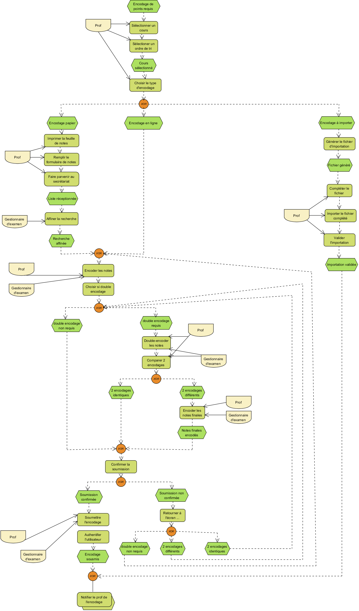
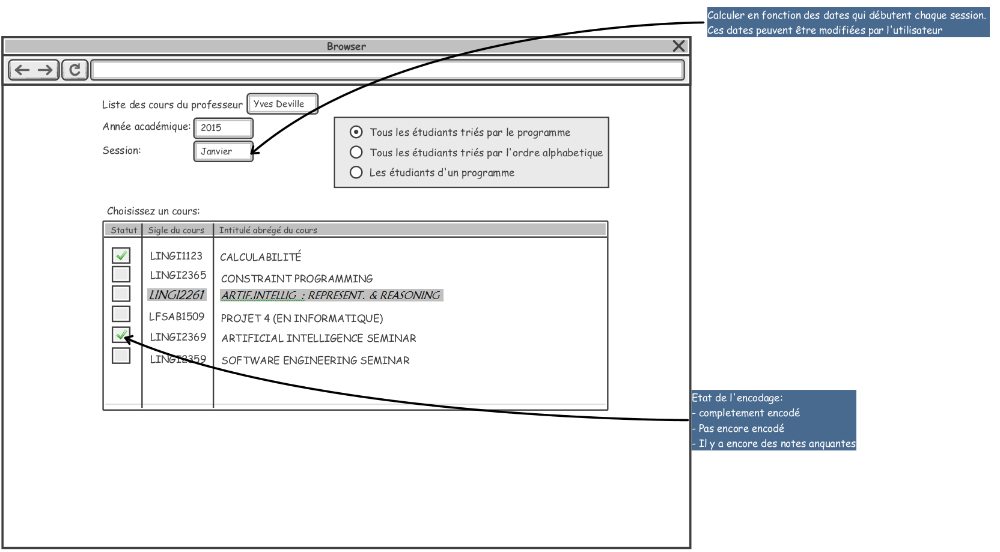

= Open Student Information System - OSIS
:toc: right

= Mode d'emploi

:sectnums!:

== Introduction

=== Le but de l'application
=== Les normes d'ergonomie
=== Securité
=== Support

== Gestion l'offre de formation
== Gestion des acteurs academiques
=== Attribution
=== Gestion des mandats pedagogique
=== Renouvelement PST
== Gestion des étudiants
=== Parcours d'étudiant
==== Evaluation des acquis
===== Encodage de notes

====== Selectioner un cours
image::images/selectionner-un-cours.png[]
====== Selectioner un ordre de tri

====== Choisir le type d'encodage
image::images/
====== Remplir le formulaire de notes
image::images/
====== Faire parvenir au secrétariat
image::images/
====== Encoder les notes
image::images/
====== Double-encoder les notes
image::images/
====== Comparer les notes
image::images/
====== Valider l'encodage
image::images/
====== Notifier le professeur de l'encodage
image::images/

===== Composition de programme
====== Inscription au mémoire
====== Inscription au stage

include::glossary.adoc[]

[bibliography]
== Bibliography
