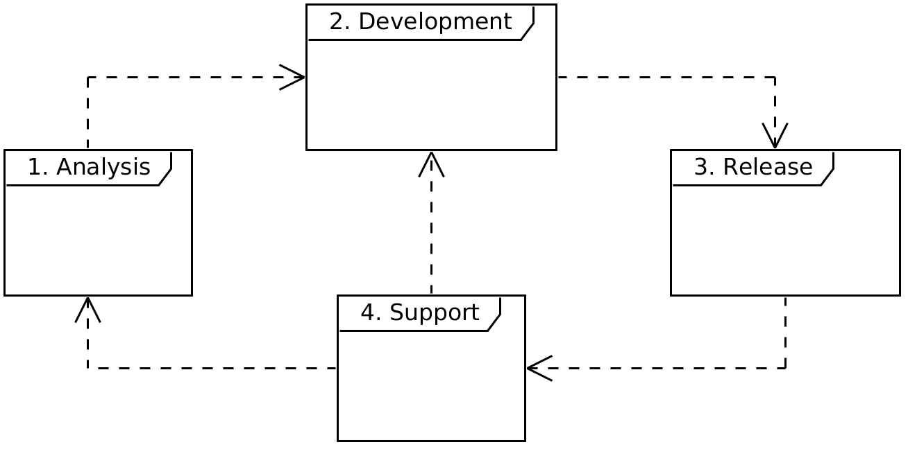
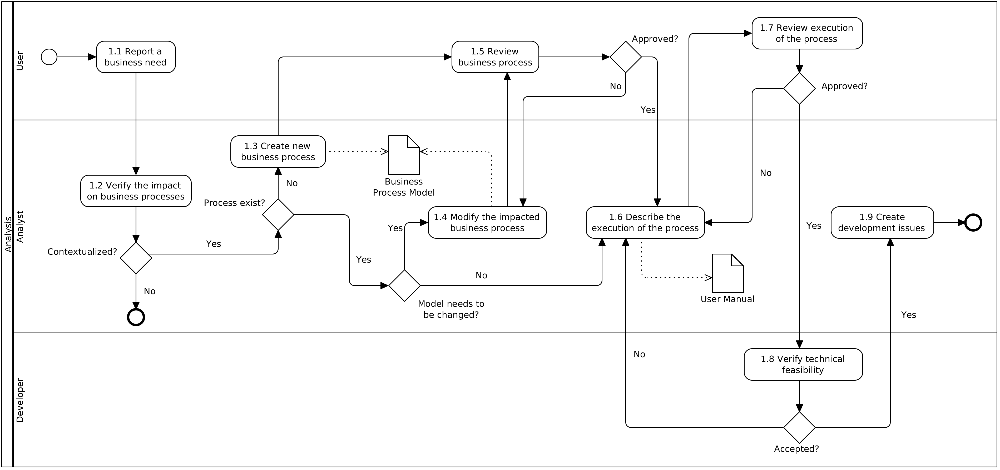
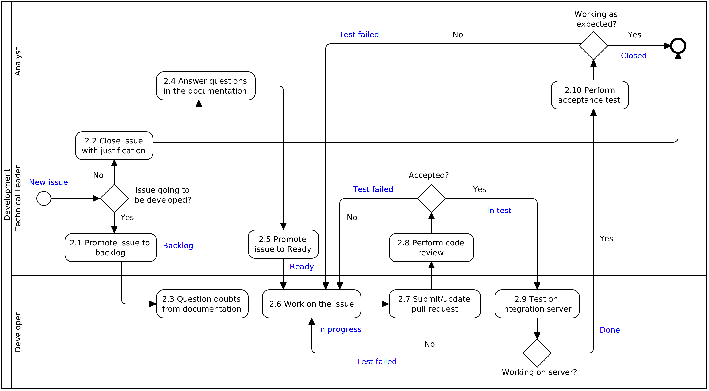
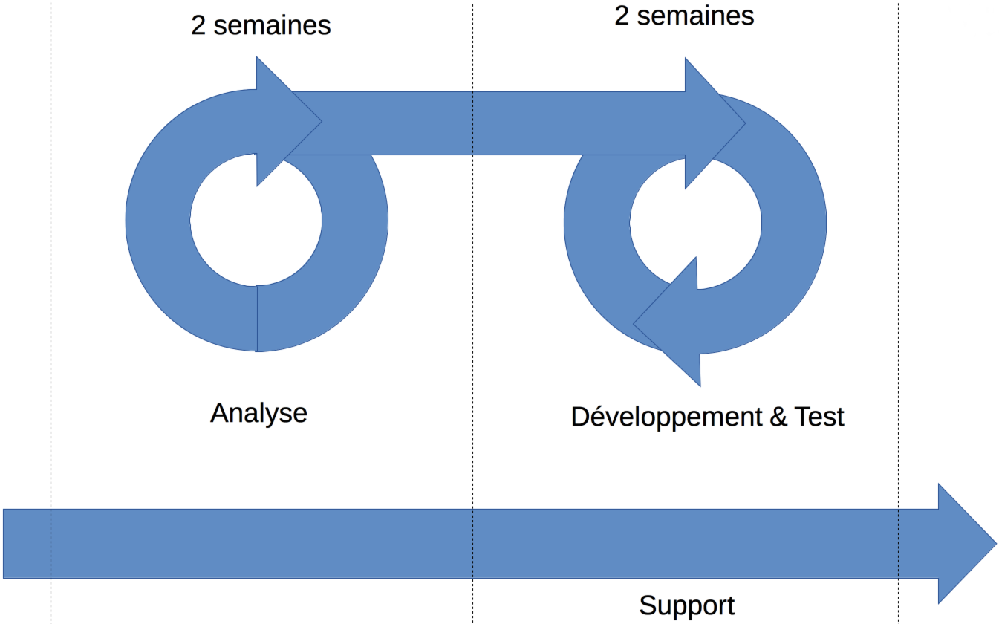
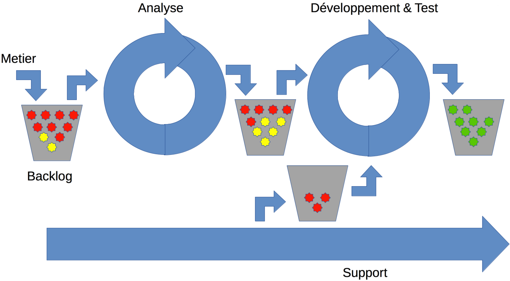
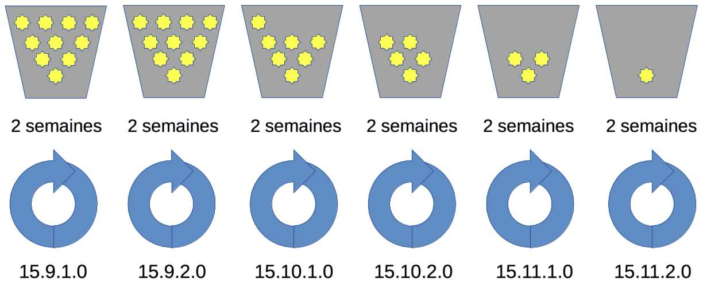

= Software Process
Hildeberto Mendonça, PhD
v1.0, 2017-03-23
:doctype: book
:toc: right

:sectnums!:

== Introduction

Software development is a creative work and as such it’s very sensitive to
formalizations. However, it is important to have some guidance about how the
work is usually done, how information flows and what actions are taken in
recurrent situations.

This document describes a low overhead, flexible and structured process to guide
contributors on the development of OSIS. It doesn’t impose rules, but
communicates how the team usually behaves in foreseen situations.

The process is inspired on agile and lean practices adapted to the context of a
large education institution and open source development. It is constantly
improved as contributors become more autonomous and tasks more automated.

=== The Fundamental Principles

In order to establish a baseline for this and future process improvements,
independent of methodologies, practices or paradigms, we have defined some
fundamental principles that should be respected in every future step. They are:

Traceability:: When an event occurs, it is possible to identify what needs
attention, where it is located, who has changed it and when. From documents to
code, everything must be traceable to support the investigation of problems,
from the causes to the effects, to minimize the changes they keep happening in
the future.

Predictability:: The more we repeat the process the more it becomes predictable.
So a simple process is memorable, but not that simple to leave important tasks
uncovered. Important investments should be made in training, reusable solutions
and documentation to support estimations. Unfortunately, predictability requires
discipline, which is hard to achieve in a creative environment. Fortunately,
many repetitive tasks can be automated, including the ones that verifies the
work that has been done.

Reactivity:: Given a certain state of the process, how long would it take to a
person resume the work of another person? Given the report of a bug, how long it
takes to solve it? The goal of reactivity is to reduce the time spent on
unexpected events, thus more time is spent of predictable tasks.

Measurability:: The more things can be quantified the better they can be
measured. Indicators can be used to monitor measurable things so progress
becomes visible, overheads can be avoided and decision making is properly
supported.

=== Turing Complete

In computer science, a programming language is said to be Turing complete if it
can be used to simulate itself or another Turing complete language. We have
bored this concept to write this document so it can also be used to define
itself and other documents.

In further sections we emphasize the user manual, an artifact as valuable as the
code that produces the application. Our intension is that this document serves
as inspiration of structure and style for the user manual. Actually, this is a
user manual to guide the team on the implementation and execution of the
software process.

== Process Map

The OSIS project consists of 4 independent and interconnected processes:
*Analysis*, *Development*, *Release*, and *Support*. They are independent
because they don’t block each other and run in different time frames. They are
also interconnected because they provide information for each other to be able
to run correctly and efficiently.

The domain of higher education is complex, specially in countries where it is
regulated by the government. There are issues difficult to model, such as the
highly intricate composition of programs, prerequisites and corequisites among
courses, the scheduling of classes while considering the availability of
auditoriums, teachers, students and resources, special rules for international
agreements with other countries and institutions and so on. Those issues have to
be constantly investigated in depth by a team of experts. That’s why *business
analysis* is so important in this kind of domain. There is simply too much
knowledge that has to be captured, organized, documented, revisited and shared,
otherwise the institution will indefinitely depend on individuals instead of the
collectivity.

The iteration of the analysis lasts for 2 weeks. This iteration is independent
from the development, so analysts do not have to wait for the outcome of the
development to advance with their analysis. It also means that we expect a
release coming out from each iteration, just like application releases.
Therefore, the analysis should be planned, executed, integrated, tested and
released, as traditionally done with code.

The development also lasts for 2 weeks and occurs in parallel to the analysis.
The output of the analysis serves as input for the development. However, the
output is accumulated in a backlog before being allocated in the upcoming
development iterations.

The support is an on-demand process, executed only when an issue in production
is reported. Every issue starts an independent instance of the process. The
duration of the process is not fixed. It depends on the time needed to fix the
issue, but it has higher priority than other processes.

=== Roles

User:: All those who directly use the application or represent a large group of
users. When there is a business need, they transmit to analysts the maximum
amount of information about the need they have. They are aware that they have to
be available for questions and meetings as demanded by the analysts, in
order to clarify missing details. If users transmit their needs to another role
other than the analyst they risk to have their need not documented neither
implemented properly. It would break the traceability principle.

Business Analyst:: Responsible for documenting how the business works and
translating the documentation into application functionalities. They produce the
business process models and the user manual to be used by developers on the
development of the functionalities, by themselves to validate those
functionalities, by support analysts to assist users on their questions and by
the users through the help menu in the application.

Technical Leader:: Responsible for the coordination of the development team.
It’s the leader who make sure the issues are having the necessary attention,
making sure they don’t get stuck or are forgotten in the backlog, and plan the
releases. The leader should also monitor the project to detect non-conformities,
identify deficiencies that impact the team’s productivity and act to overcome
those deficiencies.

Developer:: Responsible for developing the application according to the
instructions in the user manual. They have the technical knowledge to transform
business needs into application features. They are capable of maintaining any
part of the application.

Support Analyst:: Responsible for the user support, explaining users how to use
the application when the user manual is not sufficiently clear. In the case the
application is not behaving as expected, the support analyst is responsible for
reproducing the problem and creating a high priority issue to be addressed by
developers as soon as possible.

=== Artefacts

Business Process Model:: A graphical model that describes what is done, by whom
and in which sequence.

User Manual:: Documentation maintained by analysts to describe how the process
is executed using the application.

Technical User Manual:: Documentation maintained by developers to describe the
domain model and other technical aspects of the system.

Source Code:: Computer level instructions, written in the various supported
programming languages, which technically describe how the application works.

:sectnums:

== Analysis

The analysis process continuously investigates and documents how the business
works to be able to represent it in terms of information systems. The
documentation assumes the format of business processes and a user manual.

*Business processes* describe how the business works, with and without
application support, with tasks and sub-tasks organized in a logical sequence,
with responsibilities distributed among roles and producing artifacts as output.
A *user manual* describes how the application works. So, instead of producing
several documents, the analysts concentrate all their effort in a single one,
written in a way that serves both developers and users.

Writing the user manual before developing the application is not an unusual
idea. In Test-Driven Development (TDD) developers are motivated to write a
failing test before writing the required production code to pass it. The
practice of doing useful things in advance is a form of continuous reasoning
about what will be done in the project.

<<process-analysis>> is a process, defined in BPMN (Business Process Modeling
Notation), that describes the analysis of business requirements. In a first look,
this process seems time consuming and bureaucratic, but it is simply a
distribution of responsibilities among the roles: user, analyst and developer.
An instance of this process can last weeks, but it also can take a 1 hour
meeting, updating the process and the user manual right away as discussion goes,
streamlining all decisions.

This is also an illustration of a business process model artifact to be prepared
by analysts during the analysis. Each one of its tasks is explained in its own
section, as detailed as a user manual.

[[process-analysis,Figure 1]]
.Business process of the analysis

=== Report a business need

The user can request new features or modifications in the application. It's
done in many different ways because it isn't formalized. Users and analysts are
free to decide how they will communicate. This is a moment to listen to the
users, without interfering their way of thinking.

=== Verify the impact on business processes

In order to identify the impact on existing processes, the analyst should locate
in the processes where the new business need applies. For that, the analyst asks
the user about the roles involved, what they do, in which sequence, what they
need and what they deliver (reports, scores, assignments, etc.).

Users requests should be aligned with what already exists in terms of processes.
They should contribute to improve existing processes or add new processes
connected to existing ones. Requests that are not aligned with existing
processes are isolated and must be rejected until the application evolves to a
point that those requests can be connected. The problem we want to avoid here is
the disparity of data. They have to be integrated at some point in time. If we
pick 2 different processes that are completely disconnected, we risk to have
serious issues to integrate the data they manage.

=== Create a new business process

If the user is requesting something that was not yet described as a process,
then a new process is created. The criteria to create a new process are
extensive and sometimes subjective. In general, if the request does not fit in
an existing process or it requires substantial amount of work then it is a
potential candidate for a new process.

=== Modify the impacted business processes

Sometimes, the user requests changes in an existing process. Those changes don't
necessarily imply on modifications in the model. They can also represent the way
existing tasks are performed. The model changes when roles, tasks, decisions
or the flow need to be improved. The model doesn't have to change if the request
impacts only the execution of the tasks or the logic behind the decisions.

=== Review business process

The user reviews the process and approve it in order to move forward. Otherwise,
analysts and users keep adjusting the process until it is good enough to be
approved. This task is usually done at the same time the process is created
(1.3) or modified (1.4). Users and analysts get together to agree on how things
are done, without formalisms, in order to move fast.

=== Describe the execution of the process

During this task, the analyst is actually writing the user manual. It describes
the process as a whole, not only the automated activities. Activities performed
manually are described shortly and activities automated by the application are
described into details. The details include the definition of the activity, its
inputs and outputs, the wireframes representing the user interface, and a
sequence of steps about how to use them.

=== Review the execution of the process

The user reads the manual to make sure they understand the illustrations
and the instructions. If they do not approve it, then analysts and users keep
adjusting the manual until it is good enough to be approved.

=== Verify technical feasibility

Before entering in the development cycle, the changes in the user manual are
validated by the developer to make sure they are technically feasible. In
case of problems, the developer discusses with analysts until they find a
workable solution. It may impact the user manual, thus it's important that the
analyst, the user and the developer take the opportunity to perform the tasks
1.6, 1.7 and 1.8 together.

=== Create development issues

The changes may result in one or more issues to be addressed by the development
team. Those issues are self-contained, which means they don't depend on each
other, because developers should be able to work on them in parallel. An issue
created by an analyst takes the form of a user story and has the following
properties:

* A *title* that summarizes in one sentence the content of the issue;
* A detailed *description* of the issue in the format:
** As a *[role]*
** I want *[goal]*
** so that *[reason]*
** plus a link to the modified part in user manual.

A user story is a description of what the user expects from the application in
order to produce a certain outcome for the organization.

== Development

The development process defines the sequence of tasks and events that takes
place during the development of OSIS, with the goal of producing features
that work as foreseen in the analysis.

The workflow is based on a lean technique called Kanban. It is a method for
managing operational work with emphasis on just-in-time delivery while not
overloading the team members. This approach covers the process from the
definition of issues to the delivery to stakeholders. We have adopted a
Kanban board composed of 7 distinct lanes: **New Issues**, **Backlog**,
**Ready**, **To Do**, **In Progress**, **In Test**, **Test failed** **Done** and
**Closed**.

=== New Issues

New issues are the ones recently created that were not yet accepted in the
project. They are evaluated from time to time to check their relevance against a
list of criteria defined by the team. The criteria are:

- **Is the issue relevant at this point in time?** Sometimes, created issues are
not directly related to the current stage of the project. They might be good
ideas, but without a context they might be also uncertain or even unnecessary.
Our experience shows really good ideas are not forgotten. They will certainly
come back in the future, in an appropriate moment.

- **Is it well documented, clear, and free of doubts?** When the development
team accepts a poorly documented issue, there is a high probability that the
issue will go forward and backward between test and development, implying on
overheads and delays.

- **In case of bug, can it be reproduced?** Bugs can not be declared. They have
to be demonstrated. The issue should contain a clear text explaining how to
reproduce the bug, so the development team can act as fast as they can to solve
the issue.

- **If it big and complex, can it be divided in smaller issues?** Big issues are
hard to manage because their are unpredictable. Nobody can say with confidence
when they will finish. So, it is better to have small issues that are easier to
document and develop than bigger ones that are hard in every sense.

If there are enough reasons new issues can make to the next lanes. Others might
be closed precociously. The judgment is made every 15 days in a meeting where
analysts and developers get together to discuss each issue and make decisions.
Meanwhile, new issues can also be accepted outside of this meeting in case they
are urgent or bugs.

=== Backlog

Accepted new issues are moved to the backlog lane. It means they are accepted
by the development team and they will be delivered soon. The size of the backlog
represents the capacity of the development team. It should have enough work to
keep the developers busy until the next team meeting, but with some room for
unpredictable urgent issues.

The backlog answers the following questions:

- The manager asks: what will be delivered in the coming days?
- The team leader asks: what will be included in the release notes?
- The analyst asks: are my priorities respected?
- The developer asks: is there any issue I can work on?
- The tester asks: for what should I get ready to test?

=== Ready

The To Do lane is a short backlog for issues that should be prioritized. Before
taking issues from the the backlog, developers should take issues from the To
Do until it is empty.

=== In Progress

When a developer picks an issue to work on, (s)he immediately moves the issue to
the In Progress lane to communicate to the team his(er) decision. This lane
answers the following questions:

- The manager asks: what are people doing right now?
- The team leader asks: Is there any code review and applications checks to do?
- Other developers ask: what should I NOT do?
- The tester asks: for what should I get ready to test?

It is recommended that a developer does not work in several issues at the same
time. It increases overhead because of the time needed to remember and to
refocus on the issue. We should finish what we started.

If the issue requires changes in the code, the developer should create a branch
for that issue. A new branch should be created from one of the following fixed
branches:

- *dev*: aggregates developers' contributions that are related to new features
or changes in existing features.
- *qa*: it receives contributions when there is a patch to be applied in
production, since it mirrors the code in production. Some environment-dependent
tests can be performed to make sure everything works in production, since both
environments are similar.

If the issue’s number is `#234` then its respective branch is named
`feature/234`, created to isolate the changes described in the issue. To create
a new branch for the issue, perform the following commands:

    $ git checkout dev
    $ git pull origin dev
    $ git checkout -b feature/234

The first command enters in the branch `dev`, if the developer is not already in
there. Within the branch `dev`, the latest commits in the remote branch
`origin/dev` are downloaded and merged within the local branch `dev`. Then, the
new branch `feature/234` is created from the local branch `dev`.

If the issue aims to apply a patch, then the branch is named `patch/234` and
created from `qa`:

    $ git fetch origin qa
    $ git checkout qa
    $ git pull origin qa
    $ git checkout -b patch/234

The developer in charge of the issue `#234` changes the code within the branch
`feature/234` or `patch/234`. Two commands are very useful to keep track of what
has been done:

    $ git status
    $ git diff models.py

The first command shows all created, modified, removed and untracked files that
are candidates to be committed. The second shows the changes in one of the
modified files. When we are ready to commit, we should decide whether all
changed files will be included in the commit or just a subset of them. To
include all files:

    $ git commit -a -m "#234 New entities added."

To include a subset of files, we have to add each file individually:

    $ git add base/models/academic_year.py
    $ git add base/models/academic_calendar.py
    $ git add base/models/__init__.py
    $ git commit -m "New entities added."

Committing often is encouraged. All commits are done locally, thus there is no
risk of conflicts until all commits are sent to the server. The `push` option
sends all commits in a local branch to the server, identified by `origin`.

    (venv)$ python manage.py jenkins
    (venv)$ git push origin feature/234

After the push the developer is ready to create a pull request to `dev`, if it
is a feature, or to `qa` if it is a patch. A pull request allows the team leader
to review the code. If the code is conflict free, PEP8 compliant, readable and
there is no evident logic error, then the team leader performs a stability check
of the application in his(er) workstation. The basic operations are:

    $ git fetch origin feature/234
    $ git checkout feature/234
    $ git pull origin feature/234

Now the branch is in local and updated. Then (s)he checks the application:

    $ source venv/bin/activate
    (venv)$ ./manage.py migrate
    (venv)$ ./manage.py jenkins
    (venv)$ ./manage.py runserver

The team leader may perform a simple test of the ticket, if possible, just to
check runtime stability. If everything goes well, the team leader accepts the
pull request and moves the issue to the lane In Test. In case of problems, s(he)
notifies the developer about the found problems and they keep interacting until
the pull request is accepted.

=== In Test

When the issue is In Test it means it is available to be tested on the
DEV server, if it is a feature, or on the QA server, if it is a patch. The
deployment is automatically done by Jenkins when it is notified right after
commits are made in the branches `dev` and `qa`.

The developer should perform this test and if everything goes well, s(he) moves
the issue to the lane Done, but in case of problems, s(he) moves the issue to
the lane In Progress to fix the remaining problems.

=== Done

Issues in this lane are considered done by the developer, but they still have to
be validated by analysts or second level support. The issues are testable on the
DEV server if they are new features or changes in existing features or on the QA
server if they are patches to be applied in production.

To validate a issue the analyst or the support closes the issue, automatically
moving it to the Closed lane. But in case of problems, the issue should be moved
to the lane In Progress, forcing the developer to go through all the
verifications again.

=== Closed

Closed issues means they will be in production as soon as all the issues
planned for the release are all closed too.

The team leader creates a pull request from `dev` to `qa` to release new
features and changes and then accept it. s(he) checks if the application is
correctly deployed and is available on the QA server. In case of problems, a
patch issue should be created from `qa` because we cannot be sure about which
issue caused the problem since multiple issues were merged into `qa` at the same
time.

If everything goes well in QA, a new pull request is created from `qa` to
`master`. The team leader notifies all the users through the notification
feature in the application, informing at what date and time the release in
production will happen, so the users may avoid doing critical operations during
that period of time.

From the creation of the pull request to `master` until the deployment time, the
team leader must concentrate on the release notes, which must contain an user
readable description of all changes made in the application since the last
release.

=== Create work breakdown structure

=== Create requests for change

These are the states of requests for change:

- *Created*: A ticket is created but not yet planned.

- *Assigned*: An existing ticket is assigned to a person and a milestone.

- *Finished*: The assigned person has finished the work as described in the
  ticket.

- *Tested*: The tester has validated the work done in the ticket.

- *Closed*: The technical leader has considered the ticket closed and ready to
  be released.

- *Canceled*: The ticket was created by mistake.

=== Demand developers estimations

=== Estimate requests

These are the types of effort:

- *Unknown*: the team does not have the necessary knowledge to address the
  issue. Therefore, an investigation should be carried out and no estimation can
  be done.

- *Complex*: the team has the necessary knowledge to address the issue but
  cannot estimate when the work will be finished.

- *Heavy*: the team has the necessary knowledge to address the issue and
  estimate the work but the issue cannot be solved in less than 5 working days.

- *Regular*: the team has the necessary knowledge to address the issue and
  estimate the work but the issue cannot be solved in less than 2 days.

- *Easy*: the team has the necessary knowledge to address the issue, estimate
  the work and finish it in less than 2 days.

- *Flash*: the issue can be solved in a couple of hours.

=== Distribute requests in upcoming iterations

The distribution of requests is done to a maximum of 3 sprints: The one that is
about to start and the two upcoming ones. The reasons why we cannot have more
than three sprints are:

- Old tickets tend to be forgotten. In practice, new tickets are created to
  solve a problem and when old tickets are revisited we finally notice they are
  duplications of more recent tickets.

- Increase the management cost by adding more control mechanisms. For instance:
  the tickets must be revisited often to not be forgotten or duplicated.

- Accumulation of non-planned tickets, which may freeze the size of the backlog.

These are the types of priority:

- *Blocking*: The application is blocking the work of a user who may not
  complete his/her task on time. This is usually due to a bug and must be fixed
  as soon as possible.
- *Essential*: It must have. It is so crucial to have the functionality
  implemented that the process couldn’t run without it.
- *Important*: It should have. The user can live without it, but his/her
  productivity is heavily impacted.
- *Desirable*: It is nice to have. An existing functionality can be improved, so
  a user can perform his/her tasks faster.

=== Review project schedule
=== Inform user
=== Start upcoming iteration
=== Develop requests for change

The last person allocated in a ticket is the only one authorized to close that
ticket.

=== Create automated tests for change
=== Release QA version

== Test

image::images/test.png[Test]

=== Execute all tests
=== Create request for fix
=== Fix based on failing test
=== Update user manual
=== Authorize release in production
=== Release in production
=== Inform user

== Support

image::images/support.png[Support]

=== Report application issue
=== Create reproduction test script
=== Create request for fix
=== Prioritize and allocate request
=== Fix based on failing test
=== Execute all tests
=== Authorize release on production
=== Release in production
=== Inform user

== Sprints

== Queuing

== Backlog

[bibliography]
== Bibliography

Copyright (c) 2015-2017 Université catholique de Louvain. All Rights Reserved.
