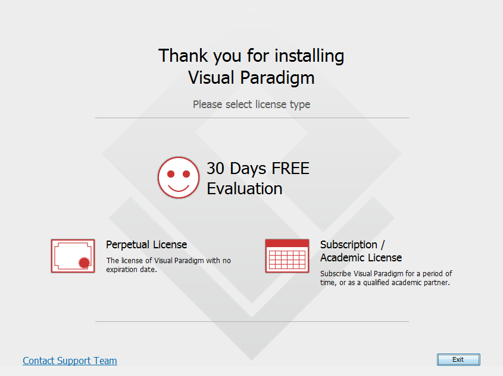
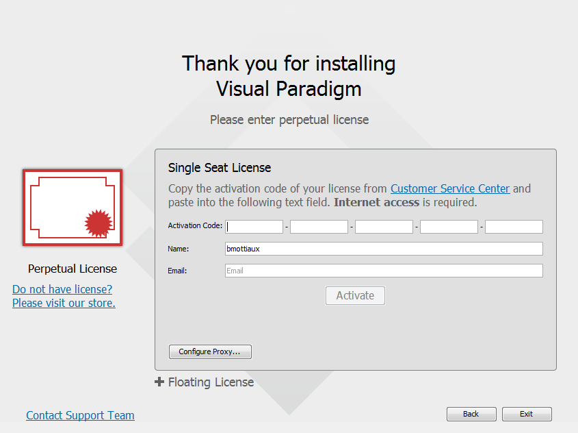
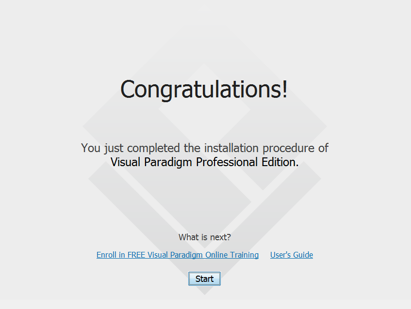
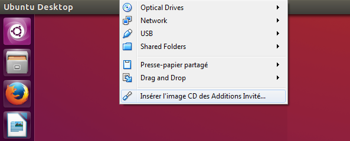
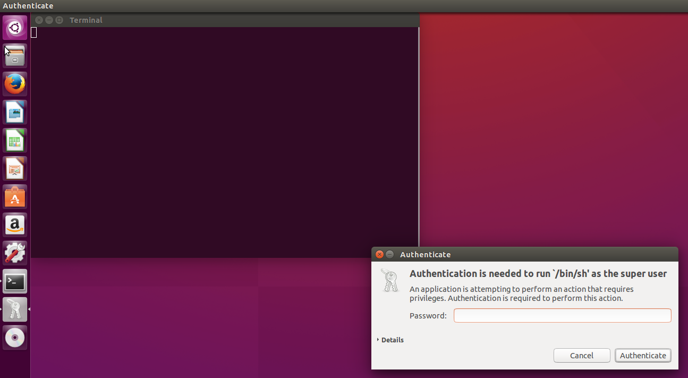
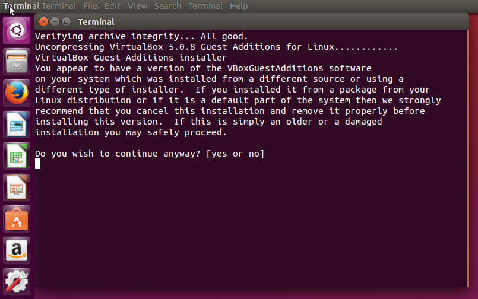
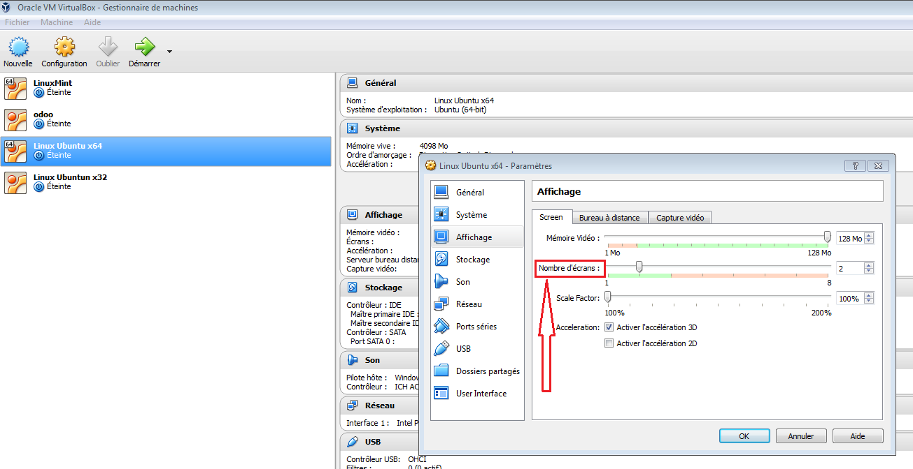
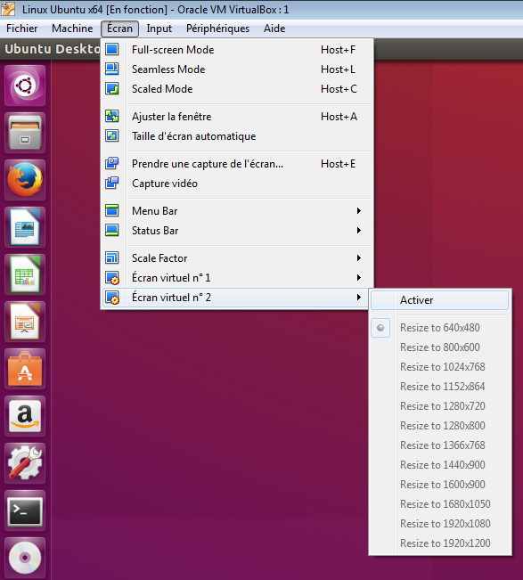
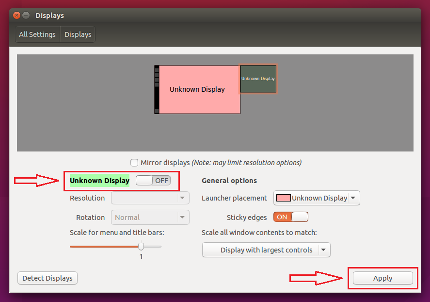

= OSIS Technical Manual
Hildeberto Mendonça, PhD
v0.1, 2015-09-12
:toc: right

== Contributing to OSIS

This documentation explains how to contribute as a committer to OSIS project. A committer is an individual who is disciplined enough to gain the confidence of the project manager to commit directly to the repository without further bureaucracy. In fact, be accepted as a committer is a great recognition of the quality of your work as a programmer.

=== Analysis Environment

==== Modeling Tool

We use http://www.visual-paradigm.com/[Visual Paradigm] to draw our business models. It is used mainly by analysts, but everybody in the team may install it to, at least, visualize the models. To install it, visit  http://www.visual-paradigm.com/download/[Visual Paradigm's download page] and download the version 12.2 or superior. Follow the installation instructions and launch the tool. The follow screen is the first one we see after running Visual Paradigm for the first time. Click on "**Perpetual License**" to continue.

The next screen shows a form to insert the activation code for one of two types of licenses: **Single Seat License** and **Floating License**. We use floating licenses, so click on the correspondent option to see the correct license form.

In the floating license form, as shown below, fill-in the form with the following values:

- Host: http://tools.epc.uclouvain.be/vpserver
- Port: 80
- Access Code: [provided by the administrator]

and click on "Connect to Server". If the connection succeeds then the number of available licenses appears. Then press "Apply" to take one of the available licenses.

image::images/screenshots/visual-paradigm-configuration-3.png[]

When the following screen appears we are ready to go. Just click "Start" to launch the tool and start working!

=== Development Environment

The first thing to do to start contributing to the project is to prepare the development environment. During this section, we explain in details how to do that in a Debian-based distribution (Debian Linux, Ubuntu, Mint, etc.).

==== Using an Ubuntu Virtual Machine

If your system is not based on Debian Linux then you can follow the steps using a virtual machine. We suggest  https://www.virtualbox.org/wiki/Downloads[VirtualBox] as virtual rumtime and http://www.ubuntu.com/download/desktop[Ubuntu] as operating system. Follow the installation instructions on their website according to your own platform. When the Ubuntu virtual machine is created and running, execute the following command to make the operating system aware of the virtual runtime:

    sudo apt-get install virtualbox-guest-dkms virtualbox-guest-x11

Conseils::
- Mettre un maximum de mémoire video (128mb min.)
- Cocher l'accélération 3D dans les paramètres/Affichage de la machine virtuelle
- Mettre au minimum 2Go de RAM

Lancer la machine virtuelle Ubuntu. Une fois la machine démarrée, dans la fenêtre de VirtualBox, clic sur Périphériques -> Insert Guest Additions...

Run le virtual CD "VBOXADDITIONS_5.0.8_103449".

image::images/screenshots/virtualbox-2.png[]

Insérer le mot de passe admin pour autoriser l'installation.

Tapez "yes" pour commencer l'installation.

Une fois l'installation terminée, éteignez la machine.

Dans les paramètres de la machine virtuelle (clic droit sur la VM -> Paramètres -> Affichage), indiquez le nombre d'écrans que vous désirez utiliser.

Démarrez la machine virtuelle.

Dans la fenêtre de VirtualBox -> Ecran -> Ecran virtuel n°2 -> Activer.

Une seconde fenêtre de VirtualBox devrait s'ouvrir.

Dans la VM ubuntu, System settings -> Displays, sélectionnez l'écran que vous avez activé, et mettez le sur "ON". Adaptez la résolution de votre écran selon vos besoins.

Cliquez ensuite sur "Apply" pour appliquer les changements. Vous devriez avoir 2 fenêtres distinctes dans VirtualBox.

==== Installing and Configuring Git

We start by installing Git to be able to download Odoo's and OSIS' source code:

    $ sudo apt-get update
    $ sudo apt-get install git

The `update` command downloads package lists from repositories to get information on the newest versions of packages and their dependencies. This way, we make sure we are getting the last version of Git and all other dependencies.

Then, we add some personal information in the local Git installation to make sure the author is well identified in all commits:

    $ git config --global user.name "[Firstname] [Lastname]"
    $ git config --global user.email "[firstname.lastname]@uclouvain.be"

Since version 2.0, Git has adopted a new behavior to pull and push commits while in a branch. When you execute `git push` or `git pull` Git will consider pushing or pulling just for the current branch. Before, these commands would push and pull all branches. But the change to this new behavior is voluntary, not automatically imposed. So, we have to explicitly say we have to move from the old behavior to the new one. To do that, execute the following command:

    $ git config --global push.default simple

For the moment, every time we push code to GitHub the prompt asks for a username and password. We can bypass this step by registering a SSH key. To do that, we first check whether there is already an existing SSH key we can reuse:

    $ ls -al ~/.ssh

If files with the extention `.pub` are listed then one of them can be reused to authenticate to GitHub. If not, then we can create one:

    $ ssh-keygen -t rsa -b 4096 -C "[firstname.lastname]@uclouvain.be"
      Enter file in which to save the key (/Users/[user]/.ssh/id_rsa): [Press enter]
      Enter passphrase (empty for no passphrase): [Type a passphrase]
      Enter same passphrase again: [Type passphrase again]

The next step is to add the new key, or an existing one, to the ssh-agent. This program runs the duration of a local login session, stores unencrypted keys in memory, and communicates with SSH clients using a Unix domain socket. Everyone who is able to connect to this socket also has access to the ssh-agent. First, we have to enable the ssh-agent:

    $ eval "$(ssh-agent -s)"

And add key to it:

    $ ssh-add ~/.ssh/id_rsa

The next step is to make GitHub aware of the key. For that, we have to copy the exact content of the file `id_rsa.pub` and paste into GitHub. To make no mistake about the copy, install a program called `xclip`:

    $ sudo apt-get install xclip

And then copy the content of the file `id_rsa.pub` in the clipboard:

    $ xclip -sel clip < ~/.ssh/id_rsa.pub

The command above is the equivalent of opening the file `~/.ssh/id_rsa.pub`, selecting the whole content and pressing `Ctrl+C`. This way, you can paste the content on GitHub when required in the next steps. On the GitHub side:

 . Login at https://github.com.
 . In the top right corner of the page, click on the profile photo and select **Settings**.
 . In the user settings sidebar, click **SSH keys**.
 . Then click **Add SSH key**.
 . In the form, define a friendly title for the new key and paste the key in the **Key** field.
 . Click **Add Key** to finish with GitHub.

To make sure everything is working, lets test the connection:

    $ ssh -T git@github.com
      The authenticity of host 'github.com (207.97.227.239)' can't be established.
      RSA key fingerprint is 16:27:ac:a5:76:28:2d:36:63:1b:56:4d:eb:df:a6:48.
      Are you sure you want to continue connecting (yes/no)? yes
      _
      Hi username! You've successfully authenticated, but GitHub does not
      provide shell access.

The final step is to change the remote URL. Go to the project folder and check the remote url:

    $ cd ~/python/projects/osis/osis-louvain
    $ git remote -v

    $ git remote set-url origin git@github.com:uclouvain/osis-louvain.git

==== Installing and Configuring PostgreSQL

PostgreSQL is the only database supported by Odoo. There is no safe way to use another database, such as MySQL or Oracle. Fortunately, PostgreSQL has a very good reputation, a large community and a generous documentation. Execute the following commands to install it:

    $ sudo apt-get install postgresql
    $ sudo su - postgres -c "createuser -s $USER"
    $ sudo apt-get install libpq-dev

The first command installs PortgreSQL and creates a database user named after the current logged OS user. The library libpq-dev is also installed for development purposes.

==== Installing Odoo for Development Purpose

The following steps describe how to install Odoo - an open source platform for business applications - from the source code. Before downloading the source, let's create a directory in the home folder (`/home/[username]`) to keep together everything related to Python development:

    $ mkdir ~/python

Then, go to the new folder and clone Odoo source code locally:

    $ cd ~/python
    $ git clone https://github.com/odoo/odoo.git -b 8.0

The command above creates a folder named `odoo` containing the source code of the main branch on the server, which is usually related to the latest stable version. At this point, Odoo is not yet ready to run. We still have to install all its dependencies. Then we continue with the installation of Python development dependencies:

    $ sudo apt-get install libxml2-dev libxslt1-dev libevent-dev libsasl2-dev libldap2-dev python-dev python-setuptools python-pip python-unittest2

The basic development dependencies are installed to enable the environment to install Odoo's direct dependencies:

    $ cd ~/python/odoo
    $ sudo pip install -r requirements.txt

The file `requirements.txt` contains a list of Odoo's direct dependencies. The `pip` command allows the installation of all dependencies by passing this file by parameter.

Now, Odoo is ready to run. To test the installation, run Odoo from command line:

    $ cd ~/python/odoo
    $ ./odoo.py

To see Odoo running, visit the URL http://localhost:8069. To stop Odoo, go back to the terminal and type `Ctrl+C`. If it doesn't work, then try `Ctrl+Shift+C`.

==== Installing OSIS modules on Odoo

Before installing the new modules, we have to create a database for Odoo. It is done through Odoo's user interface. Follow the steps below:

. start Odoo and visit the address http://localhost:8069;
. go to the section "Manage Databases";
. select "Create" on the left menu;
. fill in the form:
.. inform the administration password;
.. `osis` as the name of the new database;
.. leave "Loading demonstration data" unchecked;
.. select "English" as the database language; and
.. define a secure password for the administrator.

. activate "Technical Features":
.. login as `admin` with the password you have just created for the new database;
.. select "Settings" on the top menu and "Users" on the left menu;
.. edit the "Administrator" user and go to "Access Rights" tab;
.. check the checkbox "Technical Features" and click on "Save";
.. reload the page and you will have access to many Odoo server internals.

To keep everything organized, create the following directory structure in your python folder (`/home/[username]/python`):

    $ cd ~/python
    $ mkdir -p projects/osis

Go to the new directory and clone the `dev` branch of OSIS modules:

    $ cd projects/osis
    $ git clone https://github.com/uclouvain/osis-core.git
    $ git clone https://github.com/uclouvain/osis-louvain.git

Go to Odoo's directory and create an initialization file:

    $ cd ~/python/odoo
    $ ./odoo.py --save --stop-after-init

The file `.openerp_serverrc` is created in your home directory. Edit the initialization file (.openerp_serverrc) and add the location of OSIS modules in the attribute `addons_path`:

    $ nano ~/.openerp_serverrc
           ...
           addons_path = ...,/home/[username]/python/projects/osis
           ...

Go to Odoo's folder and install the new modules:

    $ cd ~/python/odoo
    $ ./odoo.py -d osis -u all
    $ ./odoo.py -d osis -i osis-louvain

==== Installing and Configuring Django

Django is a modern and lightweight web framework to support our front-end applications. The choice for Django was made thanks to its:

- low OI throughput;
- low memory footprint; and
- straightforward integration with Shibboleth.

In addition, Django preserves the same runtime platform of our back-end applications and runs isolated for greater availability.

Before starting, we need to install the Python virtual environment:

    $ sudo apt-get install python-virtualenv

The repository `osis-louvain-frontend` is a Django application. To contribute to that, clone the repository locally:

    $ cd ~/python/projects/osis
    $ git clone https://github.com/uclouvain/osis-louvain-frontend.git

In the new repository, create a virtual environment to isolate all dependencies of the project:

    $ cd osis-louvain-frontend
    $ virtualenv --python=python3.4 venv

Start the virtual environment and install Django:

    $ source venv/bin/activate
    (venv)$ pip install django==1.8

Before running the application, let's create the database:

    (venv)$ python manage.py makemigrations studies
    (venv)$ python manage.py migrate

And then a super user account to access the administration module:

    (venv)$ python manage.py createsuperuser

And finally run the application:

    (venv)$ python manage.py runserver

You can leave the server running while you are developing. It will take into account all changes in your code, except the changes in the model. In this case, we have to stop the server to execute the commands `makemigrations` and `migrate` as shown above. When we have finished your daily work, we can deactivate the virtual environment:

    (venv)$ deactivate

=== Following the Git Workflow

image::images/git-state-diagram.png[Git State Diagram]

The code repository is organized in three fixed branches:

- *dev*: agregates developers' contributions that are intended to be in production, but they still need to be validated.
- *qa*: at the end of the sprint, when all features are frozen, the branch `dev` is merged into `qa` to allow testers to validate the release before it gets into production.
- *master*: once the version in `qa` is fully validated, it is merged into the branch `master`, which is the one to be deployed in production.

Developers should not commit directly to any of these branches. By convention, the source code can only be changed under the context of an issue created on the issue tracker tool.

==== Creating and Working in a Branch

The issue tracker generates an incremental id that we can use to name branches. It helps to keep branches linked to issues. For example: considering an issue with the id 260, we can create a local branch with the following commands:

    $ git fetch origin dev
    $ git checkout dev
    $ git checkout -b issue#260

The first command updates the branch `dev` with the last changes on the server. The second command moves from the branch we are at the moment to the branch `dev`. The last command creates the branch `issue#260` from `dev` and immediately moves to it. From this moment, every commit will be attached to the correct branch. If the branch `dev` already exists in local, then instead of fetching it we should pull it:

    $ git pull origin dev

As we work on the issue, two commands are very useful to keep track of what has been done:

    $ git status
    $ git diff models.py

The first command shows all created, modified and removed files that are candidates to be committed. The second shows the changes in one of the modified files. When we are ready to commit, we should decide whether all changed files will be included in the commit or just a subset of them. To include all files:

    $ git commit -a -m "New entities added."

To include a subset of files, we have to add each file individually:

    $ git add models.py
    $ git add __init__.py
    $ git commit -m "New entities added."

Committing often is encouraged. All commits are done locally, thus there is no risk of conflicts until all commits are sent to the server. The `push` option sends all commits in a local branch to the server, identified by `origin`.

    $ git push origin issue#260

==== Fixing Mistakes

Version control doesn’t always happens smoothly. We will certainly face some problems and fortunately Git is very gentile on which concerns recovering from mistakes. These are some common situations we may face during development.

===== Moving to another branch before finishing the work in the current branch

Sometimes we are working in a branch and a more urgent problem arrives, requiring us to move to or create another branch. In this case, we have to commit all changes in the current branch before moving to another one, otherwise we risk to have our changes to the current branch committed in another branch. So, first add your changes and commit:

    $ git commit -a -m "New entities added but still incomplete."

and then move to an existing branch:

    $ git checkout issue#261

or create another branch from `dev`:

    $ git checkout dev
    $ git checkout -b issue#261

It also happens that we start fixing an issue but we forget to move to its respective branch. In this case, we have to commit the files related to the current branch and leave in the workspace the changes related to another branch:

    $ git add calendar.py
    $ git commit -m "Sort algorithm started."
    $ git checkout issue#260

The files that were not committed in the previous branch will be available for commit in the branch issue#260.

This practical approach of moving from a branch to another while leaving some files uncommitted may not work if at least one of the files we have changed locally was also changed remotely. We may see a message like this:

    From https://github.com/uclouvain/osis-louvain
    * branch            dev        -> FETCH_HEAD
    Updating 57c4a6d..9839a25
    error: Your local changes to the following files would be overwritten
           by merge:
           __openerp__.py
    Please, commit your changes or stash them before you can merge.
    Aborting

In this case, we have to commit local changes before moving to another branch. But things can get worse because the current branch might be actually related to a closed issue, thus committing to it doesn't make sense anymore. In this case, we can use `git stash`. It moves all changes in the current workspace to a transit area that can be recovered later on. To move all changes to the stash area, simply type :

    $ git stash

Now, if we type `git status` we find the working directory clean, which means we can move to another branch. To see the stashes we have stored we can use:

    $ git stash list

After moving to another branch, we can recover the changes from the stash are using:

    $ git stash apply

but if there is more than one stash in the list we can apply a specific one by referencing its identifier:

    $ git stash apply stash@{2}

===== Fixing the latest commit message

    $ git commit --amend -m "message"

When we work with branches it’s very common to fool with the commits. There are many branches locally and sometimes we forget to switch to the branch related to the issue
and we end up committing on the wrong branch. When it happens before pushing the commits to the server, we can undo the last commit done with the command:

    $ git reset --soft HEAD~1

But if the commit was already pushed to the server, it is still possible to undo the push as long as other people have not pushed to the same branch after the wrong push. It is done with the following command:

    $ git push origin master -f

Stop tracking a file without deleting it locally:

    $ git rm --cached [file]

Deleting remote branches

    $ git push origin --delete test

=== Adding the license to the source code

OSIS is an open source project licensed under AGPL. As such, it must respect certain rules of the license. The most important one is the addition of a license header in each one of the source files.

For Python 2.7 files, the following text should appear on the top of the file, before any Python code:

    # -*- coding: utf-8 -*-
    ##############################################################################
    #
    #    OSIS stands for Open Student Information System. It's an application
    #    designed to manage the core business of higher education institutions,
    #    such as universities, faculties, institutes and professional schools.
    #    The core business involves the administration of students, teachers,
    #    courses, programs and so on.
    #
    #    Copyright (C) 2015-2016 Université catholique de Louvain (http://www.uclouvain.be)
    #
    #    This program is free software: you can redistribute it and/or modify
    #    it under the terms of the GNU Affero General Public License as published by
    #    the Free Software Foundation, either version 3 of the License, or
    #    (at your option) any later version.
    #
    #    This program is distributed in the hope that it will be useful,
    #    but WITHOUT ANY WARRANTY; without even the implied warranty of
    #    MERCHANTABILITY or FITNESS FOR A PARTICULAR PURPOSE.  See the
    #    GNU Affero General Public License for more details.
    #
    #    A copy of this license - GNU Affero General Public License - is available
    #    at the root of the source code of this program.  If not,
    #    see http://www.gnu.org/licenses/.
    #
    ##############################################################################

For Python 3.4, the very first line `# -*- coding: utf-8 -*-` is not necessary and should be removed. For XML files, we change just the comment syntax:

    <?xml version="1.0" encoding="UTF-8"?>
    <!-- OSIS stands for Open Student Information System. It's an application
     *   designed to manage the core business of higher education institutions,
     *   such as universities, faculties, institutes and professional schools.
     *   The core business involves the administration of students, teachers,
     *   courses, programs and so on.
     *
     *   Copyright (C) 2015-2016 Université catholique de Louvain (http://www.uclouvain.be)
     *
     *   This program is free software: you can redistribute it and/or modify
     *   it under the terms of the GNU Affero General Public License as published by
     *   the Free Software Foundation, either version 3 of the License, or
     *   (at your option) any later version.
     *
     *   This program is distributed in the hope that it will be useful,
     *   but WITHOUT ANY WARRANTY; without even the implied warranty of
     *   MERCHANTABILITY or FITNESS FOR A PARTICULAR PURPOSE.  See the
     *   GNU Affero General Public License for more details.
     *
     *   A copy of this license - GNU Affero General Public License - is available
     *   at the root of the source code of this program.  If not,
     *   see http://www.gnu.org/licenses/. -->
