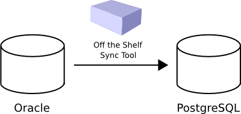
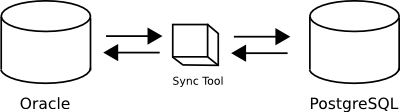
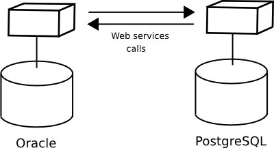
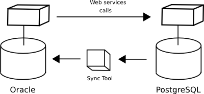
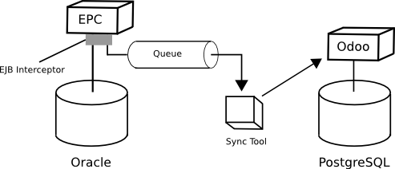

= OSIS Technical Manual
Hildeberto Mendonça, PhD
v0.1, 2015-09-12
:toc: right

== Environment

=== Team

==== Accepting the invitation to join the project

At this stage you already have a GitHub user account and the technical leader of the project is aware of that, so (s)he invites you to be part of one or more of the https://github.com/orgs/uclouvain/teams[existing teams]. GitHub sends the invitation to you by email containing the following message:

[quote, The GitHub Team]
____
Hi [username],

[team-leader] has invited you to join the Université catholique de Louvain organization on GitHub. Head over to https://github.com/uclouvain to check out Université catholique de Louvain's profile.

To join Université catholique de Louvain, follow this link:

https://github.com/orgs/uclouvain/invitation?via_email=1

Some helpful tips:

- If you get a 404 page, make sure you’re signed in as keniasousa.
- You can also accept the invitation by visiting the organization page directly at https://github.com/uclouvain

If you were not expecting this invitation, you can ignore this email.

Thanks
____

Please, follow the instructions in the email to accept the invitation. It will add you to the organisation https://github.com/uclouvain[uclouvain] and to the team originally assigned. If you did not receive this email then check you spam folder. If the email was not received at all, please ask the technical leader to send the invitation again.

== Data

=== Data Model

==== EPC

===== Databases

There are 5 EPC databases, one for each EPC instance - *dev*, *test*, *qa*, *demo* and *production*. Within each database, EPC has access to 8 schemes - *epc*, *aid*, *fgs*, *mnd*, *pres*, *std*, *str* and *doctorats*. The schema epc depends on fgs, mnd, pres, std and str. The schema aid depends on epc. The schema doctorats is isolated. These schemes are in the scope of the database migration.

===== Files

For performance reasons, files generated by EPC are stored in a network storage space. Only references for those files are kept in the database. It significantly improved performance and maintenance in comparison to storing files directly in the database, as it was done before. Documents have an expiration date which varies from 0, for temporary files, to 3 years for more relevant documents. Since no document is older than three years, historical data are not an issue.

.EPC tables
|===
|Table |Type |Description |N. Columns

|a
|z
|e
|e

|===

==== OSIS

.OSIS entities
|===
|Entity |Type |Description |N. Columns

|a
|z
|e
|e

|===

=== Data Migration

Once the decision to migrate the applications to Odoo was made, a detailed technical analysis takes place to identify the implications of this migration in order to help decision makers to define priorities and conceive a realistic planning. The current assumption is that the data is probably the only resource that will be preserved in the process of rewriting all applications on Odoo's framework. Therefore, this document focus on the data migration only.

Odoo completely abstracts the database from programmers. The database model is created using a object-relational model where classes are used to represent database tables. Objects from those classes represent data from their respective tables. The difference from the current architecture is that programmers are fully responsible for creating the physical model while Odoo takes full responsibility over this model. Therefore, there is a very low probability that the current data model is anyhow compatible with data models managed by Odoo.

A clear evidence of that is the approach adopted by Odoo to define primary keys. While it always define a unique, numeric, auto-incremented identifier, the current physical model uses all sorts of approaches such as: single numeric column, single character column, multiple numeric columns, multiple heterogeneous columns and others. Therefore, preserving the referential integrity of the data is probably the most challenging issue to be addressed in this analysis.
This document aims to support the decision making of the project manager by gathering technical information about the data, analyzing the implications and proposing solutions for the identified issues.

.EPC tables to OSIS entities
|===
|Table |Migrated |Entity

|a
|z
|e

|===

==== Strategies

The main issue identified in the previous section is how to preserve referential integrity when the data is spread in different database servers. We will probably never find a 100% reliable solution given the complexity of distributed systems, but we can considerably reduce the risk of data inconsistencies by carefully evaluating all possible alternatives and picking the one with the best cost-benefit. This is indeed an effort that cannot be postponed neither avoided. We have figured 5 migration strategies, as described hereafter.

===== Synchronize data using a synchronization tool

A off-the-shelf product is used to synchronize data between Oracle and PostgreSQL bidirectionally. This solution considers that the data model is identical or very similar in both databases. This strategy is very unlikely because EPC's data model do not follow standard rules, while Odoo follows strict rules enforced by its persistence mechanism. These discrepancies may force the implementation of very specific migration logic, which is not usually covered by migration tools.

===== Write a program to migrate data from Oracle to PostgreSQL

It seems to be inevitable the development of a custom migration tool to address this particular data migration scenario. Therefore, all the following strategies consider some level of additional development. This one, in particular, considers the development of a tool that is scheduled to run periodically, calculating the delta between both databases and updating the most out dated one.

The data model can be different because the tool encapsulates all data transformations between the models. The data model can evolve and solve current issues.

It might be more complex and more time consuming and, since it does not use the business layer to process the data, it can become inconsistent over time if the tool does not follow carefully all changes in the business layer (i.e. boundaries of transactional business operations on multiple tables can guarantee consistency while unbounded transactions made by a synchronization tool may fail, causing inconsistency).

===== Change both applications to access each other's web services

This strategy address the disadvantages of the previous one by forcing the use of the business layer during the data migration. It is possible because all updates are done through web services that processes the data in the business layer before persisting then in the database.

The disadvantage is that it makes EPC and Odoo highly coupled because it forces both applications to be aware of each other. As a consequence, a locoincide comt of code would have to be removed from Odoo after the complete phase out of EPC. This is a hard task because we it is not easy to distinguish which code is concrete and which one is volatile.

===== Change one of the applications to access other's web services

We could reduce high coupling by concentrating all changes for data migration on the EPC side. This way, the migration code would be discarded with EPC, leaving Odoo free of volatile code. EPC would call Odoo's web services to update its own data for every table owned by Odoo. These  data would be available read-only on EPC.

Unfortunately, an additional tool would be necessary to keep Odoo up to date with data from those tables that are still owned by EPC.

===== Post on a queue every time an update in the database occurs

This is probability the strongest strategy because it addresses all previous drawbacks. Every update on tables not yet owned by Odoo would cause a post of a message in a queue. Messages in this queue would be read by a tool, which would call Odoo web services to pass through the business layer before updating the database.

It is feasible because the business layer in EPC is implemented using EJBs and an interceptor can be attached to a EJB to have access to the data passed as arguments and returned to the caller. An interceptor would be responsible for posting on the queue.  This way, every update done by EPC is immediately available on Odoo's data model on demand.

To identify potential drawbacks, it would be necessary to implement a proof-of-concept in order to address unforeseen issues before starting the migration to Odoo.

=== Historical Data

The current database stores data since 1984, which matches with the beginning of information systems adoption. These data are preserved, but most of them are not useful anymore for current operational processes. They actually contribute to slow down the application by constantly increasing the size of the indexes.

Historical data cannot be simply ignored in a completely new application because the nature of EPC's data is historical by default. For example, data related to students should be available from the oldest active student until the newest one, making the studies history always available for regular reporting and updates. The period in which historical data are useful might be large, but more than 30 years of historical data certainly exceeds any reasonable limit.

The challenge is to differentiate useful historical data from archivable ones. We start by classifying EPC data in four categories:

1. *Master data*:  related to the core business but treated individually, outside of a process context. For example: offers, activities, courses, etc.

2. *Business process data*: related to business processes, such as deliberation, registrations, activities approval, encodage des notes, etc.

3. *Reference data*: not directly related to the business, but related to the education domain, complementing master data. For example: countries, languages, postal codes, etc.

4. *Auditing data*: every time a record changes a version of it is preserved in an auditing table for possible data recovery.

The data within those categories can be:

1. *Operational*: data frequently updated and retrieved from the database for on-line use or reporting. All categories above contains operational data.

2. *Archivable*: data that are not used anymore in the current business context, unless for some historical reports. Business process and auditing data are strong candidates for archiving. Master and reference data are usually required for a longer period of time and should be analyzed case by case.
