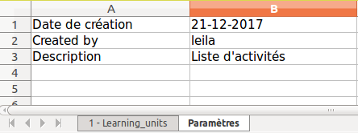
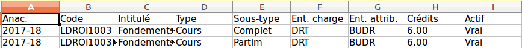
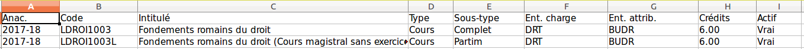

== Création de fichier xls

Une fonctionnalité a été développée pour systématiser la production de fichier excel dans Osis et Osis-Portal.
Cette fonctionnalité ce trouve dans *Osis-common/document/xls_build.py* et se nomme *generate_xls*.

La création de fichier Excel est construite pour permettre de créer aisément un fichier Excel
contenant

* de une à plusieurs feuille(s) de calcul
* une feuille de calcul informative contenant
** le nom de l'utilisateur ayant crée l'Excel,
** la date de création
** une petite description de la liste.

=== Fonctionnement

La fonction attend en entrée une série de paramètres fournis sous forme d'un dictionnaire.  Exemple ci-dessous :
[source,xml]
{
  'list_description': "Liste d'activités",
  'username': 'leila',
  'filename': 'Learning_units',
  'data': [
    {
      'colored_cols': {
        Style xls désiré
        :
        [1, 2]
      },
      'content': [
        [
          '2017-18',
          'LDROI1001',
          'Introduction au droit - Partie I',
          'Cours',
          'Complet',
          'BUDR',
          'BUDR',
          Decimal
          (
          '7.00'
          ),
          'Vrai'
        ],
        [
          '2017-18',
          'LDROI1001A',
          'Introduction au droit - partie I (Auditoire A)',
          'Cours',
          'Partim',
          'BUDR',
          'BUDR',
          Decimal
          (
          '7.00'
          ),
          'Vrai'
        ],
        [
          '2017-18',
          'LDROI1001B',
          'Introduction au droit - partie I (Auditoire B)',
          'Cours',
          'Partim',
          'BUDR',
          'BUDR',
          Decimal
          (
          '7.00'
          ),
          'Vrai'
        ]
      ],
      'header_titles': [
        'Anac.',
        'Code',
        'Intitulé',
        'Type',
        'Sous-type',
        'Ent. charge',
        'Ent. attrib.',
        'Crédits',
        'Actif'
      ],
      'colored_rows': {
        Style xls désiré
        :
        [2]
      },
      'worksheet_title': 'Learning_units'
    }
  ]
}

Les valeurs OBLIGATOIRES attendues pour les différentes clés sont les suivantes :

|=======
|Clé |Type de données | Descriptions
|list_description |String |Description de la liste
|filename |String |Nom de fichier xls (SANS l'extension)
|username |String |Nom d'utilisateur
|data |Liste de dictionnaires |Représente les données à présenter dans le fichier xls. (Voir tableau ci-dessous pour plus de détail) (Un dictionnaire par feuille de calcul).  Dans chaque dictionnaire il faut la clé content.
|=======

Explication pour la structure de données de la valeur 'data'.  (Ici certaines clés sont facultatives)

|=======
|Clé |Obligatoire/facultatif|Type de données | Description
|content |O |Liste de liste |Liste des données à afficher dans le ligne du tableau xls
|header_titles |O |List |Liste des données à afficher dans le ligne du tableau xls
|worksheet_title |O |List |Liste des données à afficher dans le ligne du tableau xls
|colored_rows |F |Dictionnaire.  En clé le style à donner à la ligne et en valeur une liste avec les numéros de lignes à colorer.  (Un numéro dans la liste correspond à la ligne de données à colorer.)  |Va permettre de colorer une ligne
|colored_cols |F |Dictionnaire.  En clé le style à donner à la colonne et en valeur une liste avec les numéros de colonnes à colorer. (Un numéro dans la liste correspond à la colonne de données à colorer.) |Va permettre de colorer une colonne
|=======

=== Validation

Avant de lancer la création du fichier xls plusieurs choses sont validées.  Si un point n'est pas correct la création du fichier xls n'est pas lancée (un message apparaîtra dans les logs)

Pour que le dictionnaire soit valide il faut au minimum les clés suivantes dans le dictionnaire:

* list_description,
* filename,
* username,
* data

On vérifie également que le nombre de titres présents dans 'header_titles' soit le même que le nombre d'éléments dans 'content'.

=== Comment utiliser la fonctionnalité

Simplement en appelant la fonctionnalité suivante:
[source,xml]
xls_build.generate_xls('dictionnaire contenant tous paramètres nécessaires)

+++<u>Un HttpResponse sera retourné en résultat:</u>+++
[source,xml]
response = HttpResponse(save_virtual_workbook(workbook), content_type='application/vnd.openxmlformats-officedocument.spreadsheetml.sheet; charset=binary')
response['Content-Disposition'] = "%s%s" % ("attachment; filename=", filename)

=== A savoir, adaptation de la largeur des colonnes

Lors de la création des colonnes il y a un mécanisme qui ajuste les colonnes à une largeur idéale qui facilitera la lecture du contenu

Il y a néanmoins une limite maximum de taille pour ne pas avoir des colonnes trop larges. (voir dans l'exemple ci-dessous la colonne C)

+++<u>Exemple illustré ci-dessous :</u>+++

Sans adaptation cela donnerait ceci :

Avec l'adaptation :

