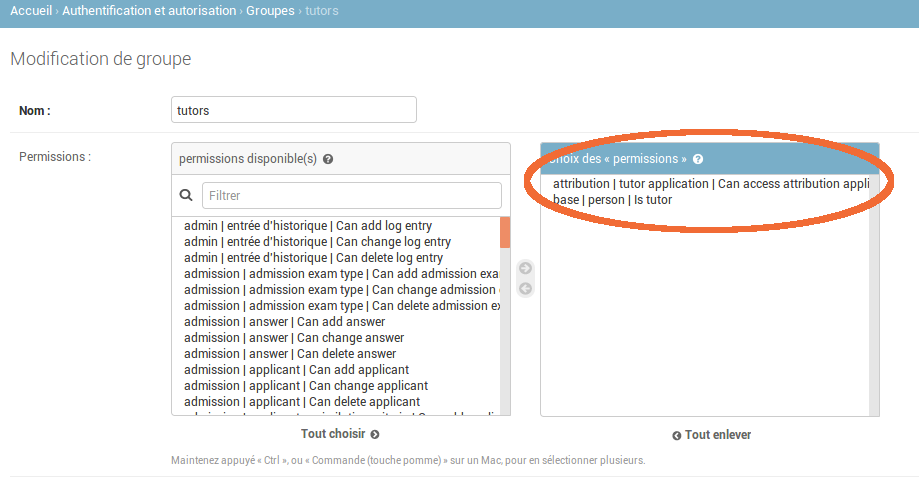
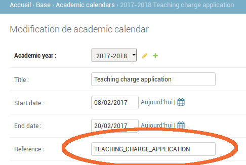

= Candidature en ligne
Doc Writer <doc.writer@asciidoctor.org>
v1.0, 2017-02-13
:toc:

toc::[]

== Droits pour accéder au module candidatures

Pour avoir accès au module il faut que l'utilisateur(l'enseignant) : +

- fasse partie du GROUP Tutor
- et que le group ait le droit _'Can access attribution application'_

== Période de candidature en ligne

On ne peut candidater en ligne que pendant une période bien déterminée.  Cette
période est définie dans un academic_calendar

La valeur 'TEACHING_CHARGE_APPLICATION' du champ REFERENCE est absolument
indispensable c'est sur base de

- la valeur de ce champ,
- de la date du jour,
- et de l'année académique

que l'on va déterminer si on est dans la période de candidature en ligne ou non.

== Point menu "Mes candidatures"

Si l'utilisateur a les droits nécessaires et que la période de candidature en
ligne est ouverte il verra apparaître dans le dashboard un point de menu
 "Mes candidatures"

image::images/candidature_en_ligne/candidatures.png[]

Ce point de menu donne accès à la consultation/édition/suppression des candidatures
