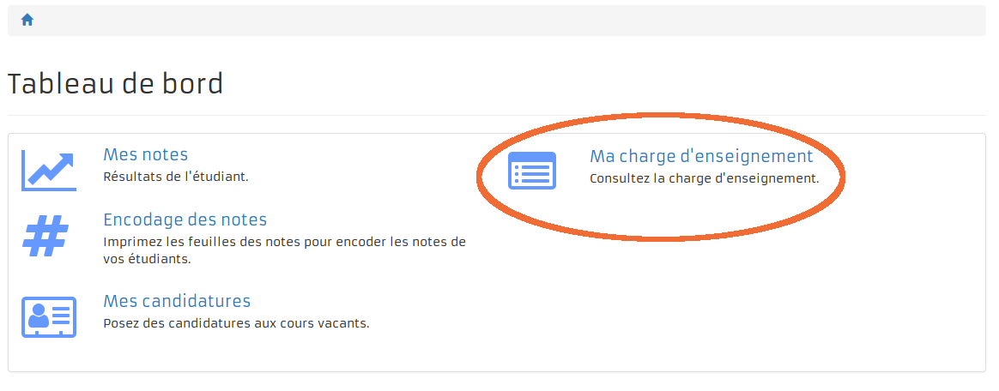

= Charge d'enseignement
:toc:

toc::[]

== Droits pour accéder à la fonctionnalité

Pour avoir accès au module il faut que l'utilisateur(l'enseignant) : +

- fasse partie du GROUP Tutor

== Point menu "Ma charge d'enseignement"

Si l'utilisateur a le droit nécessaire il verra apparaître dans le dashboard
un point de menu "Ma charge d'enseignement"

Ce point de menu donne accès à la consultation de la charge d'un enseignant.
